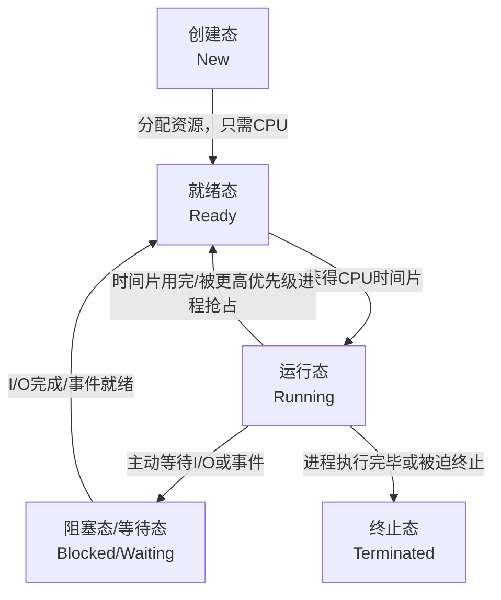

- [408](#408)
  - [数据结构](#数据结构)
    - [线性表](#线性表)
    - [栈、队列、数组](#栈队列数组)
    - [串](#串)
    - [树与二叉树](#树与二叉树)
      - [二叉树](#二叉树)
      - [树和森林](#树和森林)
      - [哈夫曼树和哈夫曼编码](#哈夫曼树和哈夫曼编码)
    - [图](#图)
      - [图的储存](#图的储存)
      - [图的遍历](#图的遍历)
      - [图的应用](#图的应用)
        - [最小生成树](#最小生成树)
        - [最短路径](#最短路径)
        - [拓扑排序](#拓扑排序)
        - [关键路径](#关键路径)
    - [查找](#查找)
      - [顺序查找](#顺序查找)
        - [有序线性表的顺序查找](#有序线性表的顺序查找)
      - [折半查找](#折半查找)
      - [分块查找](#分块查找)
      - [树形查找](#树形查找)
        - [二叉排序树](#二叉排序树)
        - [二叉平衡树](#二叉平衡树)
        - [红黑树](#红黑树)
        - [B树和B+树](#b树和b树)
        - [Hash](#hash)
          - [Hash的构造方法](#hash的构造方法)
          - [Hash的处理冲突方法](#hash的处理冲突方法)
    - [排序](#排序)
      - [插入排序](#插入排序)
      - [交换排序](#交换排序)
      - [选择排序](#选择排序)
      - [二路归并排序](#二路归并排序)
      - [基数排序](#基数排序)
      - [外部排序](#外部排序)
        - [归并排序算法](#归并排序算法)
        - [多路归并排序与败者树](#多路归并排序与败者树)
        - [置换-选择排序](#置换-选择排序)
        - [最佳归并树](#最佳归并树)
  - [计算机组成原理](#计算机组成原理)
    - [计算机系统概述](#计算机系统概述)
      - [计算机层次结构](#计算机层次结构)
        - [计算机软件](#计算机软件)
      - [计算机的性能指标](#计算机的性能指标)
    - [数据的表示和运算](#数据的表示和运算)
      - [整数类型和类型转换](#整数类型和类型转换)
      - [运算方法和运算电器](#运算方法和运算电器)
        - [定点数的表示和运算](#定点数的表示和运算)
        - [浮点数的表示和运算](#浮点数的表示和运算)
    - [存储系统](#存储系统)
      - [存储器概述](#存储器概述)
        - [存储器的分类](#存储器的分类)
        - [存储器的性能指标](#存储器的性能指标)
      - [主存储器](#主存储器)
        - [SRAM和DRAM](#sram和dram)
        - [ROM(只读存储器)](#rom只读存储器)
        - [主存储器的基本组成](#主存储器的基本组成)
        - [多模块存储器](#多模块存储器)
      - [主存储器和CPU的链接](#主存储器和cpu的链接)
        - [主存容量的扩展](#主存容量的扩展)
        - [储存芯片的地址分配和片选](#储存芯片的地址分配和片选)
        - [储存器和CPU的链接](#储存器和cpu的链接)
      - [外部存储器](#外部存储器)
        - [磁盘存储器](#磁盘存储器)
        - [固态硬盘](#固态硬盘)
      - [高速缓冲存储器](#高速缓冲存储器)
        - [Cache的基本工作原理](#cache的基本工作原理)
        - [Cache和主存的映射方式](#cache和主存的映射方式)
        - [Cache中主存块的替换算法](#cache中主存块的替换算法)
        - [Cache的一致性问题](#cache的一致性问题)
      - [虚拟存储器](#虚拟存储器)
        - [虚拟存储器的概念](#虚拟存储器的概念)
        - [页式虚拟存储器](#页式虚拟存储器)
        - [段式虚拟存储器](#段式虚拟存储器)
        - [段页式虚拟存储器](#段页式虚拟存储器)
    - [指令系统](#指令系统)
      - [指令集体系结构](#指令集体系结构)
        - [扩展操作码](#扩展操作码)
        - [指令的操作类型](#指令的操作类型)
      - [指令的寻址方式](#指令的寻址方式)
        - [指令寻址和数据寻址](#指令寻址和数据寻址)
        - [常见的数据寻址方式](#常见的数据寻址方式)
        - [程序的机器级代码表示](#程序的机器级代码表示)
      - [CISC和RISC的基本概念](#cisc和risc的基本概念)
    - [中央处理器](#中央处理器)
      - [CPU的功能和基本结构](#cpu的功能和基本结构)
      - [指令执行过程](#指令执行过程)
      - [数据通路](#数据通路)
      - [控制器的功能和原理](#控制器的功能和原理)
        - [硬布线控制器](#硬布线控制器)
        - [微程序控制器](#微程序控制器)
      - [异常和中断](#异常和中断)
      - [指令流水线](#指令流水线)
        - [流水线的冒险及处理](#流水线的冒险及处理)
      - [多处理器的基本概念](#多处理器的基本概念)
        - [SISD,SIMD,MIMD的基本概念](#sisdsimdmimd的基本概念)
        - [硬件多线程的基本概念](#硬件多线程的基本概念)
        - [多核处理器的基本概念](#多核处理器的基本概念)
        - [共享内存多处理器的基本概念](#共享内存多处理器的基本概念)
    - [总线](#总线)
      - [总线概述](#总线概述)
      - [总线结构](#总线结构)
      - [总线事务和定时](#总线事务和定时)
    - [I/O设备](#io设备)
      - [I/O接口](#io接口)
      - [I/O方式](#io方式)
        - [程序查询方式](#程序查询方式)
        - [程序中断方式](#程序中断方式)
        - [DMA方式](#dma方式)
  - [操作系统](#操作系统)
    - [操作系统概述](#操作系统概述)
      - [操作系统发展历程](#操作系统发展历程)
      - [操作系统的运行环境](#操作系统的运行环境)
      - [操作系统结构](#操作系统结构)
      - [操作系统引导](#操作系统引导)
      - [虚拟机](#虚拟机)
      - [进程和线程](#进程和线程)
        - [进程的概念](#进程的概念)
        - [进程的状态和转换](#进程的状态和转换)
        - [进程的通信](#进程的通信)
        - [线程和多线程模型](#线程和多线程模型)
      - [CPU调度](#cpu调度)
        - [调度的目标](#调度的目标)
        - [CPU调度算法](#cpu调度算法)
      - [同步与互斥](#同步与互斥)
        - [实现互斥的基本方法](#实现互斥的基本方法)
      - [死锁](#死锁)
    - [内存管理](#内存管理)
      - [内存管理概念](#内存管理概念)
        - [连续分配管理方式](#连续分配管理方式)
        - [基本分页储存管理](#基本分页储存管理)
        - [基本分段存储管理](#基本分段存储管理)
        - [段页式存储管理](#段页式存储管理)
      - [虚拟内存管理](#虚拟内存管理)
        - [请求分页](#请求分页)
        - [页面置换算法](#页面置换算法)
        - [页框回收](#页框回收)
        - [地址翻译](#地址翻译)
    - [文件管理](#文件管理)
      - [文件的操作：](#文件的操作)
      - [文件的逻辑结构](#文件的逻辑结构)
      - [文件的物理结构](#文件的物理结构)
      - [目录](#目录)
        - [文件共享](#文件共享)
      - [文件系统](#文件系统)
        - [文件存储空间管理](#文件存储空间管理)
        - [虚拟文件系统](#虚拟文件系统)
        - [文件挂载系统](#文件挂载系统)
    - [输入输出管理](#输入输出管理)
      - [高速缓存和缓冲区](#高速缓存和缓冲区)
      - [设备分配与回收](#设备分配与回收)
      - [SPOOLing(假脱机技术)](#spooling假脱机技术)
      - [磁盘调度算法](#磁盘调度算法)
        - [磁盘调度算法](#磁盘调度算法-1)
  - [计算机网络](#计算机网络)
    - [计算机网络体系结构](#计算机网络体系结构)
      - [电路交换、报文交换、分组交换](#电路交换报文交换分组交换)
      - [计网性能指标](#计网性能指标)
      - [计网分层](#计网分层)
        - [OSI参考模型](#osi参考模型)
        - [TCP/IP模型](#tcpip模型)
    - [物理层](#物理层)
      - [基本概念](#基本概念)
        - [奈奎斯特准则(奈氏准则)**无噪声**](#奈奎斯特准则奈氏准则无噪声)
        - [香农定理**有噪声**](#香农定理有噪声)
      - [编码和调制](#编码和调制)
      - [数字信号和模拟信号](#数字信号和模拟信号)
        - [数字信号转模拟信号](#数字信号转模拟信号)
    - [数据链路层](#数据链路层)
      - [组帧](#组帧)
        - [字符计数法](#字符计数法)
        - [字节填充法](#字节填充法)
        - [零比特填充法](#零比特填充法)
        - [违规编码法](#违规编码法)
      - [差错控制](#差错控制)
        - [检错编码](#检错编码)
      - [纠错编码](#纠错编码)
      - [流量控制和可靠传输](#流量控制和可靠传输)
        - [信道利用率](#信道利用率)
      - [介质访问控制](#介质访问控制)
        - [信道划分介质控制访问](#信道划分介质控制访问)
        - [随机访问介质控制](#随机访问介质控制)
      - [局域网](#局域网)
        - [以太网的MAC地址](#以太网的mac地址)
        - [高速以太网](#高速以太网)
      - [IEEE $802.11$ 无线局域网](#ieee-80211-无线局域网)
        - [$802.11$局域网的MAC帧](#80211局域网的mac帧)
      - [VLAN基本概念和原理](#vlan基本概念和原理)
      - [广域网](#广域网)
    - [网络层](#网络层)
      - [网络层的功能](#网络层的功能)
      - [网络层提供的两种服务](#网络层提供的两种服务)
- [高等数学](#高等数学)
  - [函数极限与连续](#函数极限与连续)
    - [常用极限](#常用极限)
    - [泰勒公式(在0处)](#泰勒公式在0处)
    - [题目总结](#题目总结)
    - [间断点](#间断点)
  - [数列极限](#数列极限)
    - [微分中值定理](#微分中值定理)
      - [证明：](#证明)
  - [积分微分](#积分微分)
    - [一、基本积分](#一基本积分)
    - [二、正切与余切积分](#二正切与余切积分)
    - [三、平方形式积分](#三平方形式积分)
    - [四、其他重要积分](#四其他重要积分)
    - [五、其他重要公式](#五其他重要公式)
  - [一元函数微分学](#一元函数微分学)
    - [一元函数微分学-几何应用](#一元函数微分学-几何应用)
    - [一元函数微分学-中值定理，微分等式与不等式](#一元函数微分学-中值定理微分等式与不等式)
    - [一元函数微分学-物理应用](#一元函数微分学-物理应用)
  - [一元函数积分学](#一元函数积分学)
    - [一元函数积分学的概念和性质](#一元函数积分学的概念和性质)
    - [一元函数积分学的计算](#一元函数积分学的计算)
  - [多元函数微分学](#多元函数微分学)
  - [微分方程](#微分方程)
    - [基础概念](#基础概念)
    - [相关习题](#相关习题)
  - [多重积分](#多重积分)
    - [二重积分](#二重积分)
    - [三重积分](#三重积分)
    - [曲线积分:](#曲线积分)
      - [闭合曲线积分:](#闭合曲线积分)
    - [曲面积分一般形式:](#曲面积分一般形式)
      - [闭合曲面积分](#闭合曲面积分)
    - [拉格朗日](#拉格朗日)
  - [无穷级数](#无穷级数)
    - [傅里叶级数](#傅里叶级数)
- [线性代数](#线性代数)
  - [行列式](#行列式)
  - [矩阵](#矩阵)
    - [转置矩阵](#转置矩阵)
    - [伴随矩阵](#伴随矩阵)
    - [逆矩阵](#逆矩阵)
    - [分块矩阵](#分块矩阵)
    - [矩阵的秩!!!](#矩阵的秩)
  - [线性方程组](#线性方程组)
    - [线性相关/无关/表示](#线性相关无关表示)
    - [基础解系与解的结构](#基础解系与解的结构)
    - [施密特正交](#施密特正交)
  - [矩阵相似理论](#矩阵相似理论)
  - [矩阵相似对角化](#矩阵相似对角化)


# 408

## 数据结构

### 线性表
相同数据类型有序数列

线性表特点：
- 1、个数有限2、具有先后次序 3、都是数据元素，每个元素都是单个元素 4、数据类型相同 5、表中元素具有抽象性，讨论元素间逻辑关系。
```就像是数组不是线性表，因为无序```
- 顺序表 插入$\frac{n}{2}$,删除$\frac{n-1}{2}$，按值查找$\frac{n+1}{2}$
### 栈、队列、数组
- 栈：卡特兰数：当n个不同的元素入栈时，出栈元素不同排列个数为$\frac{1}{n+1}C_{2n}^n$
- 栈：1）设栈顶元素S.top=-1 入栈时栈顶指针先加一再赋值
  2）设栈顶S.top=0 入栈时先赋值再栈顶指针加一
- 栈：中缀表达式转后缀
  遇到“操作数”直接添加到输出列表，遇到符号时：
  左括号 (：压入操作符栈。
  右括号 )：弹出栈顶运算符并添加到输出列表，直到遇到左括号。
  运算符（+, -, *, / 等）：比较当前运算符与栈顶运算符的优先级：
    若栈为空或栈顶为 (：当前运算符压栈。
    若当前运算符优先级 高于 栈顶运算符：压栈。
    否则：弹出栈顶运算符到输出列表，重复比较直到满足压栈条件。
  优先级规则：*/ > +- > (（乘除高于加减，括号最低）
- 特殊矩阵的存储：对称矩阵存一半，按行存，
  三角矩阵（剩下一般是同一常量），也是一样的按行存，但是在最后留一个位置存入常量的大小
  三对角矩阵也是按行优先存储，稀疏矩阵存对应的三元组：i，j，aij
### 串
```串最重要的应该是KMP算法吧```
- KMP算法：有主串长度n，模式串长度m，有简单模式匹配最多需要进行n-m+1次匹配，即：模式串最后一次正确匹配前每一个字符都要进行一次匹配
  介绍KMP算法原理：“前缀”：除最后一个字符外，字符串的所有头部子串；“后缀”：除第一个字符外，所有的尾部子串；“部分匹配值”：字符串的前缀与后缀最长相等的前后缀长度
  如“ababa”其部分匹配值为：‘a’：0；‘ab’：“a和b”相等长度为0；‘aba’：“a，ab”和“a，ba”相等长度为‘a’，1；‘abab’：‘a，ab，aba’和‘b，ab，bab’相等长度为2；‘ababa’相等长度为3
  所以‘ababa’部分匹配值为00123
  在KMP算法中，模式串右移的长度是“已匹配长度-对应的部分匹配值”
  next数组的构建：部分匹配值加一后右移，
  nextval数组：当$p_j=p_{next[j]}$时，即要跳转的字符和该字符一样，必然失配，所以要一直递归直至$p_j=p_{next[next[j]]}$，直至两者不相等为止
### 树与二叉树
- 树的性质 
  树的结点数 = 所有结点的度数之和+1
  度为m的树中第i层最多有$m^{i-1}$个结点：高度为h的m叉树最多有$1+m+m^2+...+m^{h-1}=(m^h-1)/(m-1)$个结点
  相对应的，度为m，具有n个结点的树的最低高度为$log_m(n(m-1)+1)$,最大高度为n-m+1
- 度：一棵树中结点的最大度数是树的度
#### 二叉树
- 二叉树是有序树
- 满二叉树：高度为h，且有2^h-1个结点，即满结点的二叉树
- 完全二叉树：高度为h，有n个结点的二叉树，当且仅当其每个结点和高度为h的满二叉树相对应，称之为完全二叉树
- 二叉排序树：左子树所有结点均小于根结点，右子树所有结点均大于根结点
- 二叉平衡树：树中任意一结点左右子树高度差不超过1
- 正则二叉树，每个分支结点只有0或2个孩子
- 二叉树的性质：高度为h的二叉树最多有2^h-1个结点
  具有n个结点的完全二叉树，其高度为$[log_2(n+1)]或[log_2n]+1$
- 二叉树顺序存储的话依照完全二叉树存储，有空着的位置写0；
  链式存储：lchild|data|rchild；左右孩指针，易验证：n个结点的二叉树有n+1个空链域
- 二叉树遍历：先序遍历：中左右；中序遍历：左中右；后序遍历：左右中；层次遍历：队列
- 线索二叉树：若无左子树，令lchild指向其前驱结点；若无rchild，令rchild指向其后驱结点
  线索二叉树的结点结构：lchild|ltag|data|rtag|rchild
  当tag为0时child指向子结点，当tag为1时指向前后驱
  **前后驱的定义**不是祖先这样的，而是遍历后的顺序，如中序遍历后‘BDAEC’则D的前驱是B，后驱是A，若D无左子树，则前驱指向B
#### 树和森林
- 树的存储方法： 
  - 双亲表示法：data|parent，后面存的是该结点父节点的序号，可以很快的得到该结点的父结点，但是求结点的孩子需要遍历整个结构
  - 孩子表示法：将每个结点的孩子结点视为一个线性表，且以单链表作为储存结构，则n个结点就有n个孩子链表。结构为$data \rightarrow first_child \rightarrow second_child$
  - 孩子兄弟表示法：也称二叉树表示法；结构为：指向第一个孩子的指针|结点值|结点右兄弟的指针
- 树转化成二叉树：在兄弟结点间加一条线，对每个结点，只保留和第一个孩子的连线
- 森林转化成二叉树：先将每棵树转化成二叉树，然后将第二课树接在成第一颗树的右子树上
- 二叉树转换成森林：将根的右子树断开，然后树转二叉树
#### 哈夫曼树和哈夫曼编码
- 哈夫曼树：选取所有中最小的两位组成一个二叉子树。
- 哈夫曼编码：左分支为0，右分支为1，由此必得到前缀编码
```哈夫曼编码我印象中唯一的要记住的是：例如5 9 12 13 16组成是5+9=14；后不一定是必须要14和其他的数字组合，而是12和13组合```
- 并查集：通过树来实现集合的合并和遍历根是否一致来判断是否是同一个集合
### 图
- 简单路径：顶点不重复出现的路径称之为简单路径
- 简单回路：出最后一个顶点和第一个顶点以外其余顶点不重复出现的回路称之为简单回路
- 距离：最短路径的长度
- 子图和生成子图：子图可以是原图中少几个顶点组成的图；生成子图的顶点必须和原图的顶点数一致
- 连通图；连通分量：图G中任意两个顶点都是连通的，称G为连通图；**无向图**中的**极大连通子图**称之为连通分量；连通分量不唯一；
- 强连通图；强连通分量：**有向图**中任意两个顶点都是连通的；有向图的极大强连通子图称之为强连通分量
- 生成树：包含图中全部顶点的极小连通子图
- 完全图：对于无向图，边的数量为0-n(n-1)/2之间，对于有向图，边的数量从0-n(n-1)之间，有最大数量的边的图是完全图
- 有向树：一个顶点的入度为0，其余顶点的入度均为1的有向图称为有向树
#### 图的储存
- 邻接矩阵：$A[i][j]=1:(v_i,v_j)$是E（G）中的边；对于带权图来说，指$A[i][j]=w_{ij}$
  - 有邻接矩阵为A，$A^n$的元素$A^n[i][j]$等于有顶点i到顶点j的长度为n的路径的个数
  - 邻接矩阵适用于稠密图：即满足边的数量E>|V|log2|V|
- 邻接表法：
  - 邻接表法适用于稀疏图，即边相对较少
  - 顶点$|DATA|firstarc|\rightarrow$依附于顶点的边（有向图指从这个顶点出发的边）
  - 无向图储存空间O（V+2E），有向图O（V+E）
- 十字链表：
 - 十字链表是用来储存**有向图**的
 - 十字链表的结构分为顶点结点和弧结点，顶点结点的结构是：data；firstin；firstout，分别是顶点名称，以该顶点为弧头的第一条弧（随意）和以该顶点为弧尾的第一条弧
 - 弧结点的结构是：tailvex；headvex；hlink；tlink；（info）前两个分别存放弧尾和弧头这两个定点的编号；后两个分别指向弧头相同的下一条弧和弧尾相同的下一条弧
- 邻接多重表：
  - 邻接多重表是用来储存**无向图**的
  ```我感觉就是顶点先指向一个依附于该顶点的边，然后在通过这个边结点指向其他有关于这个顶点的边；十字链表是指向同时以该顶点为出度/入度的边，邻接多重表则是和这顶点有连接就ok```
#### 图的遍历
- 广度优先搜索(BFS)：首先访问顶点v，然后依次访问未访问过的邻接顶点，直至图中所有顶点全部被访问过为止；如果依然有顶点未被访问，则另选一个未被访问过的顶点开始重复上述过程
  - 广度优先生成树：图的邻接矩阵唯一，所以其邻接矩阵的广度优先搜索树唯一；图的邻接表不唯一，所以邻接表的广度优先搜索树不唯一
  ```广度优先生成树依赖于广度优先搜索的顺序，由于邻接矩阵其链表的自由的性质其搜索的顺序不唯一，所以其广度优先生成树不唯一```
- 深度优先搜索（DFS）：首先访问一起始顶点v，然后由v出发访问与v邻接但是未被访问的顶点w；重复上述，直到不能访问时依次退回到最近被访问的顶点，若其还有邻接顶点未被访问，则从该点开始继续重复上述搜索过程。
- 图的遍历与图的连通性：对于无向图来说，若仅需一次遍历就可以访问图中全部顶点，则无向图是联通的；对于有向图来说，正向图遍历一次加反向图遍历一次
#### 图的应用
##### 最小生成树
- 最小生成树：带权连通无向图中权值最小的生成树称之为最小生成树
  - Prim算法：先选择任一顶点加入顶点T集合，然后选择一个与顶点T集合最近的未在集合T中的顶点和相应的边加入该顶点。以此类推
  - Kruskal算法：初始只有n个顶点，此时每个顶点自成一个连通分量，选择权值最小的边必须落在两个不同的连通分量中（使用并查集查询是否同一个顶点）
##### 最短路径
- 最短路径：两点中权值最短路径
  - Dijkstra算法：(求某一点到其他点路径)
  首先维护一个表，格式为:|结点|出发点|前结点|
  第一步:从0(出发点)开始更新周围一步能到的结点;
  第二步:选取**未被标记中**权重最近的结点**标记**;
  第三步:从这个标记的节点出发更新一步能到的结点,如果有结点权重小于现在存储的权重则更新;
  第四步:从**未被标记中**选取权重最近的结点**标记**
  第五步:以此类推
  - Froyd算法:(求任意两点最短路径)
    - 第k轮:第k行和第k列和主对角线元素不变
    - 对应行列值相加和现有的比较,取小
    例如 $$0 1 2 5\\\infty 0 2 4\\3 9 0 \infty\\\infty 6 \infty 0$$经过第一步的更新后变成
    $$0 1 2 5\\\infty 0 2 4\\3 4 0 8\\\infty 6 \infty 0$$
    最后有几个顶点就更新几次,最后算出的是任意两点间最短距离

| 算法             | 无权图            | 带权图（非负权）    | 带负权图（无负权回路） | 带负权回路图          |
|------------------|-------------------|---------------------|------------------------|-----------------------|
| BFS              | $O(V + E)$        | 不适用              | 不适用                 | 不适用                |
| Dijkstra         | $O((V+E) \log V)$ | $O((V+E) \log V)$   | 不适用                 | 不适用                |
| Floyd  | $O(V^3)$          | $O(V^3)$            | $O(V^3)$               | 不适用（可检测负环）  |

##### 拓扑排序
- AOV网:若用有向无环图表示一个工程,其顶点表示活动,有向边<vi,vj>表示vi必须先于vj的这样一种关系.则将这种有向图称之为AOV网
- 拓扑排序:在一个有向无环图中,由一个有向无环图的顶点组成的排序,当且仅当满足
  1) 每个顶点只出现一次
  2) 若顶点A在序列中排在B的前面,则在图中不存在从B到A的路径
- 拓扑排序的方法:从AOV网中选择一个入度为0的点,并输出;然后删除和这个点有关的所有有向边;重复
- 拓扑排序时间复杂度:
  邻接表O(V+E),邻接矩阵O(V^2)
##### 关键路径
- 在带权有向图中,顶点表示事件,有向边表示活动;边上的权值表示完成该活动所需的事件.称之为AOE网(不是AOV网)AOV网的边上没有权重
- 关键活动指一个**活动**的最迟开始时间和其最早开始时间一致的活动
- 关键路径:所有的关键活动构成关键路径
### 查找
#### 顺序查找
- 简单的从一头查找到另一头
- 平均成功查找长度:定位第i个元素时,$ASL_{成功}=\frac{n+1}2$
- 平均失败查找长度:$ASL_{失败}=n+1$
##### 有序线性表的顺序查找
- 有序线性表的顺序查找的平均成功查找长度和上述一致
- 有序线性表的顺序查找的平均失败查找长度:当第i个小于关键字,第i+1个大于关键字时,可以直接判断查找失败,$ASL_{不成功}=\frac n2+\frac n{n+1}$
#### 折半查找
- 仅适用于有序表
- 将定值和中间比,然后查其他两半
- 折半查找选取中间结点时,既可以采取向上取整,也可以采取向下取整,但每次查找的取整方式必须相同
- 可以构成折半查找判定树
- 平均查找成功长度为$\frac{n+1}{n}log_2(n+1)-1≈log_2(n+1)-1$
#### 分块查找
- 块内元素可以无序,但是块间元素有序,即第一块中的最大关键词小于第二个块中所有关键字.有索引表,包含各块最大关键字和第一个元素地址.
- 第一步是索引块中折半或顺序,然后在块内顺序查找
- 长度为n的查找表均匀的分为b块,每块有s个,都顺序查找,$ASL=\frac{b+1}2+\frac{s+1}2 =\frac{s^2+2s+n}{2s}$当且仅当s=$\sqrt n$时平均查找长度最小为$\sqrt n+1$
#### 树形查找
##### 二叉排序树
- 二叉排序树是为了方便插入和删除而不是为了检索
- 大小排序:左根右
- 二叉排序树的删除:
  - 叶结点直接删除
  - z只有一个左子树或右子树,则让子树替代z的位置
  - 有左右两棵子树,则令z的直接前驱(或直接后驱替代)z,然后从二叉排序树中删去这个直接前驱(后驱)
##### 二叉平衡树
- 定义:左子树和右子树的高度差相差不超过1
- 插入:插入后调整
##### 红黑树
##### B树和B+树
##### Hash
- 将查找表中的关键字映射成该关键字对应的地址的函数
- 冲突:有可能会把两个及以上的关键字映射成同一个地址
###### Hash的构造方法
- 直接定址法:$H(key)=a*k+b$,这种方法不会冲突,但是当关键字分布不连续,空位较多,会造成空间的浪费
- 除留余数法:$H(key)=key \\% p$ 假设散列表表长为m,则选取一个不大于m单最接近或等于m的质数p
- 数字分析法:设关键字是r进制数,r个数码在各位上出现的频率不一定相同,选取数码 较为均匀的若干位作为散列地址,
- 平方取中法:取关键字平方后中间几位作为散列地址
###### Hash的处理冲突方法
- 开放定址法：表中的空闲地址开放，递推公式：$(H(key)+d_i)\% m$其中$d_i$有下面四种取法
  1) $d_i$=n
  2) $d_i=1^2,-1^2,2^2,-2^2...,n^2,-n^2$
  3) $d_i=i×Hash_2(key)$此方法需要两个哈希函数
  4) $d_i=伪随机数列$
- 拉链法:所有的同义词存在一个线性链表中,这个线性链表尤其散列地址作为唯一标识
- 装填因子:$\alpha = \frac{表中记录数n}{散列表长度m}$
### 排序
#### 插入排序
- 直接插入排序:查找前面的待插入位置k, 将有序序列中的待插入位置k后所有元素后移一个位置,将i复制为k.
  - 空间复杂度为O(1),时间复杂度O(n²),具有稳定性,即不会出现同一个位置相同元素位置发生变化.适用于链表和顺序表表
- 折半插入排序:和直接插入排序的区别就是，直接插入排序是顺序查找，而折半插入是折半查找。插入的操作一致
  - 空间复杂度O(1),时间复杂度O(nlogn),稳定,只适用于顺序表
- 希尔排序:先取一个小于增量$d_1$,把表中的数据分成$d_1$组,所有距离$d_1$的倍数的记录放在同一组,在各组内进行直接插入排序;在去第二个$d_2< d_1$,重复上述过程,直到d=1.最后直接进行一轮直接插入排序
  - 空间复杂度O(1),时间复杂度$O(n^{1.3})$,不稳定,只适用于顺序表
#### 交换排序
- 冒泡排序:从后往前(或从前往后)两两比较相邻元素的值,若为逆序,则交换他们,直到最后一次没有交换
  - 空间复杂度:O(1),时间复杂度:$O(n^2)$,稳定,,适用于顺序存储和链式存储
- 快速排序:首先选择一个元素作为枢轴，将这个元素的值保存。将这个元素的位置视作空位。头尾指针ij。首先从j开始往前找，找到元素小于枢轴，和枢轴换位置。在从i开始找元素大于枢轴的，在和枢轴换位置。直到i=j
  - 空间O(1),时间最好$O(log_2n)$,最坏$O(n^2)$,平均$O(nlog_2n)$,不稳定,仅线性表.
#### 选择排序
- 简单选择排序:第i趟排序和L(i)换位置,这样n-1轮即可获得排序
  - 空间O(1),时间$O(n^2)$,不稳定,链表和线性表都适用
- 堆排序:
  - 堆的定义:1)L(i)≥L(2i)且L(i)≥L(2i+1)或2)L(i)≤L(2i)且L(i)≤L(2i+1);第一种叫大根堆,第二种叫小根堆;即任意非根结点小于等于其双亲结点和任意非根结点大于等于其双亲结点
  - 堆排序的思路:堆满足根是极值,输出根后继续调整堆使其满足大小根堆
  - 堆的初始化:从后往前处理,根和左右子结点进行交换选出符合要求的.
  - 堆的删除,输出根后,将根和最后一个元素交换,然后调整堆
  - 空间O(1),时间O(nlog2n)不稳定,只适用于顺序表
#### 二路归并排序
有n个数据的表,视作n个子表,两两归并合成n/2个有序表;继续两两归并
- 归并的方法,由于是有序表归并,则设置两个指针,较小的一个输出并指针后移
- 空间O(n),时间O(nlog2n),稳定,适用于链表和有序表
#### 基数排序
不基于比较和移动进行排序,而是基于关键字的大小进行排序
- 几进制就创造几个桶，首先从第一位开始，放入对应的桶中，在从1-10的顺序依次拿出。再根据第二位放入对应的桶中，重复上述。最大位数是几位就进行几轮
- 空间O(r),时间O(d(n+r)),d是最大位数,n是关键字个数,r是进制;稳定,适用于链表和线性表
#### 外部排序
- 前面都是内部排序,指数据都在内存中,文件常常是按块存储在磁盘中的,磁盘读写的机械动作往往时间远远超过在内存中进行运算的时间,所以外部排序主要考虑访问磁盘的次数,即I/O次数
##### 归并排序算法
- 首先将所有的数据均分为k个初始归并段，此时将所有的归并段输入到内存中，将初始归并段排序成段内有序，此时I/O操作经历一次
- 在经历log2k次归并排序,最后生成最终结果.最后经历$(log_2k+1)n(n为数据块的数量)$次
##### 多路归并排序与败者树
- 因为当k一旦增多,二路归并排序就需要进行多轮,增加了I/O次数,此时增加归并路数就可以减少归并趟数从而减少I/O次数
- 但是归并路数增多会导致每输出一个元素，都需要在 K 个元素中找到一个最小值。如果使用简单的线性比较，每次比较需要 K-1 次操作，总时间复杂度为 O(K*N)，当 K 很大时，CPU比较会成为瓶颈。这时就需要通过败者树进行
- 败者树实现:K个顺串组成叶结点,内部节点存储的是失败者,胜利者一直往根走,哪里胜出哪里从顺串补充.
##### 置换-选择排序
- 堆排序,先输出最小的到输出队列;如果后来的小于之前输出最小的,把这个后来的最小的冻结留到下一个输出队列输出.
##### 最佳归并树
- 实现最佳归并树需要补充的虚段数:8个归并段进行3路归并:(8-1)\%(3-1)=1
- 手法类似于哈夫曼树
## 计算机组成原理 
### 计算机系统概述
#### 计算机层次结构
- 储存器：分为主储存器（也称内存或主存）和辅助存储器（也称外存）CPU可以直接访问主存。主存分为存储器地址存储器（MAR）和存储器数据存储器（MDR）。MAR存储访存地址，MDR存储读写数据。
  MAR用于寻址，其位数反应最多可寻址的的存储单元的个数，如MAR为10位，则最多有1024个存储单元。MAR的长度和PC的长度相等
  ```MAR相当于一个酒店的房间号，这个酒店能住多少个人还是要看是几人间，所以总的来说是2^{MAR}*储存字长。而储存字长一般来说是1字节。对于32位系统来说，是2^32bytes，即4GB的内存```
- 运算器的组成：核心：算数逻辑单元（ALU），还包括若干通用寄存器，用于暂存中间数和操作数；如累加器（ACC）、乘商寄存器（MQ）、操作数寄存器（X）、变址寄存器（IX），基址寄存器（BR），程序状态存储器，也称标志存储器（PSW）
- 控制器的组成：由程序计数器PC，指令寄存器IR和控制单元CU组成。
- CPU的组成：CPU一般由运算器和控制器组成，CPU包含ALU（算数逻辑单元），通用寄存器组（GPRs），标志寄存器（PSW，标志CF是否有进位借位；ZF：是否为0；SF：是否为负；OF：是否溢出），控制器，指令寄存器（IR），程序计数器（PC），MAR和MDR
#####  计算机软件
- 高级语言通过编译程序翻译成汇编语言或者是机器语言。汇编语言通过汇编程序翻译成机器语言。高级语言也通过解释程序顺序逐条翻译成机器指令并立即执行
```解释器相当于vscode点击运行按钮；编译器是链接成一个独立的可执行文件.exe```
#### 计算机的性能指标
- 机器字长：32位，64位计算机的位数就是机器字长。一般等于ALU的宽度和寄存器的位数。通常选用1字节（8位）的整数倍
- 数据通路带宽：数据总线一次所能并行传送信息的位数。这里指的是外部信息总线
- 主存容量：2^{MAR}*MDR
- 运算速度：
  时钟周期：CPU工作的最小时间单位，以相邻状态单元间的最大延迟时间作为基准，以指令流水线的每个流水段的最大延迟时间确定
  主频：时钟周期的倒数，每秒有几个时钟周期
  CPI：执行一条指令所需的时钟周期数
  IPC：每秒执行多少条指令。IPS=主频/平均CPI
  CPU执行时间=CPU时钟周期数/主频=（指令条数*CPI）/主频
- 大数字表示：在表述储存容量，文件大小时，K、M、G、T通常使用2的幂次表示，如1Kb=2^10b。在描述速度速率时，k，M，G，T通常使用10的幂次表示，使用小写的k。
- 透明即不可见，就是不知道的意思
### 数据的表示和运算
- 十进制转二进制：
  整数部分：除基取余：指除以要转换的进制。取余数位。最先取得余数是低位
  小数部分：乘基取整：乘以要转换的进制。取整数位。最先取得的整数为高位
- 定点数的编码表示
  真值：使用正负号表示正负数
  机器数：分为原码，补码，反码，移码。指使用数字来表示正负的数
  **在现代计算机中，通常使用补码来表示整数，原码小数来表示浮点数的尾数部分，用移码来表示浮点数的阶码**
- 原码：范围-（2^n-1）～2^n-1，有两个0的表示，加减法计算困难
- 反码：实现了2-3=2+（-3），但是仍然存在两个0；
  正数的反码是原码，负数的反码是对应正数的原码的按位取反
  但是反码的计算中如果最高位有进位需要加到结果的最低位
- 补码：
  正数的补码，反码，原码，完全相同
  负数的补码是负数的反码再加一
  范围：$-2^{n-1}~2^{n-1}-1$
  - 变形补码：为了判断运算结果是否溢出，采用双符号位补码。左符表示真正的符号位，右符用于判断是否溢出。
- 移码：
  主要是用于判断大小，表示浮点数的阶码
  在真值X的基础上架上一个常数(偏置值)，通常这个常数取2^n-1,
  移码和补码数值完全相同，只是符号位刚好相反
  原码计算移码可以换成十进制加128再转换成2进制
#### 整数类型和类型转换
- int型：short int 8位；int 32位；long int 32位机器中32位，64位机器中64位；有无符号通过在前面加上关键字unsigned 区分，默认有符号
  char 8位，默认按无符号
  上述都是通过补码存储
- 强制类型转换不改变各位位值，只改变解释这些位的方式
- 从小字长转换成大字长时，要对高位进行扩展。如果是无符号整数，则进行0扩展；如果是有符号整数，则进行符号扩展
#### 运算方法和运算电器
- 在带标志加法器中，溢出标志$OF=C_n\oplus C_{n-1}$;符号表示SF判断正负，为1则为负；零标志ZF是0则表示结果不为0；进位借位标志CF=C_{out}\oplus C_{in}
- 定点数的移位运算：
  1) 逻辑移位：将操作数视作无符号整数，左移时，高位移出，低位补0；右移时，低位移出，高位补0。对于无符号数的逻辑左移，若高位1移出，则发生溢出
  2) 算数移位：将操作数看做有符号数，左移时，高位移出，低位补0，若溢出的高位不同与移位后的符号位，则发生溢出。右移时，低位移出，高位补符号位。若低位的1移出，则影响精度
##### 定点数的表示和运算
  加法，补码相加；减法，将被减数和减数的负数的补码相加。高位丢弃
  溢出判别方法：仅当两个符号相同的数相加或是两个符号相异的数相减才会发生溢出
  1) 采用一位符号位：设A的符号是A，B的符号是B，运算结果的符号为S。溢出表达式：$V=AB\bar{S}+\bar{A} \bar{B} S$,若V是0表示无溢出，若V是1，表示有溢出
  2) 采用双符号位：如果双符号相同则未溢出，如果双符号位不同，则有溢出
  3) 采用一位符号位的进位和最高数位的进位相同，则无溢出
- 标志符分析：
  零标志ZF：对于无符号数和有符号数都有意义
  溢出标志OF：对于无符号数来说没有意义。是反应有符号数是否溢出的。计算方法为$OF=C_n \oplus C_{n-1}$
  进/借位标志CF：表示无符号数运算时有无借位，判断是否溢出；加法时CF=1时表示溢出，减法时，通过CF=NOT C_out判断是否溢出。不能判断有符号数是否溢出
  符号标志SF：表示结果的符号，即F的最高位。对于无符号数无关
- 无符号数的比较：A-B：相等时ZF=1；A>B时ZF=0，CF=0；A < B时ZF=0，CF=1
- 有符号数的比较：A-B：A=B ZF=1,SF=0;A>B ZF=0,SF=OF;A< B ZF!=OF
  因为由于有符号数可能溢出时可能符号位会被扭曲。所以当OF，即溢出位为1时，符号位被扭曲，所以SF=1（运算结果为负数），A>B。
##### 浮点数的表示和运算
- 浮点数的表示格式：
  $$N=(-1)^S×M×R^E$$
  S取值0或1，表示符号；M是一个二进制的定点小数，称为尾数，一般用定点**原码**小数表示；E是一个二进制的定点整数，称为阶码或指码，用移码表示；R是基数(隐含)，一般约定为2，4，16
  IEEE标准下32位和64位浮点数的格式：
|符号|阶码|尾数|
|---|---|---|
|1|8|23|
|1|11|52|
- 浮点数的表示范围
  上溢：大于最大正数或小于最小负数。此时统称为上溢。数据一旦上溢，计算机必须中断运算操作；
  下溢：精度过于小时。计算机当做机器零来处理
- 浮点数的规格化
  尾数化表示：1/2 < M<1.要化简成0.1····这样的
  IEEE754表示：再左规一次，变成1.····，然后隐含整数1
- IEEE754标准
基数隐含为2.阶码的偏置值的分别为127和1023。这是为了能够表示负数的阶码
  将实数转换成IEEE754单精度数(即32位)
  -8.25：先转换成二进制：-1000.01=-1.00001×2^3
  再算阶码E：E-127=3，E=130=1000 0010
  有1；1000 0010；0000 1000 0000 0000 0000 0000=C104 0000H
IEEE 全为0和全为1的特殊意义
| 值             | 单精度-S | 单精度-E  | 单精度-M  | 单精度值       | 双精度-S | 双精度-E    | 双精度-M      | 双精度值       |
|----------------|----------|-----------|-----------|----------------|----------|-------------|---------------|----------------|
| 正零           | 0        | 00000000  | 000...0   | +0             | 0        | 000...0 (0) | 000...0 (0)   | +0             |
| 负零           | 1        | 00000000  | 000...0   | -0             | 1        | 000...0 (0) | 000...0 (0)   | -0             |
| 正无穷大       | 0        | 11111111  | 000...0   | +∞             | 0        | 111...1 (1) | 000...0 (0)   | +∞             |
| 负无穷大       | 1        | 11111111  | 000...0   | -∞             | 1        | 111...1 (1) | 000...0 (0)   | -∞             |
| NaN            | x (0或1) | 11111111  | ≠0        | NaN            | x (0或1) | 111...1 (1) | ≠0            | NaN            |
| 非规格化正数   | 0        | 00000000  | ≠0        | 正非规格化数   | 0        | 000...0 (0) | ≠0            | 正非规格化数   |
| 非规格化负数   | 1        | 00000000  | ≠0        | 负非规格化数   | 1        | 000...0 (0) | ≠0            | 负非规格化数   |

**尾数使用原码表示，指数使用移码表示但是偏置值不是n位移码常用的$2^{n-1}$,而是$2^{n-1}$-1**
- 浮点数的加减：
  1) 对阶，小阶码像大阶码看齐。右移低位移出的有效位保留并参与尾数部分的运算 
  2) 尾数加减，将对阶后的尾数按顶点原码小数的加减规则进行运算，记得将隐藏位还原到位数位置
  3) 规格化
  4) 舍入，像偶数舍入，正向舍入，负向舍入，截断
  5) 溢出判断：主要是判断指数溢出。指数上溢产生异常。指数下溢，按机器零处理。尾数溢出可以左规右规，然后判断指数有无溢出
- C语言中的浮点数类型：float和double分别对应IEEE754单精度浮点数和双精度浮点数。long double 对应扩展双精度浮点数。
  不同类型数混合运算，自动类型提升运算，称为隐式类型转换
  int-> float 虽然不会溢出，但是float24位尾数，int32位，会影响精度
- 大小端和对齐储存
  大端：先储存高位字节，再储存低位字节。字节顺序和原序列一致
  小端：先储存低位字节，再储存高位字节。字节顺序和原序列相反
  对齐存储：
|数据类型 (C/C++)|典型大小|典型对齐要求|解释|
|:---|:---|:---|:---|
|`char`|1字节|1字节|单个字节，可以从任何地址开始。|
|`short`|2字节|2字节|起始地址必须是2的倍数（如0x1002, 0x1004）。|
|`int`|4字节|4字节|起始地址必须是4的倍数（如0x1004, 0x1008）。|
|`long`|8字节 (64位系统)|8字节|起始地址必须是8的倍数（如0x1008, 0x1010）。|
|`float`|4字节|4字节|同`int`，地址是4的倍数。|
|`double`|8字节|8字节|同`long`，地址是8的倍数。|

也就是说int a，char b，short c 最后是8字节
### 存储系统
#### 存储器概述
##### 存储器的分类
- 按在计算机的作用分类，分为主存，辅存(也称为外存)，高速缓冲存储器(Cache)
  CPU-Cache-主存-辅存；CPU可以访问Cache和主存。辅存只能访问主存
  主存和Cache之间的数据调动是硬件自动完成的，对程序员透明。
  主存和辅存的数据调动是由硬件和操作系统共同完成的，对应用程序员透明
- 按储存介质分类：磁表面存储器，磁芯存储器，半导体存储器，光存储器
- 按存取方式分类：RAM(随机存储器)；只读存储器(ROM)；串行访问存储器
- 按信息的可保存性划分：断电后存储信息即消失的存储器，称为易失性存储器，如RAM；断电后信息仍然保存的存储器，称为非易失性存储器，如ROM、磁表面存储器和光存储器
##### 存储器的性能指标
- 有三个主要性能指标：存储容量、单位成本、存储速度
  存储容量为存储字数*字长；单位成本为总成本/总容量；存储速度
  存取时间T_a(启动一次存储器到完成该操作的时间)；存取周期T_m(存储器进行一次完整的读/写操作所需的全部时间)；主存带宽B_m(数据传输速率)=数据的宽度/存取周期
  存取周期往往大于存取时间，因为有恢复内部状态的时间
#### 主存储器
##### SRAM和DRAM
- 半导体存储器分为RAM和ROM。RAM又分为静态随机存储器SRAM和动态随机存储器DRAM。主存储器主要是由DRAM完成。Cache主要是有SRAM实现。都是易失性存储器
- SRAM的工作原理
  由双稳态触发器(六晶体管MOS)来记忆信息的；静态是指即使信息被读出后，仍保持原状态而不需要再生(非破坏性读出)
  SRAM的存储速度快，但是功耗大、集成度低，价格昂贵，一般用于Cache
- DRAM的工作原理
  动态随机存储器DRAM是利用元电路中的栅极电容上的电荷来存储信息的。存储元通常只使用一个晶体管
  相对于SRAM来说，DRAM具有集成度高，位价低，功耗小等优点。但是速度比SRAM慢。且必须定时刷新和读后再生。一般用于主存
- SDRAM
  DRAM电容上的电荷一般只能维持1～2ms，因此即使电源不断电，信息也会自动消失。此外，读操作会使其状态发生改变(破坏性读出)。需要读后再生。对同一行进行两次相邻刷新的时间称为刷新周期，通常取2ms。常见的刷新方式有下3种：
  1) 集中刷新，在一个刷新的周期内，利用一段固定的时间，依次对存储器的所有行进行逐一再生，再次期间内停止对存储器的读/写操作。这段时间称作**死时间**。优点是读/写不受刷新操作的影响。缺点是死时间内不能访问存储器
  ```指的是连续的一段长时间用于刷新，剩下的时间可以100%用于读写```
  2) 分散刷新，将一个存储器系统的工作周期分为两部分，前半部分用作正常的读写操作，后半部分用于刷新，增加了系统的存取周期。优点是没有死区。
  3) 异步刷新：
  ```指的是这刷新时间分散开，均匀的分布在一个系统周期内```
  刷新对于CPU透明。刷新不依赖于外部的访问。DRAM的刷新单位是行，由芯片内部自动生成行地址。刷新操作类似于读，根据读出的内容对相应单元进行重写。刷新和再生不完全相同。刷新是一行为单位逐行恢复数据，再生仅需恢复被读出的数据
- DRAM的地址引脚复用技术
  DRAM由于芯片容量较大，地址位较多，通常采用地址引脚复用技术，行地址和列地址使用相同的引脚先后两次输入，减少所需一般的地址引脚
  如16*8位的DRAM芯片，储存阵列为4 *4，也就是需要log_2 4=2个地址线和8个数据线。芯片内部有一个行缓冲器，用来缓存指定行中每列的数据。其大小为列数 *储存元的位数，常使用SRAM实现。选中某行后，该行所有的数据都被送到行缓冲器，以后每个时钟都可以连续的从DRAM中输出一个数据，因此支持突发传输(指在寻址阶段给出数据的首地址，在传输阶段可以传送多个连续存储单元的数据)。
  ```作为这一行的Cache```
  ```总结：SRAM昂贵，使用触发器储存信息，同时送行列信息，不用刷新，用作Cache，DRAM便宜，用作主存；SDRAM更加先进，是同步DRAM芯片```
##### ROM(只读存储器)
- ROM的特点：
  ROM和RAM都是支持随机访问的存储器，SRAM和DRAM都是易失性存储器(依赖于长时稳定的电源供应)而ROM掉电也不会丢失信息。
- ROM类型：分为掩模式只读存储器MROM、一次可编程只读存储器PROM、可擦除可编程只读存储器、Flash存储器和固态硬盘SSD
  掩模式只读存储器：半导体厂商按要求在芯片制作中直接写入，任何人无法更改内容，价格便宜
  一次可编程只读存储器：允许用户利用专门的设备写入自己的程序，一旦写入无法更改
  可擦除可编程只读存储器：可以改写，但是编程次数有限且慢，所以替代不了RAM
  Flash存储器：在EPROM（(可擦除可编程只读存储器)发展而来，兼顾ROM和RAM优点，U盘是一种Flash(NAND Flash)
  固态硬盘：基于闪存的固态硬盘室友固态电子储存芯片阵列制成的硬盘，有控制单元和储存单元(Flash)组成。
##### 主存储器的基本组成
- CPU首先把被访问单元的地址送到MAR中，通过地址线将主存地址送到主存中的地址寄存器，以便地址译码器进行译码。选中相应的单元，同时CPU将读写控制信号送到主存的读写控制电路。若是写操作，则CPU同事讲要写的内容送到MDR，在读写控制电路的控制下，经数据线将信号写入选中的单元 ；若是都操作则主存读出选中单元的内容送纸数据线，然后被送到MDR
- MDR的位数和数据线的位数相同。MAR的位数和地址线的位数相同。
##### 多模块存储器
多模块存储器是一种空间并行技术，利用多个结构完全相同的存储模块的并行工作来提高存储器的吞吐率；常见的有单体多字存储器和多体低位交叉存储器
- 单体多字存储器：在该存储器，每个存储单元存储m个字，总线宽度也为m个字；一次并行读取m个字，在一个存取周期内，从同一地址取出m条指令，然后将指令逐条送至CPU执行，即每个1/m个存取周期，CPU向主存取一条指令;但是一旦遇到转移指令或是操作数不能连续存放时，这种方式的提升就不明显
- 多体并行储存器：
  - 高位交叉编址：高位表示模块号，每个模块都有相同的容量和存取速度，各模块都有独立的读写控制电路。低位地址为模块内地址。访问一个连续主存块中，总是先在一个模块内访问，等到该模块访问完才转到下一个模块访问，CPU总是按顺序访问存储模块，因此不能提高存储器的吞吐率
  - 低位交叉编址：每个模块按"模m"交叉编址，模块号=单元地址%m。该方式可以采用轮流启动和同时启动两种方式。
    轮流启动方式：若每个模块一次读写的位数正好等于数据总线位数，模块的存取周期为T，总线周期为r。按每隔1/m个存取周期轮流启动各模块，则每个1/m个存储周期就可以读出或写入一个数据。存取速度提高m倍。交叉存储器要求其模块数大于或等于m，保证某模块在m*r时间后可再次启动该模块。这样连存储m个字所需T=(m-1)r；；；但是如果相邻m次请求中有多个访问地址在同一个模块中，会出现访存冲突，需要延迟发生冲突的访问请求
    同时启动方式：如果有4个模块，每个模块一次读取的位数是16位。数据总线是64位。因此应该同时启动4个模块进行并行读写
#### 主存储器和CPU的链接
- 连接原理：主存储器通过数据总线，地址总线和控制总线与CPU链接；数据总线的位数与工作频率的乘积正比与数据传输速率；地址总线的位数决定了可寻址的最大内存空间；控制总线指出总线周期的类型和本次输入输出操作完成的时刻。
  单个芯片的熔炼是有限的，因此通过存储器芯片扩展技术，将多个芯片集成在一个内存条上，然后由多个内存条以及主板上的ROM芯片组成计算机作序的主存空间，再通过总线和CPU相连
##### 主存容量的扩展
- 位扩展法：指对字长进行扩展。当CPU的系统数据线多于储存芯片的数据位数时，必须对储存芯片进行扩位。使其数据位数和CPU的数据线数相等。8片8K×1位的芯片组成8K×8位的芯片
  位扩展的连接方法：各芯片的地址线、片选控制线和读写控制线与系统总线相应并联。各芯片的数据线单独引出，分别连接系统数据线。各芯片同时工作
- 字扩展法：
  对储存字的数量进行扩展。各芯片的地址线和系统地址线的低位对应项链，芯片的数据线和读写控制线与系统总线相应并联。由系统的高位译码得到各芯片的片选信号。各芯片分时工作
  例如4片16K×8位的RAM芯片组成64K×8位的储存器。
  00开头表示第一片芯片
- 一般来说都是运行字位同时扩展法
##### 储存芯片的地址分配和片选
##### 储存器和CPU的链接
- 一般来说，使用ROM存放系统程序、标准子程序和各类常数；RAM则是为用户编程而设置的
- 一般来说CPU的地址线要比存储芯片的地址线多，所以存储芯片的地址线一般连接到CPU的低位地址线
- CPU的数据线一定要和储存芯片的地址线一样多，如果不一样要对储存芯片进行字位扩展
- 读写如果连在一下，高水平为读，低水平为写。但是如果分开作为RD和WE，均为低水平有效
#### 外部存储器
##### 磁盘存储器
- 磁盘存储器由磁盘驱动和磁盘控制器组成。磁盘驱动器是驱动磁盘转动并在盘面上进行读写操作的装置；磁盘控制器是磁盘驱动器与主机的接口，负责接收并解释CPU发来的命令。
- 储存区域：一个磁盘分为若干记录面，每个记录面又分为若干圆形的磁道，每条磁道又划分为若干扇区，扇区(也称块)是磁盘读写的最小单位
  - 磁头数：即记录面数，一个记录面对应一个磁头
  - 柱面数：表示磁盘每面盘面上有多少条磁道，在一个盘组中，不同记录面的相同位置的磁道构成一个圆柱面
  - 扇区数：表示每条磁道上有多少个扇区
  ```磁盘是以柱面为单位连续存储的，这样磁头臂不用去寻道，只需要不断切换不同的磁头即可，在一个柱面的存储空间全部用完后才会去下一个柱面```
- 磁盘高速缓存：在内存中开辟一部分区域用于缓冲将要被送到磁盘上的数据。主要是磁盘的读写对于内存太慢了，整个系统都在等磁盘的工作，所以开辟一个缓存空间，延迟写入。写磁盘是按"簇"(多个盘区统一叫做一个簇，方便管理)写的，会尽量分配到同一个柱面的连续簇中。
- 磁盘的性能指标：
  - 记录密度：盘片单位面积上记录的二进制数据量，通常以道密度(沿磁盘半径方向单位长度上的磁道数)、位密度(磁道单位长度上能记录的二进制代码位数)、面密度(位密度和道密度的乘积)表示
  - 磁盘的容量：非格式化：记录面数×柱面数×每条磁道的磁化单元数；格式化：记录面数×柱面数×每道扇区数×每个扇区的容量
  - 存取时间：由寻道时间(磁头移动到目的磁道的时间)、旋转延迟时间(磁头定位到要读写的扇区的时间)、传输时间(传输数据所花费的时间)三部分构成。
  - 数据传输速率：磁盘存储器在单位时间内向主机传送数据的字节数，称为数据传输速率。假设磁盘转数位r转/秒，每条磁道容量为N字节，则数据传输速率D_r=rN。
- 磁盘地址：磁盘的地址一般如下
  |柱面(磁道)号|盘面(磁头)号|扇区号|
  |---|---|---|

如果有16个盘面，每个盘面有256个磁道，每个磁道划分为16个扇区。则有8位的柱面号，4位的盘面号和4位的扇区号
  - 磁盘的主要操作为：寻址、读盘，写盘。第一步是读取控制字，第二步是执行控制字。磁盘读写是串行的
- 磁盘阵列：RAID(独立冗余磁盘阵列)指将多个独立的物理磁盘组成一个独立的逻辑盘。数据在多个物理盘中分个交叉存储，并行访问。具有更好的存储性能和安全性
  - RAID0：无冗余无校验：连续多个数据块交替放在不同的物理磁盘的扇区中。几个磁盘交叉进行并行读写
  - RAID1：镜像磁盘阵列:两个磁盘同时读写，互为备份
  - RAID2：纠错的海明码
  - RAID3:位交叉奇偶校验
  - RAID4：块交差奇偶校验
  - RAID5：无独立校验的奇偶校验
##### 固态硬盘
SSD是基于闪存的储存器，和U盘没有本质区别，只是容量更大，存取性能更好。一个SSD由一个或多个闪存芯片和闪存翻译层组成。闪存翻译层将来自CPU的逻辑块读写请求翻译成对底层物理设备的读写控制信号，相当于替代了磁盘控制器的角色
- 磨损均衡：闪存的擦写寿命是有限的，一般是几百次到几千次。如果集中使用一部分闪存，这部分会磨损的特别快，导致整一块SSD也损坏
  由此引入磨损均衡：动态磨损均衡：优先选取擦除次数少的新闪存块。静态磨损均衡(更先进)：就算没有数据写入，SSD也会检测并自动进行数据分配，让老闪存块承担以读为主的存储任务。
#### 高速缓冲存储器
Cache通常集成在CPU当中
- 时间局部性：最近的未来要是用的信息，很可能是现在正在使用的信息。空间局部性：最近的未来要用到的东西很可能与现在正在使用的信息在存储空间上是临近的。
- 分析指定代码的时空局部性：主要还是看被经常调用的数据是怎样分布的
##### Cache的基本工作原理
便于Cache和主存交换信息，Cache和主存都被划分为大小相等的块，Cache块也称作Cache行。每块有若干字节组成。块的长度称作块长，也称作行长。Cache块数远小于主存中的块数。
- CPU 发出读请求时，先访问寄存器，当寄存器没有时，访问Cache(包含L1(每个CPU核心自己一个)，L2，L3(多个核心公用))。当Cache命中时，将地址转化为Cache地址，直接对Cache进行读操作，和主存无关。当不命中时候，访问主存，并把刚刚访问的这个块替换成Cache中的某一块。上述全程硬件实现。CPU和Cache交换以字为单位，但是Cache和主存交换以Cache块为单位
- CPU发出写操作时，若Cache命中，有可能遇到Cache和主存内容不一的情况，需要一定的写策略
- Cache命中率：访问Cache的次数与访问Cache的次数和访问主存的次数的和的比值
##### Cache和主存的映射方式
Cache腰围每块加一个标记位，指明它是主存的哪一块。标记的内容相当于内存中块的编号。为了说明Cache中信息是否有效，还要加一位有效位
- 直接映射：内存中的每一块都只能装进Cache的唯一位置。若这个位置一有内容，则产生块冲突。原来的块必须无条件替换出去。实现简单，但是不够灵活。方法是Cache行号=主存块号%Cache行数。如果Cache有2^c块，主存有2^m块。则Cache中的低c位行号就是主存中的低c位行号。而主存的高位则是有m-c个作为标记位。最后接b位来标识块内地址
  访存流程是首先根据访存地址中间c位来找对应的Cache行，将Cache行中的标记和对应的主存地址的高t位标记进行比较，若相等(为了判断是不是同一个主存的地址)且有效位是1，则访问命中，根据主存地址低位的块内地址。```我要访问一个主存，我现在是有一个主存地址。然后根据主存地址中间的c位来判断Cache标志位和高位是不是一样的。如果一样的话，我就根据主存地址中的块内地址来访问Cache块内地址来读```
- 全相联映射：主存中的每一块可以装入Cache中的任意位置。但是标记的比较速度慢加成本高
  地址结构是|标记|块内地址|；首先将主存的高位标记(位数=log2主存块数)与Cache各行的标记进行比较，若有一个相等缺有效位为1，则命中。不命中则将该地址所在这一块信息宋奥Cache任意空闲行，有效位置1，设置标记。
- 组相联映射：将Cache分成Q个大小相等的组，每个主存块可以装入固定组中的任意一行。即组间采用直接映射，组内采用全相联映射。每组有几行Cache就是几路组相联。组相联映射关系：Cache组号=主存块号%组数Q；|标记|组号|块内地址|
  访存流程为：首先根据中间的组号找到对应的Cache组。将对应Cache组的标记和主存地址的高位地址做比较。如果相等且有效则访问Cache命中
##### Cache中主存块的替换算法
- 随机算法：随机的替换
- 先进先出：选择最早调入的Cache进行替换
- LRU(近期最少使用)算法：对每个Cache设置一个计数位，也称LRU替换位。记录主存块的使用情况。假如4路组相联
  1) 命中时所命中的计数器清零，比其低的计数器加一。
  2) 未命中且还有空闲行时，新装入的行计数器置0，其余非空闲行全+1
  3) 未命中且无空闲行，计数值为n-1=3的行被替换，新装入的行计数器为0，其余的全+1
  当集中访问的存储器大于Cache，就会不停的调换，称为抖动
- 最不经常使用算法：将一段时间内被访问次数最少的Cache换出。每行也设置一个计数器，新行装入后从零开始计数，每访问一次，计数器+1；替换时将最小的行数换出。
##### Cache的一致性问题
- 写命中策略：
  - 直写法：有修改直接写会内存。耗时但是一致；写缓冲：为了减少全写法直接写入主存的时间损耗，在Cache和主存之间加入一个写缓冲。
  - 回写法：有修改不写回内存，而是表示脏位(表示有修改)，只有当因为内存不足被移出Cache时才会写回内存。快，但是有一段时间最新和内存不一致
- 写不命中策略
  - 写分配法：没有写命中时，更新主存单元，然后把这个主存块调入Cache。
  - 非写分配法：只更新主存单元而不调入Cache
- 非写分配法常常和全写法(直写法)搭配(追求稳定性)。写分配法常和回写法分配(追求速度)
- 分级式Cache：由于执行部件存取数据时，指令预取部件要从同一Cache读指令，可能会引发冲突。所以采用分离式Cache
  L1离CPU更近，速度更快，容量更小。
  一个两级Cache系统，L1Cache对L2Cache使用全写法，L2Cache对主存使用回写法。由于L2的存在，其访问速度远大于主存，避免了频繁写是造成的写缓冲饱和溢出
  ```由于L1 Cache对L2 Cache使用直写法，每次CPU写L1时都会触发对L2的写操作，从而导致L2接收频繁的写请求。如果L2 Cache也对主存使用直写法，那么这些频繁的写操作会直接传递到主存，而主存访问速度较慢，容易导致写缓冲（Write Buffer）饱和或溢出，从而成为性能瓶颈。但在这个系统中，L2 Cache对主存使用回写法，因此L2会先将写操作累积在缓存中（标记为“脏”），只在必要时（如缓存行替换时）才写回主存。这样，L2 Cache acts as a buffer，减少了直接写主存的频率，避免了写缓冲饱和问题。```
#### 虚拟存储器
##### 虚拟存储器的概念
虚拟存储器将**主存或辅存**的地址空间统一编址，形成一个庞大的地址空间。在这个空间内用户可以自由编程。而不必在乎实际的主存容量和在主存中实际存放的位置
- 用户编程涉及到的地址称为虚地址或逻辑地址。虚地址对应的空间称为虚拟空间或是程序空间。实际的主存单元被称为实地址或是物理地址。对应的是主存地址空间。
- CPU使用虚地址时，先判断这个虚地址有没有装入内存，如果在内存中，通过地址变换直接访问内存实际单元。如果不在内存中，把包含这个字的一段或是一页调入到主存再由CPU访问。如果主存已满则用过置换算法置换
- 虚拟存储器只能采用回写法。因为访问辅存的代价太大了，提高命中率很关键。所以虚拟存储机制采用全相联机制。每个虚页面可以访问到对应主存的任意一个空闲页位置。因此当进行写操作时，不能每次写操作都同时写回磁盘。
##### 页式虚拟存储器
以页为单位，主存空间和虚拟地址空间都被分为相同大小的页。主存的物理页被称作页框。虚拟地址空间的页就是虚页。页表记录了程序的虚页调入内存时被安排在主存的位置。页表在**内存**中长期存在

页表由无数个页表项（Page Table Entry, PTE） 组成。每一个PTE对应进程虚拟地址空间中的一个虚拟页（Virtual Page），它记录了该虚拟页的所有映射和状态信息。

一个典型的PTE包含以下字段（以32位系统为例）：

位字段 名称 说明
31-12 物理页框号（PFN） 核心字段。指明了该虚拟页映射到的物理内存页框号。
11-... 标志位（Flags） 一组控制位，包括：
 - 有效位/存在位（P） 最关键的一位。1表示该页在物理内存中；0表示不在，访问它会引发缺页异常。
 - 修改位/脏位（D） 1表示该页已被写入（脏），置换回磁盘前需写回；0表示与磁盘一致，可直接丢弃。
 - 访问位/引用位（A） 1表示该页近期被读过或写过，用于页面置换算法（如LRU）。
 - 用户/管理位（U/S） 决定用户态程序是否有权访问该页（内存保护）。
 - 读/写位（R/W） 决定该页是可读可写还是只读。
- 查找方式：
  页表是一个线性数组。虚拟地址中的虚拟页号（VPN） 直接作为索引（Index）来查找页表中的PTE。
  - 计算PTE地址：PTE_Address = PageTable_Base_Address + (VPN * sizeof(PTE))
  - PageTable_Base_Address是页表基址寄存器，不在内存中而是单独存在，存储每个进程的页表首地址。根据此找的对应的页表首地址。再依据虚拟地址的高位虚拟页号找到对应的页表项(存储物理地址的页号)(在页表实现了虚拟页号和物理页号的对应。一般使用直接映射，假如虚拟页号是0000010，就是去第三个(因为从0开始)页表项找物理页号)。如果找到了对应的物理页号，将物理页号和页内地址拼接就是物理地址。如果装入位是1，则取出物理页号。如果装入位是0，执行缺页处理程序，去磁盘(SSD什么的)中调入数据进内存
- 快表(TLB)：将经常访问的页对应的页表项放在高速缓冲器组成的快表中，使用SRAM实现，类似于Cache，使用全相联映射。
- TLB，Cache，Page缺失分析：首先是访问TLB，看是不是在TLB中，不是的话就访问内存，看看有没有在内存中，如果都不在那就缺页，需要去外存调入。这时候根本不可能在Cache中。而如果在内存中，则在不在Cache则都有可能
- Cache缺失有硬件完成。缺页由软件缺页处理程序完成。TLB即可用软件也可以用硬件
##### 段式虚拟存储器
- 段长可变，所以段表中要给出各段的起始位置和段长。
- 分段对程序员不透明，但是分页对程序员透明。
- 段式优点：具有逻辑独立性，易于编辑管理和修改保护，也便于多道程序的共享。但是段长可变，容易在段间留下碎片。
##### 段页式虚拟存储器
先把程序按逻辑结构分段，每段在划分位固定大小的页。程序对于主存调入调出仍以页位基本交换单位。虚地址为|段号|段内页号|页内地址|三部分组成
缺点是两次查表
### 指令系统
#### 指令集体系结构

- 机器指令，简称指令是指示计算机执行某种操作的命令。指令集体系结构(ISA)所规定的内容主要包括
  - 指令格式,指令寻址方式,操作类型,以及每种操作对应的操作数的相关规定
  - 操作数的类型,操作数的寻址方式,以及是按大端方式存放还是按小端方式存放的
  - 程序可访问的寄存器编号,个数和位数.储存空间的大小和编址方式
  - 程序执行的控制方式.包括程序计数器,条件码定义
- 指令的基本格式
  |操作码字段|地址码字段|
  |---|---|

  其中,操作码指出该指令执行什么操作,有什么功能,操作码是用于识别指令,了解指令功能和区分操作数地址内容的关键信息.地址码给出被操作的信息的地址.
  指令字长是一条指令所包含二进制代码的长度.和机器字长没有固定的关系
- 根据地址码的数量分为下述几类:
  - 零地址指令:不需要操作数的指令:空操作,停机,关中断和隐含操作数的指令:从栈中弹出
  - 一地址指令:只有目的操作数的指令:加一,减一,取反,移位;隐含约定目的地址的指令:如ACC(累加器)提供
  - 二地址指令:常用的算数和逻辑运算指令,往往要求使用两个操作数.目的地址还用于保存本次的运算结果
  - 三地址指令:A_3存放结果
  - 四地址指令:A_3存放结果,A__为下一条将要执行的指令的地址
  上述的操作码都只占8字节.剩下的地址码字节平分
##### 扩展操作码
```我感觉是类似于哈夫曼编码:即不允许短码是长码的前缀.```
##### 指令的操作类型
- 数据传送
  通常有寄存器之间的传送(MOV);从内存单元读数据到CPU寄存器(LOAD);从CPU寄存器写数据到内存单元(STORE);进栈操作(PUSH);出栈操作(POP)deng
- 算数和逻辑指令
  如ADD,SUB(减),MUL,DIV(除),INC(加一),DEC(减一),AND,OR,NOT,XOR
- 移位操作
  算术移位,逻辑移位,循环移位
- 转移操作
  无条件转移(JMP),条件转移(BRANCE),调用(CALL),返回(RET),陷阱(TRAP)等
- 输入输出操作
  CPU和I/O设备的交换数据或传送控制命令
#### 指令的寻址方式
##### 指令寻址和数据寻址
指令寻址方式有两种:一种是顺序寻址方式;另一种是跳跃寻址方式
  顺序寻址是通过计数器PC加一(一条指令的长度),自动形成下一条的地址
  跳跃寻址通过转移类指令实现.跳跃是指由本条指令给出下条指令的地址的计算方式;分为绝对跳转(直接给出转移目标地址)和相对跳转(指出转移目的地址相对于当前PC的偏移值),CPU总是根据PC的内容去主存取指令的,因此转移指令执行的结果是修改PC值,下一条指令仍然是由PC给出
数据寻址是指如何在指令中表示一个操作数的地址,或怎样计算除操作数的地址.数据寻址的方式较多.为区别各种方式,通常在指令字中设置一个寻址特征字段.用来指明属于哪种寻址方式
|操作码|寻址特征|形式地址A|
|---|---|---|

指令中的地址码字段并不代表真是地址,这种称之为形式地址.形式地址结合寻址方式,可以计算出操作数在存储器的真实地址.这种地址被称作有效地址(EA)
##### 常见的数据寻址方式
- 隐含寻址：```指上述的一地址指令的隐含操作数```指令中只明显指出第一个操作数的地址。因此累加器对于单地址指令格式来说就是隐含寻址。优点是利于缩短指令字长，缺点是需要增加存储操作数和隐含地址的硬件
- 立即数寻址：地址中指出的不是操作数的地址，而是操作数本身。也称立即数。使用**补码**表示。优点是不用访存。缺点是A的位数限制了立即数的范围
- 直接寻址：形式地址A就是真实地址EA。优点是不用计算操作数地址，只访存一次。但是A的位数限制了寻址范围。
- 间接寻址：相对于直接寻址，给出的不是操作数的真正地址，而是操作数有效地址所在主存单元的地址，也是就是操作数地址的地址。优点是可扩大寻址范围(有效地址EA的位数大于形式地址A的位数)，缺点是多次访存。由于执行速度较慢，一般为了扩大寻址范围，通常采用寄存器间接寻址
- 寄存器寻址：和直接寻址的原理一样，只是把访问主存改为访问寄存器。指令的地址字段给出的是操作数所在的寄存器的编号，所以地址码位数较少。指令子长较短。缺点是寄存器昂贵
- 寄存器间接寻址：综合了间接寻址和寄存器寻址个字的特点。即扩大了寻址范围，又减少了访存次数
- 相对寻址：是把PC的内容加上指令格式中的形式地址A而形成的操作数有效地址：EA=(PC)+A。优点是操作数的地址不固定，随PC的变化而变化，且与指令地址之间总是相差一定的偏移量。**广泛应用于转移指令**
- 基址寻址：试讲基址寄存器(BR)的内容加上指令字中的形式地址A而形成的有效地址。起哄基址寄存器即可采用专用寄存器，又可指定某个通用寄存器作为基址寄存器。
  基址寄存器是面向操作系统的，其内容有操作系统或管理程序确定。主要用于解决程序逻辑空间与存储物理空间的无关性，在程序执行过程中，基址寄存器的内容不变，形式地址可变(作为偏移量)，优点是可以扩大寻址范围，不比考虑自己的程序存在主存的什么位置，
- 变址寻址：是将变址寄存器(IX)的内容加上指令字中的形式地址A而形成操作数的有效地址。
  变址寄存器面向用户，在程序执行过程中，变址寄存器的内容由用户改变，而形式地址不变
  优点是可扩大寻址范围，在数组处理的过程中，设定A作为数组的首地址，不断改变变址寄存器IX的值，可以很容易的形成数组中任意一个数据的地址。偏移量(IX)的位数足以覆盖整个存储空间
  ```上述的基址寻址，变址寻址以及相对寻址都是偏移寻址```
- 堆栈寻址：是存储器中一块特定的，按照后进先出的原则管理的存储区。读写单元地址是用一个特定寄存器给出的，该寄存器称为堆栈指针。分为硬堆栈和软堆栈两种：硬堆栈是寄存器堆栈，成本较高。软堆栈是从内存中划出一片区域来做堆栈。采用堆栈结构的计算机大部分指令表面上都表现为无操作数指令，因为操作数地址都隐含使用SP
##### 程序的机器级代码表示
- 常用的汇编指令介绍：
  - 相关寄存器：x86中有8个32位通用寄存器，
| 32位 | 16位 | 8位 (高) | 8位 (低) | 主要别名/用途 | 特殊功能/指令 |
|------|------|----------|----------|--------------|--------------|
| EAX | AX | AH | AL | 累加器 | 算术运算、函数返回值、MUL/DIV |
| EBX | BX | BH | BL | 基地址寄存器 | 通用数据存储（无明显隐含用途） |
| ECX | CX | CH | CL | 计数寄存器 | LOOP, REP 循环计数器 |
| EDX | DX | DH | DL | 数据寄存器 | 配合EAX做乘除法（存放高位结果） |
| ESI | SI | (无) | (无) | 源索引寄存器 | 字符串/内存块操作的源地址 |
| EDI | DI | (无) | (无) | 目标索引寄存器 | 字符串/内存块操作的目标地址 |
| EBP | BP | (无) | (无) | 栈基址指针 | 指向当前栈帧底部，用于访问参数和局部变量 |
| ESP | SP | (无) | (无) | 栈指针 | 永远指向栈顶，PUSH/POP会改变其值 |

- 常用指令：
  <reg>：表示任意寄存器，若后面有位数，则指定位数，如<reg32>
  <mem>：内存地址。如[eax]、[var+4]
  <con>:表示8位，16位或32位常数
- 数据传送指令：
  - mov：将第二个数复制到第一个操作数
  - push：将操作数压入内存的栈：push <mem>，单操作数。入栈前先将ESP减4
  - pop：和上面相反先出栈，然后将ESP值加4
- 算数和逻辑运算指令：
  - add/sub，结果保存在第一个操作数中
  - inc/dec：一个操作数自加一和自减一
  - imul：有符号整数乘法，有两种格式，第一种两个操作数，将结果存在第一个操作数中。第二种三个操作数。将结果存在第一个操作数中，第一个操作数必须是寄存器
  - idiv：有符号整数除法，只有一个操作数：被除数为edx：eax中的内容，操作结果有两部分，伤和余数，商送到eax，余数送到edx。
  - and/or/xor：双操作数指令，结果放第一个
  - not：位翻转：0->1
  - neg：取负
  - shl/shr:逻辑左移，逻辑右移；双操作数，第一个是被操作数，第二个是移位的位数
- 控制流指令：
  - jmp：无条件跳转到<label>所之地的地址；从label中去指令运行
  - jcondition：条件跳转:根据CPU中状态字来判断是否转移。如je(jump when equal)；jz(jump when zero);jne(jump when not equal);jg(jump when great than);jl(jump when less than)
  - cmp/test：cmp相当于sub，用于比较两个操作数的值，test相当于and。但是这两个都不保存结果。只更新CPU中的状态字的条件码
  - call/ret：用于实现子程序的调用和返回
- 选择/循环语句的机器级表示：主要还是使用cmp/test和jcondition。来实现跳转
- 过程调用的机器级表示：
  P将入口参数放到Q能访问到的地方
  P将返回地址存到特定的地方，然后将控制转移给Q
  Q保存P的现场(通用寄存器的内容)，并为自己的非静态局部变量分配空间(栈帧)
  执行过程Q
  Q回复P的现场，将返回结果放到P能访问到的地方，释放自己的非静态局部变量分配空间
  Q取出返回地址，将控制转移给P
  Q一般使用(EAX,ECX,EDX),P使用(EBX,ESI,EDI).每个过程都有自己的展区，称为栈帧，因此，一个栈由若干栈帧构成，EBP指示栈帧的其实位置，ESP指示栈顶，随着数据入栈而动态变化
#### CISC和RISC的基本概念
- CISC(complex)复杂指令计算机(如x86计算机)和RISC(reduce)精简指令计算机(arm，MIPS架构的计算机)
| 特性维度 | CISC (复杂指令集计算机) | RISC (精简指令集计算机) |
|---------|------------------------|------------------------|
| **指令系统** | 指令数量多，功能复杂 | 指令数量少，功能简单 |
| **指令长度** | 可变长 | 定长（规整） |
|**指令执行时间**|没有限制|大都在一个周期内实现|
|**指令使用频率**|相差较大|都比较常用|
| **寻址方式** | 寻址方式丰富多样 | 寻址方式简单 |
| **通用寄存器** | 寄存器数量较少 | 寄存器数量非常多|
| **实现方式** | 微程序控制为主 | 硬布线控制为主 |
| **时钟频率** | 相对较低 | 可以做得非常高 |
| **功耗** | 相对较高 | 相对较低 |
| **设计周期** | 长 | 短 |
|**指令流水线**|可以通过一定方式实现|必须实现|

```RISC只有LOAD和STORE可以访存，其他的操作都在寄存器中运行，所以寄存器相当多。```
```举例说明：例如移位：CISC可以使用一条命令shl来进行，像一个微程序。而RISC就是使用LOAD，LSL，STORE三个指令来进行，多是简单指令所以可以使用硬布线来进行```
```RISC速度更快，但是CISC更能适用其他功能。RISC便于设计，指令系统简单，所以出错概率低，可靠性高。```
### 中央处理器
#### CPU的功能和基本结构
- CPU由运算器和控制器组成。CPU功能具体功能包括：指令控制、操作控制、时间控制、数据加工、中断处理
- CPU中的寄存器：大体分为两类：
  - 用户可见寄存器：如通用寄存器(含基址/变址寄存器)，程序状态字寄存器、程序计数器(PC)。
  - 用户不可见寄存器：如存储器地址寄存器(MAR)，存储器数据寄存器(MDR)，指令寄存器(IR)(IR位数等于指令字长)，暂存寄存器，累加寄存器，移位寄存器
#### 指令执行过程
- 指令周期：CPU每取出一条指令所需的全部时间称为指令周期，分为取指周期(做取值，译址)，简址周期和执行周期，中断周期；因为各种指令操作功能不同，所以各种指令的指令周期也不一样
  - 对于无条件转移指令JMP，在执行阶段不需要访问主存，只包含取指阶段和执行阶段
  - 对于间接寻址的指令，因为要去找操作数，需要先访问一次内存，取出有效地址，然后访问内存，取出操作数，所以说还与包括间址周期。
  - 当CPU采用中断的方式实现主机和I/O设备的信息交换时，CPU在每条指令执行前都要发中断查询信号，若有中断请求，则CPU进入中断响应阶段，也称中断周期
- 指令执行的过程：CPU执行指令时，先进入取指周期，从PC指出的主存储单元中取出指令，送至**指令寄存器**，同时PC加1作为下一条指令的地址。当遇到转移指令等改变执行顺序的指令时，在PC加“1”后会重新计算并更新PC值。然后判断是否有间接寻址：若有，则进入间址周期取出操作数的有效地址。然后进入执行周期完成去操作数，执行运算和存操作数的任务。
- 指令周期的数据流：
  - 取指周期：任务是根据PC的内容从主存中取出指令代码并存放在IR中。
    PC-MAR-地址总线-存储器(为了取指令)
    CU发出取指令-控制总线-主存储器(和上面的操作匹配)
    主存储器-数据总线-MDR-IR(主存传输对应指令地址的内容给IR)
    CU发出控制信号-PC加1(转到下一个指令)
  - 间址周期：任务是取操作数有效地址，将地址码送到MAR并送至地址总线，此后CU向主存储器发出读命令，以获取有效地址并存至MDR(相当于一个中转站，所有的从内存读取的数据先存放在MDR，如果是间接寻址的地址的话再存放在MAR)
    Ad(IR)/MDR-MAR-地址总线-主存
    CU发出读操作-控制总线-主存
    主存-数据总线-MDR
  - 执行周期：任务是取操作数，并根据IR中的指令的操作码通过ALU产生执行结果
  - 中断周期：任务是处理中断请求。假设程序断点存入堆栈，并用SP来指示栈顶地址，而且进栈操作是先修改栈顶指针，后存入数据，数据流为：
    CU控制将SP减一，SP-MAR-地址总线-主存
    CU发出写命令-控制总线-主存
    PC-MDR-数据总线-主存(程序断点存入主存储器)
    CU(中断服务程序的入口地址)-PC  
- 指令执行方案：一个指令周期通常包括几个执行步骤，每个执行步骤完成指令的一部分功能，不同的处理器采用不同的方案来安排指令的执行步骤
  - 单周期处理器：对所有的指令都选用相同的执行时间来完成。此时每条指令都在一个时钟周期内完成(CPI=1)，指令之间串行执行。因此指令周期取决于执行时间最长的指令的执行时间
  - 多周期处理器：对于不同的指令选用不同的方案，指令需要几个周期就为其分配几个周期，因此可选用不用个数的时钟周期来完成不同指令的执行过程(CPI>1)。不再要求所有指令占用相同的指令时间，多指令周期方案内指令之间仍是串行```将每条指令的执行过程分解为多个等长的、更小的步骤（如：取指、译码、执行、访存、写回）。每个步骤在一个时钟周期内完成。不同的指令需要不同数量的步骤（周期）```
  - 流水线处理器：采用指令间并行的执行方案，其追求的目标是每个时间周期完成一条指令的执行过程(CPI=1，理想情况)这种方案通过在每个时钟周期启动一条指令，尽量让多条指令同时运行，单个字处在不同的执行步骤中``` 时钟周期设定与多周期处理器相同，由最慢的流水段决定。在理想情况下，每个时钟周期都有一条指令完成（离开流水线），因此 CPI ≈ 1```
#### 数据通路
- 数据通路的功能：随着技术的发展，更多的功能逻辑被集成在CPU芯片中，但不论CPU内部结构多复杂，大体上分为数据通路和控制部件(CU)两大部分
  数据在指令执行过程中所经过的路径，包括路径上的部件，称为数据通路。ALU，通用寄存器，状态寄存器，异常和中断处理逻辑等都是指令执行是数据流经的部件，都属于数据通路的一部分。描述了信息从哪里开始，中间经过哪里部件和最后被传送到哪里。
- 数据通路的组成
  数据通路的组成元件主要分为组合逻辑元件和时序逻辑元件
  - 组合逻辑元件(操作元件)
    不含存储信号的记忆单元，也不受时钟信号的控制，输出和输入之间无反馈通路，信号是单向传输的。有加法器、算术逻辑单元(ALU)、译码器(三八译码器，2^3=8)、多路选择器(👇选择哪个输出)、三态门(由控制信号来决定信号线的阻断)等
  - 时序逻辑元件(状态元件)
    与该时刻以前的输入有关，所以必然有存储信号的记忆芯片。此外，时序逻辑单元必须在时钟节拍下工作。所以各类寄存器都属于时序逻辑元件
- 数据通路的基本结构：
  - CPU内部单总线
    将ALU和所有寄存器都连接到一条内部总线上。称为单总线结构的数据通路。这种结构比较简单，单数据传输存在较多的冲突现象。(单周期处理器(CPI=1)不能采用单总线结构，因为单总线将所有寄存器都连接到一条公共总线上，一个时钟只允许一次操作，无法完成一条指令的所有操作)
  - 多总线
    将所有寄存器的输入端和输出段都连接到这些总线上，可以同时在多个总线上传送不同的数据
  - 专用数据通路
    根据指令执行过程中的数据和地址流动方向连接电路，避免使用公用的总线
#### 控制器的功能和原理
- 控制器的结构和功能
  对于计算机硬件系统来说：
  - 运算器通过数据总线和内存储器，I/O设备传送数据
  - I/O通过接口和总线相连
  - 内存，I/O从地址总线接受地址信息，从控制总线得到控制信号，通过数据总线和其他部件传送数据
  - 控制器从数据总线接受指令信息，从运算器部件接受指令转移地址(跳转，在执行阶段)，送出指令地址到地址总线，还要向系统中的其他部件提供他们运行索要的控制信号
  ```变址/基址寻址：计算的是数据在内存中的地址，结果送MAR。目的是找数据。跳转指令：计算的是下一条指令在内存中的地址，结果送PC。目的是改变程序执行流程。虽然都经过ALU```
##### 硬布线控制器
由复杂的组合逻辑门电路和触发器构成。原理是根据指令的要求、当前的时序及内外部的状态，按时间的顺序发送一系列微操作的信号
通过译码器译码产生的指令信息，和时钟脉冲配合，按一定节拍发出不同的控制信号。也接受标志位寄存器的信息来影响控制信号。速度主要取决于电路延迟。因此高速计算机的CPU一般都是硬布线
##### 微程序控制器
微程序控制器采用存储逻辑实现。也就是将微操作信号代码化，使每条指令转化成一段微程序并存入一个专门的存储器，微操作控制信号由微指令产生
- 微操作和微命令：控制部件像执行部件发出的控制命令是微命令，是构成控制序列的最小单位，例如打开或关闭某个控制们的点微信号```因此微命令和微操作不是微程序控制器独有的，硬布线控制器也有```
- 微指令和微周期：微指令是若干微命令的集合，微周期是从控制存储器中取出兵执行一条微指令所需的全部时间，一般为一个时钟周期
- 主存和控制存储器：主存用于存储程序和数据，用RAM实现，控制存储器(CM)在CPU内部，用ROM实现，相当于机器指令的实时解释器，是提前编制好存入的(如ADD，SUB这些指令)
- 微指令的编码方式：也称微指令的控制方式，是如何对微指令的控制字段进行编码
  - 直接编码方式：某位直接对于某个微命令。假如说有n个微命令，就要有n位。虽然简单直观，但是有极大的浪费
  - 字段直接编码方式：将互斥的微命令分在同一段，把相容性微命令放在不同字段中，每个字段独立编码。每种编码代表一个微命令且给字段微命令单独定义。可以缩短微指令字长，但是需要过译码电路再发出，较慢。
    此外每个小端还有留出一个状态，表示本字段不发出任何微指令。因此当某字段长度位3位时，只能表示7种互斥的命令，000常用于表示不操作
  - 字段间接编码方式：一个字段的某些微命令需由另一个字段中的某些微命令来解释，因为不是靠字段直接译码发送的切明了，所以称为字段简介编码，也称隐式编码，可进一步缩短字长，但是削弱了微指令的并行控制能力，因此通常作为字段直接编码的一种辅助手段
- 微指令的地址形成方式：
  - 由位置的的后继地址字段直接指出，也称为断定方式
  - 根据机器指令的操作码形成：当机器指令取自指令寄存器时，微指令的地址由操作码经微地址形成部件形成，该部件形成的是机器指令微程序的首地址
  - (uPC)+1=uPC
  - 根据各种标志决定是否跳转
  - 由硬件直接产生微程序入口地址，电源加电后，第一条微指令的地址可由专门的硬件电路产生，并送至uPC，这个地址即为取指周期微程序的入口地址
- 微指令的格式
  - 水平型微指令：上述三个直接编码，字段直接编码和字段间接编码都是水平型微指令，可以并行。执行速度快，微程序短。缺点是微指令长```微程序包括微指令```所以单个的微指令长，但是整体微程序短
  - 垂直型微指令，类似于机器指令操作码的方式，在微指令字中设置微操作码，一条微指令只能定义一种微程序
#### 异常和中断
- 异常和中断的基本概念：由CPU内部产生的意外时间称作异常，也称作内中断。由来自CPU外部的设备向CPU发出的中断请求称为中断(外中断)。异常是CPU在其内出检测到的，与正在执行的指令相关的同步时间。中断是典型的由外部设备触发，与当前正在执行的指令无关的异步事件
- 异常相应的时机：若CPU在执行用户程序的第i条指令**时**检测到一个异常，或执行第i条指令**后**发现一个中断信号。则CPU打断当前程序，然后转入相应的异常或中断处理程序。处理完后返回原来的程序
- 异常的分类：分为硬故障和程序性异常。硬故障是由硬连线出现的异常引起的，如储存器校验错，总线错误。程序性异常也称软件异常，指在CPU内部由执行指令而引起的异常现象，如整除0，溢出，断点，非法指令，**缺页**等。按异常发生原因和返回方式的区别分为故障，自陷，终止
  - 故障：指在**引起故障的指令启动后，执行结束前**检测到的异常事件。如指令译码时，出现非法操作码；取数据时，发生缺页；对于缺页等异常现象，可讲所需的段或页面从磁盘中调入内存，回到发生故障的指令继续执行。断点为当前发生故障的指令。对于非法操作码和除数为0等，因为无法通过异常处理程序恢复故障，因此不能回到原断点执行。因此必须终止进程
  - 自陷：也称陷阱和陷入。是预先安排的一种"异常"。通常是事先在程序中用一条特殊的指令设置一个陷阱，如果执行到了陷阱的指令，CPU在执行完自陷指令后，自动根据不同的"陷阱"类型进行相应的处理，然后反应自陷指令的下一条指令执行。在x86中，如程序调试的断点和单步跟踪就是通过陷阱机制实现的。此外系统调用，条件自陷等都属于陷阱命令
  ```异常和自陷属于程序性异常，即程序中断```
  - 终止:若在执行的过程中发生了使计算机无法继续执行的硬件故障，如控制器出错，储存器校验错，总线错误。程序无法继续执行，只能终止。此时调用异常服务程序来重启系统。
  ```终止异常和外中断属于硬件中断```
- 中断的分类：中断是来自CPU外部，和CPU执行指令无关的事件引起的中断。包括I/O设备发出的I/O中断或发生某种特殊事件，如用户按esc等。CPU每执行完一条指令就会检查中断请求信号线。若检测到则进入中断相应周期
  - 可屏蔽中断：CPU可以设置相应的屏蔽字来屏蔽或不屏蔽
  - 不可屏蔽中断：通过专用的不可屏蔽中断请求线，发送请求。通常是非常紧急的事件，如电源掉电。
- 响应过程：
  - 关中断：在保存断点和程序状态时，不能被新的中断打断。因此要禁止响应新的中断。
  - 保存断点和程序状态：
  - 识别异常和中断并转到相应的处理程序：异常一般使用**软件识别方法**，指CPU设置一个异常状态寄存器，用于记录异常原因。操作系统使用一个同一个异常或是中断查询程序，按优先级顺序访问异常状态寄存器。以检测异常和终端类型。先监测到的先被处理
  中断可采用软件识别方法或硬件识别方法。**硬件识别方法**也称为**向量中断**。异常或中断处理程序的首地址称为中断向量。所有的中断向量都存放在中断向量表中。。每个异常和中断都被指定一个中断类型号。在中断向量表中，类型号和中断向量一一对应，因此可以根据类型好快速找到对应的处理程序。```一个串行一个并行```
#### 指令流水线
- 将一条指令分为5个部分，每个时间同时处理五条指令的不同部分。实现了时间上的并行技术。
  取值(IF):从指令寄存器或是Cache中取指令
  译码/读寄存器(ID)：操作控制器对指令进行译码，同时从寄存器中取操作数
  执行/计算地址(EX)：执行运算操作或计算地址
  访存(MEM)：对存储器进行读写
  写回(WB)：将指令结果写回寄存器堆
  理想情况下，CPI=1
- 流水线对于指令集的要求：指令长度应尽量一致。有利于简化取指令和指令译码操作 。否则取指令所花时间长短不一。采用LOAD/STORE指令。除这两指令外其他指令均不能访问存储器。数据和指令在存储器按边界对齐存放，有利于减少访存次数。
- 流水线个段数时间按照最长的时间为准。也就是说不能缩短单条指令执行时间，但是对于挣个程序来说执行效率提高
- 每个流水段后面都要增加一个流水段寄存器。用于锁存本段处理完的所有数据。以保证本段的执行结果能再下一个时钟周期给下一流水段使用。
##### 流水线的冒险及处理
不同类型指令在个流水段的操作：
| 指令类型 | IF (取指) | ID (译码/取数) | EX (执行) | MEM (访存) | WB (写回) |
| :--- | :--- | :--- | :--- | :--- | :--- |
| **ALU (e.g., ADD)** | 从内存取指令 | 解码指令，读取寄存器操作数 | ALU对操作数进行运算 | - (无操作) | 将ALU结果写回寄存器 |
| **Load (e.g., LW)** | 从内存取指令 | 解码指令，读取基址寄存器 | 计算内存地址 (基址+偏移) | 从计算出的地址读数据 | 将从内存读出的数据写回寄存器 |
| **Store (e.g., SW)** | 从内存取指令 | 解码指令，读取基址寄存器和要存储的数据寄存器 | 计算内存地址 (基址+偏移) | 将数据写入计算出的地址 | - (无操作) |
| **Branch (e.g., BEQ)** | 从内存取指令 | 解码指令，读取两个要比较的寄存器 | ALU比较操作数，计算目标地址 | - (无操作) | - (无操作) |
| **Unconditional Jump** | 从内存取指令 | 解码指令，可能计算目标地址 | - (可能无操作，或传递地址) | - (无操作) | - (无操作) |

- 结构冒险：指硬件上的冒险。比如说IF段和MEM段同事访问同一个寄存器。如果只有一个访存口时，就会造成冲突。解决方式有后一条指令暂停一个时钟周期；或是让寄存器的读口和写口分开。比如L1级Cache数据Cache和指令Cache分离
- 数据冒险：主要是后面的指令用到前面指令的结果时，前面指令的结果还没有产生。称为写后读(RAW)
  如两条指令：R2+R3=R1；R1-R5=R4.此时R1要到最后的WB才会写入内存，而第二条指令在ID除就要使用。因此产生冲突。
  - 解决方法：延后2个回合，WB在前半个时钟周期，ID在后半个时钟周期；
  - 或是采用旁路转发技术，在第一条指令的EX段就通过旁路转发到第二条指令的ALU输入端。这时就是第二段的EX在第一条指令的EX后即可；
  - 关于Load/Use数据保险：Load指令与后面的运算指令存在数据相关问题时，无法通过转发记录解决。只有在MEM才能得到主存的结果。因此在WB的前半周期才能存入R2新值。所以要让EX在MEM之后。
- 控制冒险：指令之间是顺序执行的，但当遇到改变指令执行顺序的情况时，例如转移，返回或是中断异常，会改变PC值，造成断流。
  最简单的就是延迟后续指令的执行。
  或是采用分支预测。分为简单(静态)预测和动态预测。若是静态预测的条件总是不满足，则按序执行分支指令的后续指令。动态预测根据历史转移情况，有较高的准确率
- 流水线的性能指标：$TP=\frac{n}{T_k}$,n是任务数，T_k是处理完n个任务所用总时间。设k为流水段的段数，$\Delta t$为时钟周期，在连续的理想情况下，k段流水线能再k+n-1个时钟周期内完成n个任务，也就是最大吞吐率为1/$\Delta t$
- 流水线的加速比：完成同样一批任务，不使用流水线的时间和使用流水线的时间的比值：kn/(k+n-1)
- 高级流水线技术
  - 超标量流水线技术，也称动态多发射技术：每个时钟周期内可并发多条独立指令。以并行操作方式将两条或多条指令编译并执行。为此需要配置多个功能部件。多数超标量流水线技术都通过动态分支预测技术**乱序执行**
  - 超长指令字技术：也称静态多发射技术：将多条能并行操作的指令组合成一条有多个操作码字段的超长指令字。
  - 超流水线技术，将流水线功能段划分的越多，时钟周期就越短，吞吐率也就越高。是通过提高主频来提升流水线性能。但是划分的越细，流水线寄存器的开销越大，因此也是有限制的
#### 多处理器的基本概念
##### SISD,SIMD,MIMD的基本概念
- SISD：单指令流单数据流。这种计算机通常指包括一个处理器和一个储存器。处理器在一段时间内仅执行一条指令，按指令流的要求穿行执行若干指令。为提高速度，有些SISD采用流水线技术。前面介绍的多属于SISD
- SIMD：单指令流多数据流。指一个指令流对多个数据流进行处理。一般称为数据级并行技术。这种计算机通常由一个指令控制部件，多个处理单元构成。每个处理单元虽然执行的都是同一条指令，但是每个单元都有自己的地址寄存器。这样每个单元就都有不同的数据地址。因此不同的处理单元执行的同一条指令所处理的数据是不同的。一个顺序应用被编译后，既可能像SISD串行，也可能并行运行，在使用For循环处理数组时最有效。
- MISD：不存在这样的计算机
- MIMD：分为多计算机系统和多处理器系统。
  - 多计算机系统的每个计算机节点都有各自私人的存储器。并且具有独立的地址空间。不能通过存取指令来访问不同的地址空间，而要通过信息传递今昔数据交换。也称**信息传递MIMD**
  - 多处理器系统是共享存储多处理器(SMP)的简称,具有共享的单一地址空间.通过存取指令来访问系统中的所有存储器.也称**共享存储MIMD**
  - 向量处理器是MIMD的**变体**,实现了直接操作一维数组(向量)指令集的CPU,而串行处理器只能处理单一数据集,其基本理念是将从存储器中收集的一组数据按顺序放到一组向量寄存器中,然后以流水化的方式对它们一次操作,醉后将结果写回寄存器.
##### 硬件多线程的基本概念
在传统CPU中,线程的切换包含一系列开销,为了减少线程切换过程的开销,便诞生了硬件多线程.线程的切换只需激活选中的寄存器,从而省略了和存储器数据交换的环节.硬件多线程分3种:
- 细粒度多线程
  多个线程之间轮流交叉执行命令,多个线程之间的指令是不相干的.可以乱序并行执行
- 粗粒度多线程
  连续几个时钟周期都执行同一个线程的指令序列.仅在当前线程出现了较大的开销阻塞时才切换线路.如Cache缺失.在这种方式下,每次流水线阻塞都必须清除被阻塞的流水线,新线程的指令在开始执行前需要重载流水线,因此开销比细粒度的大.上述两个都实现了指令级并行,但是线程不并行
- 同时多线程
  上述两种的变体,实现了线程的并行,也就是同一个时间周期内,发射多个不同线程中的多条命令执行(Inter中的超线程就是同时多线程)
##### 多核处理器的基本概念
多核处理器是指将多个处理单元 集成到单个CPU中,每个处理单元称为一个核,每个核既可以有自己的Cache,又可以共享同一个Cache.;所有的核共享一个主存储器
多核处理器可以多线程执行,是物理上的并行.而单核处理器上的多线程是一种多线程交错执行
##### 共享内存多处理器的基本概念
具有共享的单一物理地址空间的多处理器称为共享内存多处理器,通过储存器中的共享变量互相通信.分两种类型:统一存储访问多处理器和非统一访问多处理器
统一访问多处理器每个处理器对所有储存单元的访问时间是大致相同的,即访问时间与那个处理器提出的访问请求及访问哪个字无关
非统一访问多处理器
### 总线
#### 总线概述
总线是一组能够为多个部件分时和共享的公共信息传送线路。**分时和共享**是总线的两个特点。分时是指同一时间只允许有一个部件向总线发送信息，若系统中有多个部件，则它们只能分时的向总线发送信息。但是多个部件可以同时从总线读取相同的信息
- 总线设备：按其对总线有无控制功能可分为主设备(指发出总线请求并获得总线控制权)和从设备(被主设备访问的设备)两种
- 总线特性：指机器特性和电器特性，功能特性，时间特性
- 总线分类：
  1,片内总线：芯片内部的总线，有CPU芯片中各寄存器和ALU的连接。
  2，系统总线：计算机系统内部各功能部件之间相互连接的总线
    数据总线用来在各部件之间传输数据、指令、中断类型号，是双向传输总线。位数反应一次能传输的数据的位数
    地址总线用来支出数据总线上源数据或目的数据所在的主存单元或I/O端口的地址。单向传输总线，位数反应最大寻址空间
    控制总线用来传输各种命令，反馈和定时信号。包括中断，I/O读，I/O写等
  3,I/O总线，为了隔离低速设备和高速设备
  4，通信总线：计算机系统和其他计算机系统之间的传输信息
  或是按照时序控制分类，分为异步总线(没有统一的时钟，以祸首的形式来协调各部件的信息传输)和同步总线(通过统一的时钟进行同步，在规定的时钟节拍进行规定的总线操作)
  或是按照数据传输方式来分类，分为串行总线(只有一条双向或两条单向传输的数据线，数据串行输出。适合远距离通信)和并行总线(有多条双向传输的数据线，可实现多比特位的同时传输，缺点是信息位存在延迟以及数据线之间存在干扰，适合近距离传输)。
#### 总线结构
- 单总线结构：将I/O和CPU，主存都挂在一条总线上，允许I/O和主存，I/O之间相互直接交换信息
- 双总线结构：一条是主存总线，一条是I/O总线。I/O总线通过通道连接内存总线，将低速I/O设备从原单总线分离出来。
- 三总线结构：多加了一条DMA(直接内存访问)总线。可以在用于内存和高速外设之间直接传输数据。
  提高了I/O设备的性能。但是任意时间只能使用一种总线(也就是DMA和CPU同一时刻只有一个可以接管总线)。
#### 总线事务和定时
- 总线事务：从请求总线到完成总线使用的操作序列称为总线事务。是一个周期内发生的一系列活动
  请求阶段：主设备(CPU或DMA)发出总线传输请求。并且获得总线控制权
  仲裁阶段：总线仲裁机关决定将下一个传输周期的总线使用权授予某个请求者(主设备)
  寻址阶段：主设备通过总线给出要访问的"从设备地址"及有关命令，启动"从模块"
  传输阶段：主模块和从模块进行数据传输，可单向或双向进行数据传输
- 总线上的数据有非突发方式和突发方式两种。
  非突发方式指 每个传送周期内都先传输地址，主从设备之间通常每次只能传输一个子长的数据
  突发方式(猝发方式)能后进行连续成组数据的传输，其寻址阶段发送的是连续数据单元的首地址，在传输阶段传送多个连续单元的数据，每个时钟周期可以传送一个字长的信息，但是不释放总线，直到一组数据全部传送完毕
- 总线定时：是指总线在双方交换数据的过程中需要时间上配合关系的控制。这种称为总线定时，实际上是一种协议或规则
  - 同步定时方法：字面意义上的同步，拥有统一的时钟周期。一次周期进行一次数据传输。但是属于强制性同步，不能及时进行数据通信的*有效性检验*。```这里的“有效性检验”指的并不是类似校验和（Checksum）或CRC那种数据内容正确性的检验，而是指 “数据是否已经准备好被传输”的可靠性保障机制。```适用于总线长度较短及总线所接的部件存取时间比较接近的系统。*发送方时钟控制接收方时钟*，实现的硬件比较复杂，现实中较少采用
  - 异步定时方法：单纯依靠**握手**来进行通讯。分为不互锁，半互锁，全互锁三种方式。
    1) 不互锁就是发出请求信号时候不必等到回答信号，隔一段时间就撤销这个请求信号。回答方也不必等到**请求方的请求信号被撤销**这个信号然后撤销自己的回答信号
    2) 半互锁指请求方需要等到回答方的回答信号后才能撤销请求信号，但是回答方发出回答信号后隔一段时间自己撤销
    3) 全互锁指请求方需要等到回答方的回答信号后才能撤销请求信号，回答方也需要等到**请求方的请求信号被撤销**这个信号然后再撤销自己的回答信号
    异步串行通信收发双方时钟不严格一致，因此每个字符都要用开始位和停止位作为字符开始和结束的标志。第一位是开始位，当总线上是没有数据传输的逻辑1的状态时，发送方首先发送一个逻辑"0"电平，即开始位。字符发送完后，可以发送奇偶校验码(可选)，最后发送停止位
  - 半同时定时方法：和第一个方式一样，有相同的时钟沿，但是设置一个**wait信号**当每个时钟开始时，先检测Wait信号是否有效，如果无效就等下一个时钟再检测一次。
  ```上述三个总线的使用权完全被主设备及其选中的从设备控制，但是从设备在准备数据的阶段，总线纯属空闲等待。所以提出来分离式定时方式```
  - 分离式定时方式：把总线事务分为请求和应答两种子过程。当设备A请求设备B数据时，把这个命令传输给设备B，一传输完，立刻释放总线。等到设备B准备好设备时，请求总线控制权，然后把设备给A。优点是没有空闲时间，缺点是控制复杂开销大
### I/O设备
#### I/O接口
也称I/O控制器,主要功能如下
  - 进行地址译码和设备选择。CPU送来选择外设的地址码时，接口必须对地址进行译码以产生设备选选择信息，使主机能够和指定外设交换信息
  - 实现主机和外设之间的通信联络控制
  - 实现数据缓冲：接口有缓冲寄存器，已实现外设和CPU之间的速度不匹配
  - 信号格式的转换：实现主机和外设之间的格式转换
  - 传送控制命令和状态信息：如果CPU要启动某外设了，通过接口中的命令寄存器向外设发出启动命令。外设准备就绪时，将准备好的命令送回接口中的状态寄存器，并反馈给CPU。外设向CPU提出中断请求时，CPU也有相应的响应信号反馈给外设。
- I/O接口的基本结构
  - I/O接口中的数据线传送的是**读/写数据，状态信息，控制信息，中断类型号**。地址线传递的是要访问I/O接口中的寄存器地址。控制线传递的是读/写控制信号，以及响应信号，传送中断信号和握手信号。
  - 数据线和两个寄存器相连：数据缓冲寄存器和状态/控制寄存器。数据缓冲寄存器用来暂存与CPU或内存之间传送的数据信息，状态寄存器用来记录接口和设备之间的信息。控制寄存器用来保存CPU对外设的**控制信息**```控制信号通过控制线和I/O控制逻辑器相连。控制信号和控制信息并不一样。```
  - 控制线和**I/O控制逻辑**相连，负责对控制寄存器(数据线传输过来的)中的命令字进行译码，并将译码得到的控制信息通过**外设界面控制逻辑**传给外设
- I/O端口及其编址
  - I/O端口是接口电路中可被CPU直接访问的**寄存器**(端口和接口不一样)，CPU可对数据端口进行读和写，对控制端口写，对状态端口读
  - 编址有独立编址和统一编址。独立编址指I/O端口寄存器使用独立的地址进行编址，同一个地址有内存和I/O两个地方的地址对应。要读写的时候需要I/O访存指令。而统一编址是接着内存的地址继续向后写。缺点是压缩了主存的空间。因为地址位数有限
#### I/O方式
##### 程序查询方式
流程如下：
  1) CPU执行初始化程序，并预置传送参数
  2) 向I/O接口发出命令字，启动I/O设备
  3) 从外设接口读取状态信息
  4) CPU周期(定时查询)或持续(独占查询)的查询设备状态，直到外设准备就绪
  5) 传送一次数据
  6) 修改地址和计数器参数
  7) 判断传送是否结束，如没有结束，转至第3步
优点是设计简单，硬件量少，但是CPU要花很长时间来查询和等待
##### 程序中断方式
中断工作流程中的细节：
1) 中断请求：中断源是请求CPU中断的设备。为了区分不同的中断源，中断系统对每个中断源设置中断请求标记触发器。当期状态是1时，表示有请求。这些触发器可组成一个请求标志寄存器。可集中在CPU，也可以分散在中断源中
2) 中断响应判优：指CPU响应中断的顺序。一般来说，不可屏蔽中断>可屏蔽中断；高速设备>低速设备；输入设备>输出设备；实时设备>不同设备
3) CPU响应中断条件：有中断请求；CPU允许中断以及开中断(异常和不可屏蔽中断不在此)；一条指令执行完毕(异常不在此列)
```CPU在统一时刻(即一条指令执行结束时)，采样中断请求信号```
4) 中断相应流程(前三条是由硬件直接实现的，也称为中断隐指令)
  - 关中断：此时即使是不可屏蔽中断也无法响应，要等到开终端后进行中断嵌套
  - 保存断点：为保证中断服务程序执行完后可以正确的返回原来的程序，必须将源程序的断点：(指令无法直接读取的PC和PSW(标志寄存器)的值保存在栈或是特定的寄存器中)。异常的PC是当前地址。中断的PC是下一个地址
  - 引出中断服务程序：识别中断源，将对应服务程序的地址送入PC中。
  - 保存现场和屏蔽字：进入中断服务程序后首先要保存保存现场和屏蔽字，现场信息是用户可见的工作寄存器的内容。它存放程序执行到断点的现行值(由软件实现。断点的保存由硬件实现)
  - 开中断：允许更高级的中断请求得到响应，实现中断嵌套
  - 执行中断服务程序
  - 关中断:保证恢复现场和屏蔽字不会被中断
  - 恢复现场和屏蔽字
  - 开终端，中断返回：返回到断点处
- 中断屏蔽字：假如ABCD中，A>D>C>B 则A：1111，D：0111，C：0110：B:0100.即如果A能中断D，则D的第一个就是0
##### DMA方式
是一种完全由硬件进行成组信息传送的控制方式，具有程序中断方式的优点，即再数据准备阶段，CPU和外设同步工作。DMA在内存和外设之间之间开辟一个通路而不必经过CPU。降低了CPU的开销，不需要保护CPU和恢复现场的工作
适用于磁盘，显卡，声卡，网卡等高速设备大批量数据的传输。中断的作用仅适用于故障和正常传输结束时的处理
```主存中要开辟专用的缓冲区；数据块传送时，地址由硬件直接实现；DMA传送前要通过程序进行预处理，结束后通过中断方式进行后处理```
- DMA控制器的组成：对数据传送进行控制的是DMA控制器(DMA接口)主要功能有：获得总线控制权，确定主存起始地址和长度；报告DMA操作结束。
  DMA中要设置数据缓冲寄存器，因为DMA和外设的传输速度比DMA和内存更快。
  DMA控制器中的中断机构负责传送完后提出中断请求
  DMA控制器中的传送长度计数器统计长度，每输出一个字长度减一，直至为0。传送地址计数器负责存放要交换数据的地址，每输出一个字长度加一
- DMA的传送方式：由于DMA和CPU只能有一个控制总线，所以为了有效使用内存，有下述三个方式使用内存:
  停止DMA访存：顾名思义，当DMA传送完后再让CPU使用主存。
  周期挪用：由于I/O访存的优先级高于CPU访存。(I/O不立刻访存就有可能丢失数据。)因此I/O设备挪用一个存取周期，传送完一个数据字后立刻释放总线。是一种**单字传送方式**。
  DMA和CPU交替访存:将CPU的工作周期分为两个时间片，一个给CPU访存，一个给DMA访存。这种方式适用于CPU的工作周期长于主存存取周期。如工作周期1.2μs，访存周期0.6μs这样。
- 预处理：由**CPU**完成一些必要的工作，如初始化DMA控制器的有关寄存器，设置传送方向、测试并启动设备。然后CPU继续执行原程序直到I/O设备准备好发送的数据。I/O设备向DMA控制器发送DMA请求，再由DMA控制器向CPU发送总线请求。
- 数据传送:DMA以数据块为基本传送单位。传送通过循环来实现。这一阶段完全由DMA控制
- 后处理：DMA控制器向CPU发出中断请求，CPU执行中断服务程序做DMA结束处理，包括校验数据，
```CPU只有在一条指令执行完后才能进行中断处理，但是CPU在取指，间址，执行任意一个周期结束后均可响应。```
## 操作系统
### 操作系统概述
- 操作系统作为计算机资源的管理者主要负责：
  - 处理机管理:主要是对进程的管理。包括进程控制，进程同步，死锁处理，处理机调度
  - 存储器管理：内存分配和回收，地址映射，内存保护和共享
  - 设备管理：设备分配等
  - 文件管理：文件储存空间的管理，目录管理，文件读写管理和保护
- 操作系统为用户和计算机之间提供接口：
  - 命令接口：分为联机命令接口(即cmd命令行)和脱机命令接口(也称批处理命令，，、即.bat文件)
  - 程序接口：由一组**系统调用**(也称广义指令)组成
- 并发：和并行不同，相当于交叉允许两个进程，而不是同时进行两个进程
- 共享：互斥共享：同时只允许一个进程访问资源。同时访问，允许多个进程同时访问一个资源
- 虚拟：时分复用(虚拟处理器)和空分复用(虚拟存储器)
- 异步：多道程序允许多个程序并发执行，但是进程的执行不是一步到底的，以不可预知的速度向前推进，这就是**异步**
#### 操作系统发展历程
- 手工操作阶段（无操作系统时代）
  CPU等待人工操作：装纸带、卸纸带等大量人工操作时间严重拉低了CPU的利用率（CPU利用率为5%左右）。人机矛盾突出
- 批处理阶段(操作系统开始出现)
  - 单道批处理系统：自动，顺序，单道。在运行**期间**，发出I/O请求后，高速CPU要等待低速I/O完成。单道批处理系统虽然解决了“人机矛盾”，但无法解决“CPU与I/O设备速度不匹配”的矛盾。
  - 多道批处理系统：核心思想是多道程序技术：在内存中同时存放多道相互独立的程序。当一道程序因I/O请求而暂停时，CPU立即转而执行另一道程序。宏观上并行，微观上串行。不提供人机交互
- 分时操作系统：
  将处理器的时间分成很短的时间片，轮流分配给各联机作业使用。多个用户虽然同时共享一台主机，但是彼此独立，虚拟处理器。```不同于多道批处理器(硬件自动控制)，分时系统实现了人机交互```但是不能很短的时间处理紧急的操作(比如飞机订票或是导弹发射)
- 实时操作系统：硬实时系统(必须在规定的时间之前操作完成)和软实时系统(可以偶尔违反规定时间)
- 网络操作系统和分布式计算机系统：网络操作系统就是单纯的实现各计算机之间的资源共享。但是分布式计算机在此基础上实现了同一个任务可以在分布在不同的计算机上
- 个人计算机操作系统
#### 操作系统的运行环境
- 内核态和用户程序：内核态可以使用特权指令，而用户态不能使用特权指令，只能使用非特权指令。
  在用户态需要使用特权指令时，使用**访管指令**(非特权指令)进入内核态，操作后切换到用户态(该指令是特权指令)
- 内核所包括的内容：
  - 时钟管理：计时，时间片轮转
  - 中断机制：中断机制中，只有一小部分功能属于内核，它们负责保护和恢复中断现场的信息，转移控制权到相关的处理程序。这样里减少中断的处理时间
  - 原语：底层是一些可被调用的公用小程序。处于操作系统的底层，具有**原子性**，只能一口气完成。定义原语的直接方法是**关中断**让其不可分割的完成后再开中断。
  - 系统控制的数据结构及其处理：进程管理；存储器管理。设备管理
- 系统调用：是操作系统提供给程序员使用的接口，可视为一种供程序员调用的公共子程序。系统中的共享资源由操作系统掌管所以凡是与共享资源有关的操作(存储分配，文件管理等)都必须通过系统调用来向操作系统提出请求，由**操作系统代为完成**。
  - 过程是：用户程序将系统调用号和所需的参数压入栈，接着执行一个**陷入命令**，转入内核态。执行后中断返回。
#### 操作系统结构
- 分层法：将系统分为若干层，每层只调用低层的功能。便于调试和维护，易扩充和维护。但是很难定义各层，效率较差
- 模块化：内聚性：模块内部各部分联系的紧密程度，越高越独立；耦合度：模块间连接影响程度，越低越好。便于理解，维护。但是各接口很难但满足对接口的实际需求
- 宏内核：就是我们说的内核态(Android,iOS,macOS,Linux)
- 微内核：指将最基本的保留在内核，将那些不需要在内核态执行的功能移到用户态执行(执行相互独立，交互依靠微内核进行通讯)。
  微内核结构包括微内核和多个服务器。微内核仅包括最基本的核心功能，包括与硬件紧密相连的一部分；一些较为基本的功能；客户与服务器之间的通信；进程(线程)的管理；低级存储器(如实现逻辑地址变换物理地址的页表机制和地址变换机制)管理；中断和陷入处理
  操作系统中的绝大部分功能都放在微内核外的一组服务器(进程)中解决。这些都是通过进程来实现的。运行在用户态，客户和服务器之间使用**微内核**提供的消息通信机制实现的。
  微内核可以分布式计算。主要问题是性能问题：需要频繁的在内核态和用户态切换，
  微内核在实时，工业及军事应用中流行
- 外核：使用在虚拟机上，用于给不同的虚拟机分配对应的内存并确保这些内存的安全性。减少了资源的映射层。
#### 操作系统引导
1) 激活CPU：激活的CPU读取ROM中的boot程序，将指令寄存器置为BIOS的第一条指令，开始执行BIOS
2) 硬件自检：BIOS在内存最开始的空间构建中断向量表，因为接下来POST(通电自检)过程中要用到中断过程。
3) 加载带有操作系统的硬盘：自检完后，BIOS开始读取Boot Sequence(CMOS中保存的启动顺序)将控制权交给启动顺序第一的存储设备，然后CPU将该存储设备引导扇区的内容加载到内存中
4) 加载主引导记录(MBR):硬盘以特定的标识符区分引导硬盘和非引导硬盘，目的是找到操作系统
5) 扫描硬盘分区表，并加载硬盘活动分区：MBR中还包含硬盘分区表，进而识别含有操作系统的硬盘分区(活动分区)，找到活将控制器交给活动分区
6) 加载分区引导记录(PBR)。读取活动分区中的第一个扇区，这个扇区称为分区引导记录，其作用是寻找并激活分区根目录下用于引导操作系统的程序(启动管理器)
7) 加载启动管理器
8) 加载操作系统
#### 虚拟机
第一类虚拟机:直接安装在硬件上，作为一个操作系统内核运行。它直接接管所有的硬件资源，然后在其上创建和运行多个虚拟机。```和多系统引导不同```
第二类虚拟机：VMware。像是一个普通的进程，
#### 进程和线程
##### 进程的概念
- 进程：由最主要的PCB(进程控制块)，程序段和数据段组成
- PCB包含的内容：进程描述信息(进程标识符PID和用户标识符UID)，进程控制和管理信息(所有和进程控制有关的信息)，资源分配清单(代码段指针，数据段指针，文件描述符)，处理机(CPU)相关信息(各种寄存器相关，重新执行所需要的断点)
- 多个进程可以运行同一个程序
##### 进程的状态和转换
首先是**创建态**，当创建好分配完所有的所需资源，只需CPU时，进入**就绪态**，分到CPU后，进入**运行态**。而在运行态，当CPU被调度走后，回到**就绪态**；而出现等待I/O设备时进入**阻塞态**(从运行到阻塞时进程主动的行为)。当处于**阻塞态**时，如果I/O或其他资源就绪后，进入**就绪态**(从阻塞变成就绪是被动的，需要相关进程的协助)。**运行态**退出进入**终止态**

##### 进程的通信
- 共享存储
- 消息传递：不存在直接可访问的共享的存储空间，以格式化的消息为单位，通过操作系统提供的发送信息和接受信息两个原语进行数据交换，对用户透明
  直接通信：直接发送给接受进程，挂在消息缓冲队列
  间接通信：发给信箱
- 管道通信：单向，pipe文件，固定大小，子进程继承父进程创建的管道和父进程进行通讯
- 信号：用n位向量记录定义的信号，再用n位向量记录被屏蔽的信号。内核给某个进程发送信号(当内核检测到特定系统事件)，或是一个进程给另一个进程发送信号(调用kill函数，要求内核发送一个信号给目的进程)。当操作系统把一个进程从内核态切换到用户态，会检查该进程是否有未被阻塞的信号。若有，则强制进程接受信号并立即处理信号。
##### 线程和多线程模型
- **线程**的出现是为了减少程序的**并发执行的开销**的，当只有进程时，并发执行需要创建多个进程来执行，多个进程的切换需要切换进程的上下文，开销很大。而线程只需要切换同一个进程的线程即可，只需要切换线程的寄存器断点就好
- 进程是资源分配的最小单位，线程是执行的最小单位。线程由线程ID，程序计数器，寄存器集合和堆栈组成，继承进程的地址空间。线程也有就绪，阻塞，运行三种状态。
- 每个线程有一个线程控制块TCB,通常包括线程标识符，一组寄存器，线程运行状态，优先级，线程专用存储区(用于保存现场)，堆栈指针。
- 线程的实现方式：
  -用户级线程：线程的管理工作（创建、销毁、同步、调度）全部由用户空间的线程库完成，内核感知不到线程的存在。内核的调度单位仍然是进程。优点：极致高效：线程切换无需陷入内核态（模式切换），就在用户态完成，速度极快。灵活性：可以为不同应用定制不同的调度算法。可移植性：可以在不支持内核线程的操作系统上实现。 但是无法利用多核：内核一次只把一个CPU核心分配给一个进程，所以一个进程的多个用户线程无法真正地在多个CPU核心上并行执行。
  - 内核级线程：线程的管理工作由操作系统内核完成。内核为每个线程维护一个线程控制块（TCB），并负责其调度。线程是内核调度的基本单位。优点：并发性好：一个线程阻塞了，内核可以调度同一个进程内的其他就绪线程运行。能利用多核：内核可以将一个进程的多个线程真正地分配到多个CPU核心上并行执行。缺点：效率较低：线程的任何操作（创建、销毁、同步、调度）都需要通过系统调用陷入内核，需要进行两次模式切换（用户态->内核态->用户态），开销大于用户级线程。
  - 组合方式：一对多(实际上就是用户级线程)，一对一(其实就是内核级),多对多(最好的)
#### CPU调度
对CPU进行分配
作业调度(高级调度)：负责从外存后备队列中选择哪些作业可以进入内存，并为其创建进程、分配资源。它决定了系统中有资格参与竞争的程序数量（多道程序度）。
内存调度(中级调度)：空间管理。负责在**内存和外存之间**换出（挂起）或换入（激活）进程，以解决内存紧张问题，提高系统吞吐量和内存利用率。引入挂起态。它通过挂起**阻塞态**的进程来腾出内存空间，等其能转为**就绪态**再将其激活转为**就绪态**。
进程调度(低级调度)：从**就绪态**选进程分配CPU，频率最高
- 进程调度的实现：
  分为三部分：
  排队器：将进程所有的就绪进程按一定的策略排为一个或多个队列，以便调度程序选择
  分派器：根据调度程序所选的进程，将其从就绪队列取出，分配CPU
  上下文切换器：将当下进程的上下文保存在PCB中，再装入分派程序的上下文，以便分派程序运行。再移除分派程序的上下文，填入新选进程的CPU现场信息装入CPU的各个寄存器(有大量store和load命令花费时间，现在有使用硬件实现：两组寄存器，一组内核一组用户。这样上下文切换只用改变指针即可)
- 进程切换的时机：
  新进程被创建：父进程创建子进程：决定运行父进程还是子进程
  进程正常结束或异常终止
  进程主动阻塞
  进程阻塞结束
  当前进程时间片用完或有更紧急的任务
- 不能进行进程调度的情况：正在处理中断；原子操作
- 进程调度方式：抢占式(依据一定的原则，如优先权，短进程优先和时间片原则)和非抢占式
- 闲逛进程：无进程时运行闲逛进程，不会被阻塞，因为不需要除CPU外的其他资源
- 两种线程的调度：
  用户级线程调度内核并不知道，所以直接给进程时间，让进程中的调度程序分配时间
  内核级线程:不用考虑线程属于什么进程，对被选择的线程赋予一个时间片，超过时间片直接强制挂起
##### 调度的目标
为了比较CPU调度算法的性能，由下述的评价标准：
- CPU利用率：CPU有效工作时间/(CPU有效工作时间+CPU等待时间)```注意CPU和设备之间可以并行```
- 系统吞吐率：表示单位时间内CPU完成作业数量。
- 周转时间：从作业提交到作业完成的时间，是作业等待，再就绪队列派对，在CPU上运行以及I/O操作时间综合
  周转时间＝作业完成时间－作业提交时间
  带权周转时间：作业周转时间/作业时间运行时间
- 等待时间：处于等待CPU的时间之和
- 响应时间：从用户提交请求到系统首次响应所用的时间，用于交互式系统中。
```先有进程的调度，再有进程的切换```
##### CPU调度算法
- 先来先服务(FCFS)：有利于长作业而不利于短作业和I/O繁忙作业
- 短作业优先(SJF):对长作业不利，长作业容易饥饿，没有考虑高优先级作业(默认非抢占式，可以是抢占)
- 高响应比优先:响应比＝(已经等待时间+运行时间)/运行时间。等待时间相同，短作业优先。运行时间相同，先来先服务。克服长作业饥饿。
- 优先级调度：分为**抢占式**和**非抢占式**。而根据进程创建后能否改变进程优先级又分为**静态优先级**和**动态优先级**.
  优先级一般来说，系统进程>用户进程；交互式进程>非交互式进程；I/O进程>计算型进程
- 时间片轮转(RR)调度算法：主要适用于**分时操作系统**。将所有就绪的进程按FCFS排成一个就绪队列，每隔一定时间剥夺时间片给后面的进程
- 多级反馈队列调度：设置多个就绪队列并赋予不同的优先级，每个队列所分配到的时间片大小不同，优先级越高时间片越长。每个队列FCFS。
  **若优先级队列1的任务在第一个时间片结束尚未完成，则移动到优先级2的队列末尾等待调度，以此类推**
  仅当优先级1队列为空时，才调度第二级的队列运行。若CPU正在执行第i级队列，又有优先级高的任务进入，则**立即**将正在运行的放到i级队列末尾，CPU给优先级高的任务。
- 基于公平原则的调度算法
  (1)保证调度算法:若有n个用户，或一个用户n个进程。保证每个用户或进程有1/n的CPU时间(保证对进程公平，但不保证对用户公平。)
  (2)公平分享调度算法：以一种每个用户相等或成比例的时间片分配(用户公平)
#### 同步与互斥
- 临界资源：一次只允许一个进程使用的共享资源
- 进入临界资源需要互斥访问
  - 将访问分为4部分：
    进入区：检查能否计入临界区。若能则设置正在访问的标志，以阻止其他进程进入临界区
    临界区：访问临界资源的代码
    退出区：清楚正在访问的标志
    剩余区：其他
- 同步：直接制约关系，指为完成某中任务而建立的两个或多个进程。当进程B依赖进程A的信息，只有A单缓冲向B提供数据，B才被唤醒。
- 互斥：间接制约关系
##### 实现互斥的基本方法
- 软件实现方式
  算法一：单标志法
    就是只允许一个进程访问，访问后使用权转给另一个进程。但是若某个进程不再进入后，另一个也无法进入。违背空闲让进准则
  算法二：双标志**先**检查法
    设置一个布尔数组flag[2]，用来标记各个进程想进入临界区的医院，Pi进入临界区**前**检查对方是否想进入临界区，若对面想，则等待。否则将flag[i]设为ture，在进入临界区
    但是会导致可能**同时进入临界区**
  算法三：双标志**后**检查法
    先设置自己的标志再去看别人的标志，但是容易**谁也进不去**
  算法四：peterson算法
    加入turn标志，如果双方都要访问临界时，进入前设置一个谦让标志，因为两个都写同一个标志，所以会有一个被复写掉
- 硬件实现方法
  中断屏蔽方法：关中断开中端。缺点：限制了CPU交替执行程序的能力。
  硬件指令方法－TestAndSet
    共享一个lock变量。读取并设置是原子操作。但是等待的进程会一直占用CPU
  硬件指令方法-Swap指令
    逻辑和TS无异，共享一个lock变量。但是每个进程也维护一个自己的key变量。要运行时进行key和lock的交换。同样不能让权等待。可能产生饥饿
- 互斥锁：最简单工具。进入是调用acquire()获得锁。退出调用release()释放锁
  缺点：忙等待和TS，Swap一样
- 信号量
  wait()，signal()也称PV操作
  - 整型信号量：当S≤0时，就会不断循环测试wait命令，会有忙等状态。
  - 记录型信号量：不存在忙等状态。除了整型变量value，还有一个进程链表L，用于链接所有等待该资源的进程。
  当进行P操作请求资源时没有，**将该类资源减一**，表示有程序在等待资源。然后进行block
  当进行V操作发现S仍然≤0时，知道有程序在等待资源，则wakeup S.L链条中第一个进程
#### 死锁
- 多个进程因竞争资源造成的一种僵局具有
  互斥条件
  不可剥夺条件
  请求并保持条件
  循环等待条件
  四个全部条件
- 死锁的处理策略
  - 死锁预防：限制条件严格，通过设置某些限制破坏四个必要条件之一
    破坏互斥条件：将必须互斥使用的资源改成共享(没什么实用价值)
    破坏不可剥夺条件：等到请求的资源得不到满足时，要释放已经保持的所有资源。(容易造成前一阶段的失效，常用于易于保存和恢复的资源)
    破坏请求并保存条件：请求资源时不能持有不可剥夺资源。
      预先静态分配：一次申请全部资源(会导致饥饿)
      允许进程获得初期资源后就可以运行，并再资源使用完后释放
    破坏循环等待：顺序资源分配法，给系统中的各资源编号，规定必须在持有小编号的情况下申请大资源。因此大资源不能申请小编号资源。但是实际和理想还是有偏差，编程也不容易
  - 避免死锁：再资源的动态分配过程中，防止系统进入不安全状态
    系统安全状态：系统能按某种进程推进顺序为每个进程分配所需要的资源。直至满足每个进程对资源的最大需求，此时称该顺序为安全序列
    银行家算法：
    首先计算need矩阵：所有的进程的Max矩阵-Allocation矩阵。然后找有没有Work矩阵＞Need矩阵的
  - 死锁的检测和解除：检测出死锁的发生并剥夺资源。
    死锁检测：资源分配图来检测是否存在死锁
    死锁解除：资源剥夺，撤销进程，进程回退
### 内存管理
#### 内存管理概念
- 内存管理目的：地址转换，内存扩充，内存共享，内存保护
- 程序的链接与装入
  创建进程首先要把程序和数据装入内存，将用户的源程序变成可在内存执行的程序，有以下这几步：
  编译：将用户源代码编译成若干目标模块
  链接：由链接程序将编译后的模块以及所需要的库函数链接在一起，形成一个完整的装入模块
  装入：由装入程序将装入模块装入内存运行
- 装入有下面三种装入方式
  - 绝对装入：只适用于单道程序环境，逻辑地址和实际内存地址完全相同，
  - 可重定位装入：也称为静态重定位，逻辑地址和内存地址有地址转换，但是一开始必须分配全部地址空间，并且中途不能移动和重新申请空间。
  - 动态运行时装入：也称为动态重定位，并不会立即将装入模块中的相对地址转换为绝对地址。而是将这种地址转换推迟到程序真正要运行时装入。因此内存后的所有地址全是相对地址。这时候需要一个重定位寄存器。
    优点是可以将程序分配到不连续的存储区，只需要装入部分代码即可运行。
- 根据链接时间的可以将链接分为下面三种链接方式
  静态链接：程序运行前，先将目标模块和库函数链接层一个完整的装入模块。以后不在拆开，所以要解决相对地址和外部调用符号
  装入时动态链接：边装入边链接。便于修改和更新
  运行时动态链接：执行时需要某模块才链接。可以加快程序的装入过程，可以节省内存空间。
- 进程映像：
  代码段，数据段，进程控制块PCB，堆(存放动态分配的变量，malloc向高地址分配空间)，栈(实现函数调用，从用户的最大地址向小地址增长)
- 内存保护  
  - 设置上下限寄存器
  - 采用重定位寄存器(也称基地址寄存器)和界地址寄存器(也称限长寄存器，存放的是最大的逻辑地址)进行越界检查。
    首先将逻辑地址和界地址寄存器进行比较，如果没有超过，则**加上**基地址寄存器的值映射成物理地址，交送给内存单元
##### 连续分配管理方式
- 单一连续分配：单用户，单任务，只运行一个程序```?神人分配方式```
- 固定分区分配：将用户空间划分为固定的分区大小不等的分区。每个分区给一个作业。建立一张**分区使用表**
- 动态分区分配：无内部碎片，有外部碎片。但是可以使用紧凑技术整理外部碎片
  - 内存回收：在动态分区分配中，设置一个**空闲分区链/表**，当分配给内存的地址大小大于所需要的内存大小时，则将多余的内存分割开。根据分割内存的首址来判断是否有空闲分区表上的空闲区相连。如果相连则合并，不相连则新建
  - 基于顺序搜索的分配算法：依次搜索空闲分区链中的空闲分区
    首次适应算法：第一个能满足大小的分区。内存低地址有很多小碎片，开销较大
    临近适应算法：循环首次适应，从上次查找结束的位置开始继续查找
    最佳适应算法：第一个能满足大小的最小的空闲分区。性能很差。最多外部碎片
    最坏适应算法：最大的空闲分区。
  - 基于索引搜索的分配算法：系统很大时，空闲分区链很长，所以大，中型系统往往使用索引。对每类大小相同的空闲分区单独设立一个空闲分区链，并设置一个索引表来管理。分配空间时，先在索引表找到空间大小对应的表项，然后获得对应的头指针，
    - 快速适应算法：空闲分区的分类根据进程常用的空间大小进行划分。分配过程分两步：首先根据进程的长度，在索引表中找到能容纳的最小分区。然后从链表中去下第一块进行分配。缺点是回收分区需要有效的合并分区。
    - 伙伴系统：所有分区的大小均为2的i次幂。分配时如果小的没了就把大的分区分为两半。回收时要把相邻的两个空闲伙伴分区合并为更大的一个
    - 哈希算法：根据分区大小计算哈希表中位置。
##### 基本分页储存管理
```简单的计组学过的一级页表就不赘述了.牢记:逻辑地址%页表长度=页号.去页表寄存器找这个页号对应的物理块号:页表首址+页表长度*页号.再根据对应的页内偏移量找数据```
- 两级页表
  引入页表管理后,一个32位地址空间在页面大小4KB，页表项4B的情况下需要
  ```首先是页面大小4KB需要计算业内偏移量：12位。也就是说32位地址的低12位作为业内偏移量。所以要有20+2-12＝10，即1K个连续的页面来储存```
  这显然不合理。所以引入两级页表，其需要1K个页表项正好刚好占用4KB，使得正好占用一个页表。
  所以一个页表来找1K个页表项。这页表项在去找剩下的1K个页面。再去找页内偏移量。
  逻辑地址是前10位页目录。中十位二级页号，后12位页内偏移量
##### 基本分段存储管理
- 分页是从计算机角度考虑的，目的是提高内存的利用率，通过硬件实现。而分段则是考虑用户和程序员，满足编程和动态增长动态链接。
- 分段将逻辑地址分为大小不等的段。段内连续段间不连续。段内偏移量16位，段号16位。分段系统总是要用户显式提供段号和段内偏移量。
- 段表是每个进程的，映射逻辑空间和内存空间。内容是段号，段长，和本段在主存的始址
##### 段页式存储管理
- 一段，每段分多个固定的页。段页表，通过段表查页表始址，通过页表找到物理块号。最后形成物理地址。
#### 虚拟内存管理
上面的内存管理都是为了同时将多个进程保存在内存中。
  都具有一次性将作业全部装入内存，作业被装入内存后直到运行结束后才被换出的特性
为了防止进程阻塞采取虚拟内存。
##### 请求分页
虚拟内存的实现靠的是请求分页存储管理
  基本分页机制是只有页号和物理块号(因为目的是在内存和逻辑内存对应，和外存无关)，而请求分页的页表加入了"状态位P(是否调入内存)""访问字段A(访问过几次)""修改位M(是否修改，脏位)"和"外存地址"
- 缺页中断机构：
  当要访问的页面不在内存，产生一个缺页中断。请求操作系统的**缺页中断处理程序**。此时缺页的进程阻塞，放入阻塞队列，调页完成后在将其唤醒。若内存有空闲页框，则分配一个页框。若没有，则有页面置换算法选择一个页面淘汰。
- 页框分配：
  驻留集大小：给每个进程分配的页框数量
  内存分配策略：
    固定分配局部置换(很难确定每个进程分多少个)
    可变分配全局置换(容易盲目的给进程增加物理快，导致多道并发能力下降)
    可变分配局部置换(使缺页率趋于适当的程度)
- 物理块调入算法
  平均分配算法、按比例分配算法(进程大小)、按优先权分配
- 调入页面的时机
  预调页策略：运行前的调入
  请求分页策略：运行期间的调入
- 从何处调入页面
  请求分页的外存分为两部分，一部分是**对换区**，连续存储。另一部分是**文件区**，离散存储。因此对换区速度更高
  - 当对换区足够多，全部从对换区调入
  - 当对换区不够多，不修改的从文件区调入，因为不必再调出；可能会修改的从对换区调入
  - UNIX方式：与进程相关的文件都放在文件区。因此未运行过的页面都从文件区调入。曾经运行但是被换出的放在对换区。进程请求的共享页面若被其他进程调入进程，则不需要再从对换区调入。
##### 页面置换算法
- 最佳(OPT)置换算法：即未来最长时间未使用算法，不可能实现。
- 先进先出(FIFO)算法：没有利用局部性原理，可能会出现Belady异常，即随着分配的物理块的增多，缺页次数不减反增
- 最近最久未使用(LRU)：选择最近最久未使用的页面。实现起来需要寄存器和栈的硬件支持
- 时钟(CLOCK)置换算法：试图用较小的开销接近LRU的性能  
  - 简单的CLOCK置换算法：为每一位设置一个访问位，首次被装入或被访问时，访问位置1。将所有页面连接成循环队列，某一页被替换找下一页，如果为1则置为0再找下一页，如果为0则换出。也称为最近未使用算法(NRU)
  - 改进型CLOCK算法：新增修改位，第一轮先找修改位为0，访问位为0的。这一轮不把访问位置为0；没找到进行第二轮，这一轮找访问位为0，修改位为1的，这一轮置访问位为0
##### 页框回收
- 页面缓冲算法：再原页面置换算法基础上加已修改页面链表，保存被换出且已修改过的页面，等到数量达到一定数量后，一起换出到磁盘。
- 页框回收：当空闲页框不足后，操作系统你会发起页框回收操作。因为“页框回收”本身需要页框的缓冲。空闲页框不足会导致内存请求僵局。
- 内存映射：(机组)将I/O映射成内存。通过访问内存来访问I/O。
##### 地址翻译
关键！
### 文件管理
与进程一样。便于文件管理，引入了文件控制块的数据结构。包含基本信息：文件名，物理位置，逻辑位置，物理结果；存取控制信息；使用信息：上次修改时间，文件建立时间。
- 因为文件目录会占用大量的盘块导致检索效率底下。于是每个文件单独形成一个索引节点
  磁盘索引节点包括类型，物理地址，长度，链接计数，存取时间
  文件被打开后将磁盘索引节点复制到内存，并增加：索引节点号，状态(是否上锁)，访问计数，逻辑设备号，链接指针
#### 文件的操作：
- 文件的打开和关闭：避免重复检索，采用系统调用open打开文件后，维护一个打开文件表，并给用户一个文件描述符，当再次访问该文件先从打开文件表中使用文件描述符查找文件信息。不再使用文件时，使用系统调用close关闭
  在多个进程可以同时打开文件的操作系统，采用两级表：整个系统表和每个进程表。整个系统的打开文件表包含与进程无关的信息，如磁盘位置，访问日期等。每个进程的打开文件表保存的时进程对文件的使用信息：如文件当前的读写指针，文件访问权限，并包含指向系统表特定条目的指针。**系统打开文件表**关联一个打开计数表，close会减一，等到计数器为0时从系统表删除相对应条目
  *文件操作使用文件描述符而不是文件名来进行操作*
#### 文件的逻辑结构
- 无结构文件：由字符流构成的文件,通过指针来指出要访问的字节。例如可执行文件，库函数，源程序等等。没有结构(无法直接定位到某条特定记录)要访问只能通过穷举搜索的方式
- 有结构文件：有相同或不同的数量的数据项组成，根据各记录的长度分为定长记录(检索更快)和变长记录(检索更慢)
  再根据按记录的组织方式分为
  顺序文件：
    串结构：各记录之间的顺序和关键字无关，按存入的先后时间进行排序。检索需要顺序排序，比较费时(即非有序排序)
    顺序结构：按关键词排列，对于定长记录的顺序文件，检索时可以采用折半查找(即有序排序)
  索引文件：为主文件的每个记录再索引表中分别设置一个索引表项，包含指向记录的指针和长度。索引表按关键字排序，本身是一个顺序文件。
  索引顺序文件：多级索引表，一个组内的可以无序，但是组间必须有序
  散列文件：哈希
#### 文件的物理结构
为文件分配磁块
- 连续分配：优点:访问容易速度快；缺点：外部碎片加无法动态增长
- 链接分配
  - 隐式链接：每个盘块中存放有指向下一盘块的指针。缺点：只支持顺序访问，稳定性不好，浪费空间
  - 显式链接：链接的指针存放在FAT(文件分配表)中。就是索引表。使用-1表示最后一块。-2表示空闲。```FAT表在系统启动时就读入内存，检测记录在内存进行```
- 索引分配：
  - 单级索引分配
    1. 文件控制块：每个文件在目录中都有一个对应的文件控制块。在索引分配中，FCB里不再存放文件数据块的具体地址，而是存放一个指针，指向该文件的索引块的位置。
    2. 索引块：这是一个特殊的磁盘块，其内部不存放文件数据，而是存放一组指针。每个指针指向文件的一个实际数据块在磁盘上的物理地址。
    3. 数据块：这些是实际存放文件内容的磁盘块
  - 多级索引分配
    支持大文件。一个盘块大小4KB，一个盘块号4KB，则可支持1024×1024×4KB＝4GB大小的文件
  - 混合索引分配
    对于小文件，直接将盘块地址放入FCB；对于中型文件采用一级间址；大型文件多级间址
- 文件保护：
  - 访问类型：用户对文件的访问类型。判断用户是否有权限读写，执行等
  - 访问控制：将用户分为拥有者，组(只能读)，其他三种用户类型，不同的用户类型有不同的操作权限
  - 密码和口令
#### 目录
  FCB的有序集合被称为文件目录，一个FCB就是一个目录项。
- 单级目录结构：按名存取，但是文件不允许重名。就是单纯的一排FCB
- 两级目录：一排User，每排User都指向一个用户的所有FCB
- 树形目录：dev/hda这样的分支
- 无环图目录：实现文件共享，但是增加了管理难度
##### 文件共享
- 基于索引节点的共享方式(硬连接)：多个目录指向同一个文件。拥有者不能直接删除一个硬连接链接的文件，而要等到count＝0才能删除
- 利用符号连实现文件共享(软连接)：指向的是拥有者的文件的路径文件，即创造一个文件存放这个被寻找的文件的路径。是“应用的快捷方式”
#### 文件系统
每个分区都有一个独立的文件系统，包括：
- MBR(主引导记录)，位于磁盘的0号扇区，用来引导计算机，MBR后面是分区表，该表给出每个分区的起始和结束地址。表中的一个分区被标记为活动分区，当计算机启动，BIOS启动并执行MBR，MBR做的第一件事是读入活动分区，即引导块。
- 引导块：负责启动该分区的操作系统
- 超级块：包含文件系统的所有关键信息，包括块的数量，块的大小，空闲块数量和FCB数量
##### 文件存储空间管理
管理空闲块
- 空闲表法：第几个空闲盘块，有多少空闲盘块数
- 空闲链表法：将所有的空闲盘区拉成一条空闲链。每个盘块有指向下一个空闲盘块的指针。请求分配存储空间，从链首开始依次摘下适当的空闲盘块分配给用户。
- 位视图法：m×n矩阵表述m×n个盘块
- 成组连接法：每组的第一个记录下一组的空闲盘块总数和盘块号。
##### 虚拟文件系统
- VFS屏蔽了不同文件系统的的差异，定义了四个对象类型：
  - 超级块对象：表示一个已安装的特定文件系统，对应磁盘上特定扇区的文件系统超级快
  - 索引节点对象:表示一个特定的文件,一个索引结点对应一个文件.只有在文件被访问时,才子啊内存中创造一个索引节点对象
  - 目录项对象:表示一个特定的目录项,是一个路径的组成部分,包含指向关联索引节点的指针,还包含指向父节点和子节点的指针.目录项对象没有对应的数据结构,而是VFS在遍历路径的过程中,将他们逐个解析成目录项对象
  - 文件对象:表示一个与进程相关的已打开文件,相对于物理文件,类似于进程和程序的关系
##### 文件挂载系统
- 文件在使用前,需要先安装,也称挂载:把一个存储设备上的文件系统（例如硬盘分区、U盘、光盘镜像等）连接到作系统的目录树中，从而让作系统和用户能够访问其中的文件和目录。简单来说，挂载就是“把文件系统放到一个目录下”
### 输入输出管理
- I/O接口中数据线传输控制信息,和状态信息.控制线传输控制信号
#### 高速缓存和缓冲区
使用磁盘高速缓存提高磁盘的I/O.逻辑上属于磁盘,物理上是驻留在内存中的盘块.一种是在内存开辟一个单独的空间作为缓冲区,大小固定;另一种是将未利用的内存空间作为一个缓冲池,共请求分页系统和磁盘I/O
- 缓冲区:
  单缓冲区:假定从设备传输数据到缓冲区时间为T,从缓冲区传输数据到工作区时间为M,CPU处理这块数据的时间为C
    当T>C时,等待时间T+C,当T < C时,等待时间C+M:平均时间MAX(T,C)+M
  双缓冲区:当T>C+M,则传送加处理时间永远快于上传时间,即可一直上传,时间为T.当T< C+M时,时间为C+M.所以平均时间:MAX(T,C+M)
  循环缓冲:多个大小相等的缓冲区,每个缓冲区有一个连接指针指向下一个缓冲区.in指向下一个可以输入数据的空缓冲区,out指向下一个可以提取数据的满缓冲区
- 缓冲池:空缓冲队列,输入队列,输出队列
#### 设备分配与回收
系统存在多个通道,每个通道连接多个控制器,每个控制器连接多个控制器,每个控制器连接多个设备.
- 设备控制表(DCT):为每个设备设置一个设备控制表,包括设备类型,标识符,状态,设备队列的队首指针(指向正在等待该设备的进程队列).
- 控制器控制表(COCT):为设备控制器对应COCT,操作系统根据COCT的信息对控制器进行操作和控制.
- 每个通道都有一通道控制表(CHCT)
- 整个系统只有一个系统设备表(SDT),记录连接到系统的所有物理设备的情况.每个物理设备对应一个表目.
只有当通道,控制器,设备.三者都闲才能分配成功,缺一个则等待
- 逻辑设备到物理设备映射通过逻辑设备表(LUT)来映射,有全局一个和每个用户一个两种方式
#### SPOOLing(假脱机技术)
SPOOLing（假脱机技术） 是一种利用磁盘缓冲区实现输入/输出设备与CPU并行工作的技术，它通过“先存后取”机制解决了设备速度不匹配的问题
#### 磁盘调度算法
磁盘的读写时间由寻道时间,旋转延迟时间和传输时间决定.
寻道时间T_s:跨越n个磁道的时间mn+启动磁头臂时间s=mn+s
旋转延迟时间T_r:设旋转速度r,则T_r=1/2r
传输时间:却决于每次对鞋的字节数b和磁盘的旋转时间r.N是每条磁道上的字节数（即每转能传输的数据量）
* 一条磁道转一圈，可以传输 **N 字节**；
* 磁盘每秒转 **r** 圈；
* 所以磁盘的 **数据传输率**（带宽）是：$r\times N \text{ 字节/秒}$
* 如果要传输 **b 字节** 数据，所需时间是$T_t = \frac{b}{rN}$
##### 磁盘调度算法
- 先来先服务:性能接近随机调度
- 最短寻道时间优先:每次选择离当前磁头最近的磁道,导致饥饿
- 扫描SCAN算法:只有磁头移动到最外侧才能向内移动
- 循环扫描C-SCAN算法:到最外侧直接快速移动到起始段而不服务任何请求,
- LOOK和C-LOOSK调度:不移动到最外侧而是移动到最远的一个服务
```减少延迟的方法是对磁盘交替编号,既让逻辑上相邻的块物理上保持一定的间隔```
## 计算机网络
### 计算机网络体系结构
#### 电路交换、报文交换、分组交换
- 电路交换：建立连接，传输数据，释放链接。中间一直占用通信资源。
- 报文交换：用户数据加上源地址，目的地址等信息后封装成报文。无建立连接时延，支持差错检验。但是转发时延高，缓存开销大。
- 分组交换：也称存储转发技术，把报文分成多个小组，各组分别转发
#### 计网性能指标
- 速率：在数字信道上传输数据的速率，也称比特率
- 带宽：表示数字信道的最大传输速率
- 吞吐量：单位时间内通过某个网络的实际数据量
- 时延： 
  - 发送时延：将分组的比特推向链路所花的时间，＝分组长度/发送速率
  - 传播时延：信道长度/传播速率
  - 处理时延
  - 排队时延
- 时延带宽积：传播时延*信道带宽：可容纳的比特量
- 往返时延RTT＝发送端收到来自接收端的确认的时间
- 信道利用率＝有数据通过的时间/全部时间
#### 计网分层
协议数据单元(PDU)：对等层之间传输的数据单位
服务数据单元(SDU)：层与层之间传输的数据单位
协议控制单元(PCI)：控制协议操作的信息
服务访问点(SAP)：同一节点相邻两层实体交换信息的接口
服务：下对上提供的功能调用
##### OSI参考模型
应用层                           应用层
表示层                           表示层 
会话层                           会话层 
传输层                           传输层
网络层      <-> 网络层      <->   网络层
数据链路层   <-> 数据链路层   <->   数据链路层
物理层      <-> 物理层      <->   物理层
- 物理层：传输单位是比特，规定通信链路上信号的意义和电器特征、规定电路接口的参数。而物理介质在物理层更下面。
- 数据链路层：数据链路层的传输单位是帧，主要作用是加强物理层传输原始比特流的功能，将物理层提供的可能出错的物理连接改造成逻辑上无差错的数据链路。将**网络层**交来的IP分组封装成帧，并传输到相邻节点的网络层。
- 网络层：网络层的专属单位是数据报，关心通信子网的运行控制，主要任务是将网络层的协议数据单元(分组)从源主机传输到目的主机，包括路由控制，流量控制，拥塞控制。**既提供可靠的虚电路，也提供不可靠的数据报服务**
- 传输层：也称运输层，负责主机中两个进程的通信，提供端到端(进程之间的通信而非主机之间的通信)的流量控制，差错控制，**仅提供有链接可靠的服务。**
  具有复用(多个应用层进程同时使用下面传输层的服务)和分用(传输层将收到的信息分别交付给上面应用层中响应的进程)的功能
- 会话层：允许不同主机上的各个进程进行会话，主要为表示层实体或用户进程建立连接，并在连接上有序的传输数据，这就是会话，也称建立同步(SYN)
- 表示层：主要处理不同主机中交换信息的表示方式。
- 应用层：用户和网络的接口
##### TCP/IP模型
应用层(对应会话层，表示层，应用层)
传输层(应用-应用，**使用TCP和UDP**)
网际层(主机-主机，仅提供**无连接不可靠的IP**)
网络接口层(对应物理层和数据链路层)
```TCP/IP和OSI在网络层和传输层提供的传输服务完全相反，TCP在端到端提供两种，但在网络层仅提供不可靠的IP```
### 物理层
#### 基本概念
- 码元：常用一个固定时长的信号波形表示一个k进制数，这个时长内的信号被称作码元(k进制码元)。该时长称作**码元宽度**。一码元能携带若干比特的信息，如一个信息周期有两个信号，就是2进制码元
- 通信方式:单向通信，半双工通信(不能同时发送)，全双工通信(可同时发送)
- 速率，波特，带宽
  - 码元传输速率：又称波特率或调制速率。表示每秒传输的码元数。单位是*波特*。
  - 信息传输速率：又称比特率，是每秒传输的比特数。单位比特/秒。
  ```比特率=波特率×log2​(k)。四进制码元携带2个比特。每个码元能表示00,01,10,11```
##### 奈奎斯特准则(奈氏准则)**无噪声**
极限数据传输速率为 $2W \log_ 2 V$
W是信道的频率带宽，V是每个码元的离散电频数量(即有多少个不同的码元，如果有16个就需要4个进制位来表示，即4比特)
##### 香农定理**有噪声**
极限数据传输速率为 $W\log_ 2(1+S/N)$
W是信道的频率带宽，S/N为信噪比，S是信道内所传输信号的平均功率，N是信道内高斯噪声功率。
**信噪比有两种写法：无单位记法时，S/N就是信噪比；有单位记法时，信噪比＝$10\log_ 10(S/N)$，即S/N为1000时，信噪比为30dB**
#### 编码和调制
归零编码(RZ):高电平表示1，低电平表示0。每个码元的中间均跳变到0，提供时钟，但是占用带宽
非归零编码(NRZ)：区别是不用归零，但是存在同步问题，需要接收两方都有时钟线
反向非归零编码(NRZI):使用**跳变**来表示0而非低电平，电平不变表示1。
曼彻斯特编码:每个码元中间都发生电平跳变，电平跳变既作为时钟信号由作为数据信号，向下跳变表示1，向上跳变表示0
差分曼彻斯特编码：每个码元中间都发生电平跳变，电平跳变只作为时钟信号。数据的表示为每个码元开始时是否有电平跳变，无跳变表示1。有跳变表示0。
#### 数字信号和模拟信号
##### 数字信号转模拟信号
- 调幅(AM)：振幅，容易实现，抗干扰能力差
- 调频(FM)：改变频率，容易实现，抗干扰能力强，广泛使用
- 调相(PM)：改变相位
- 正交幅度调制(QAM)：将AM和PM结合，FM相同。形成叠加信号
  设波特率为B，采用m个相位，每个相位有n种振幅，则QAM的传输速率R是
  $$R = B\log_ 2(mn)$$
### 数据链路层
功能：封装成帧，透明传输，差错检验
- 信道主要有两种，一是点对点信道，PPP就是最广泛的点对点。而是广播信道，如CSMA/CD(A)
#### 组帧
##### 字符计数法
帧首部的第一个数记录含自己在内的这一帧的字符数。如51234|50323|
##### 字节填充法
使用特定的字节来定界一帧的开始和结束。如SOH放在帧的最前面，EOT放在帧的最后面
为了防止数据中的特殊字符被误判成首尾定界符，可在数据中加入转义字符“ESC”这一个字符。

##### 零比特填充法
使用“01111110”标志一帧的开始和结束。
  如果有连续的五个1，就在后面加入一个0。在结束时，就在检索到五个1时就删去后面的0
  数据链路早期HDLC协议就是采用这个方法
##### 违规编码法
例如曼彻斯特编码将“1”编码为高－低电平对，将0编码为低－高编码对。所以使用低低和高高作为定界帧的起始和终止
局域网IEEE802标准采用
#### 差错控制
有两种，自动重传请求(ARQ)(如果检查到错误，就通知重新传输)和向前纠错(FEC)(不仅可以检错，还可以纠错)
##### 检错编码
- 奇偶校验码：
  奇校验码：附加一个检验位，使得n+1位的码字中"1"的个数为奇数
  偶校验码：附加一个检验位，使得n+1位的码字中"1"的个数为偶数
  如奇校验码：1001101 ”1”和偶校验码1001101 “0”
- 循环冗余码(CRC)
  收发双方约定一个生成多项式G(x)要求最低位必须为1。k位位串可以视作阶数为k-1，如$x^3+x^2+1$表示1101。
  发送方基于发送的数据和G(x)计算冗余码，将冗余码加载数据后面一起发送。
  计算冗余码步骤：
  (1)加0，有r阶就加r个0，即x^3开头加个0
  (2)模二除，得到的几位冗余码
#### 纠错编码
- 海明码

  位数：检验位位数k满足$2^k \ge k+n+1 $

  检验位在$2^n$处,如1,2,4,8

  检验满足被检验数据的海明位号等于检验该数的检验位海明位号,如3号被1号和2号检验,5号被4号1号检验.检验位的值为第i组(由该位置检验的所有信息位)的异或

#### 流量控制和可靠传输

​	流量控制常见有两种**停止-等待**和**滑动窗口**两种
​	**停止等待**就是简单的接收方每发送一帧都要等到确认帧之后再发下一个,因此传输效率低
​	**滑动窗口**有发送窗口(表示还未收到对方确认信息时最多可以发送的帧)和接收窗口,
​	从发送窗口和接收窗口上来看,停止等待是$W_T=1$$W_R=1$;后退N帧是$W_T\ge 1$$W_R=1$;选择重传是$W_T\ge 1$$W_R\ge 1$;

​	可靠传输通常采用确认和超时重传两种机制来实现,通常采用**确认**和**超时重传**两种机制来实现,
​	使用这两种的可靠传输机制称为自动请求重传(ARQ);
​	**后退N帧**指如果发现出错,则后面的帧全部重传
​		 GBN发送窗口的最大尺寸:应满足$1\le W_T \le 2^n-1$
​	**选择重传**在收到错误帧后会发送一个否定帧NAK,接收方接收到后立刻重发这一帧

##### 信道利用率

对发送方而言:是有效发送时间和整个发送周期的比.即

$$\frac{TD}{T_D+RTT+T_A}$$

#### 介质访问控制

​	为一个信道上的每个节点隔离来自同一信道上的其他节点所传送的信号

##### 信道划分介质控制访问

时分复用:将传输时间分为一段段等长的时间段,成为TDM帧,每个用户在每个TDM帧中占用固定序号的时隙
频分复用:将总频划分位多个子频道,每个用户使用一个子频
波分复用:在光纤中传输不同波长的光
码分复用(CDM):更常用的是码分多址(CDMA)
	要求各站点的序列内积为0，即S·T=0
	有个站点各自内积为1，即S·S=1
	因此有S(S+T)=1就可以得出S的信号

##### 随机访问介质控制

也称争用型协议,所有用户随机发送信息,胜利者能够成功的发送信息

ALOHA协议:
- 纯ALOHA协议:不进行任何检测就发送协议,若在一段时间后未收到确认,就认为发生了堵塞,等待一段时间后重发

- 时隙ALOHA协议:必须在一段时间的开始部分才能发送

CSMA协议:  

- 1-坚持CSMA:要发送前先监听信道,如果空闲立刻发送
- 非坚持CSMA:要发送前先监听信道,如果忙则放弃监听,等待随机时间后重发
- p-坚持CSMA:要发送前先监听信道,若忙,则等到下一个时隙进行监听,若空闲,有p的概率发送,1-p的概率到下一个时隙发送

CSMA/CD协议:

​	```是CSMA协议的改进方案,适用于总线型或半双工,有双方通信的冲突```

- 最短帧长(争用期可发送的数据长度):在争用期如果检测到冲突,就停止发送,此时已发送出的数据一定小于最短帧长.凡是长度小于这个最短帧长的帧,都是无效帧.帧长计算为:$最大单向传播时延*数据传输速率*2$

   ```为什么要有“最短帧长"?因为A 必须 **在自己还在发送时** 能检测到冲突,所以为了保证 A 在冲突信号返回前仍在发送，帧的发送时间必须 ≥ 2 × 传播时延。```

- 二进制退避:确定基本退避时间:一般取两倍的总线端到端的传播时延(争用期)
   从离散的整数集合$[1,2^k-1]$中取一个随机数,记为r,重传所需推迟的时间是r倍的争用期.参数$k=min[重传次数,10]$,当重传16次后仍不成功,认为网络拥挤,抛弃该帧并向高层报告出错

CAMA/CA协议:
	```是无线局域网的协议,CA为冲突避免AVIOD```
	802.11 标准规定,在检测到信道空闲时,不能立刻发送信号,而要等待一定的时间后再发送
	这个时间称为帧间间隔(IFS)有:
		SIFS(短IFS):适用于ACK帧,CTS帧,分片后的数据帧,以及所有回答AP轮询的帧
		PIFS:在PCF方法中使用(一种AP集中控制,使用探寻的方法将发送权轮流交给各站)
		DIFS(最长的IFS):在DCF方式下用来发送数据帧和管理帧

​	信道忙转空闲要使用退避算法:第i次退避在$[0,...,(2^{2+k}-1)]$中选择一个数,扩大了退避的范围
​	处理隐蔽站问题:使用信道预约,向AP发送**RTS帧**,预约接下来要发送的持续时间**$(SIFS+CTS+SIFS+数据帧+SIFS+ACK)$**;AP收到RTS帧后,若信道空闲,则等待SIFS后**广播**一个**CTS帧**,它也包括这次通信的持续时间 **$(SIFS+数据帧+SIFS+ACK)$**
​	站B虽然收不到A的信息,但是可以收到AP的信息,根据AP的CTS来调整自己的NAV(网络分配向量),在这次通信时不发送信息

轮询访问:令牌传递协议:只有取得令牌才能发送信息,令牌沿着环行总线在各站之间传递

#### 局域网

以太网就是局域网，采用无连接的工作方式，发送的数据都使用曼彻斯特编码的信号
以太网常用的传输介质有4 种：粗缆、细缆、双绞线和光纤，它们的适用情况见表

| 标准名称 | 传输介质         | 编码         | 拓扑结构 | 最大段长 | 最多节点数量 |
| -------- | ---------------- | ------------ | -------- | -------- | ------------ |
| 10BASE5  | 同轴电缆（粗缆） | 曼彻斯特编码 | 总线形   | 500 m    | 100          |
| 10BASE2  | 同轴电缆（细缆） | 曼彻斯特编码 | 总线形   | 185 m    | 30           |
| 10BASE-T | 非屏蔽双绞线     | 曼彻斯特编码 | 星形     | 100 m    | 2            |
| 10BASE-F | 光纤对（850 nm） | 曼彻斯特编码 | 点对点   | 2000 m   | 2            |

计算机与外界局域网的连接是通过主板上嵌入的一块网络适配器（Adapter）[也称网卡].当适配器收到正确的帧时，就使用中断来通知该计算机，并交付协议栈中的网络层。当计算机要发送IP数据报时，就由协议栈把IP数据报向下交给适配器，组帧后发送到局域网

##### 以太网的MAC地址

IEEE802标准为局域网规定了一种48位的全球地址指每台计算机在网络适配器的ROM中固化的地址,称为物理地址
MAC地址长为6字节一般由连着的12个十六进制数表示,高24位为厂商代码,低24位为厂商自行配置的适配器序列号
只介绍以太网V2版本的MAC帧的格式:

	帧前面插入的8字节前导码分为两个字段,第一个字段是7字节的前同步码,用来实现MAC帧的同步,第二个字段是1字节的帧开始定界符,表示后面就是MAC帧
```以太网帧没有帧结束符,因为各帧存在间隔```
	类型指的是数据字段的数据应该交给哪个上层协议进行处理
	以太网的最大传输单元是1500字节,如果IP数据报超过1500个字节,则必须将数据报分片,此外,由于CSMA/CD算法的限制(最短帧长),**以太网帧**必须满足最小字节是64B,则**数据报**的最短大小是$64-14-4=46$字节
	校验码:FCS校验码检验范围从目的地址到数据字段;采用32位CRC码

##### 高速以太网

| 标准名称         | 传输速率 | 传输介质     | 通信方式               | 介质访问控制协议              |
| ---------------- | -------- | ------------ | ---------------------- | ----------------------------- |
| 100Base-T 以太网 | 100 Mb/s | 双绞线       | 支持半双工和全双工方式 | 半双工方式下使用 CSMA/CD 协议 |
| 吉比特以太网     | 1 Gb/s   | 双绞线或光纤 | 支持半双工和全双工方式 | 半双工方式下使用 CSMA/CD 协议 |
| 10 吉比特以太网  | 10 Gb/s  | 双绞线或光纤 | 只有全双工方式         | 无                            |

#### IEEE $802.11$ 无线局域网

对于有基础设施的无线局域网，采用星形拓扑，中心称为接入点(AP),通信必须经过AP.无线局域网的一个基本服务器直径大概在100m.
基本服务集可以是孤立的,也可以通过AP连接到一个分配系统:(DS),然后连接到另一个基本服务集.构成一个扩展的服务集(ESS),显示是A-AP1-AP2-B,其中AP1到AP2是有线的

对于无固定基础设施的无线局域网,各节点地位平等,无AP
##### $802.11$局域网的MAC帧


由“MAC帧首部”“帧主体”“FCS帧检验序列”三部分序列
帧首部 最重要的是前3个地址字段（地址4用于自组网络)，

**有一个A经过AP发向B的帧，在A到AP的过程中，去往AP是1，来自AP是0.接收地址是AP，发送地址是A，目的地址是B**

#### VLAN基本概念和原理

一个以太网是一个广播域，一个以太网计算机太多会导致以太网有太多的广播帧
所以出现了虚拟局域网，将一个较大的局域网切成很多小的局域网。划分方式是{基于接口，基于MAC地址，基于IP地址}
802.3ac标准定义支持VLAN的以太网帧格式的扩展。它在以太网顿中插入一个4节的标识符（插在源地址段和类型字段之间），称为VLAN标签，用来指明发送该帧的计算机属于哪个虚拟局域网。插入VLAN 标签的顺称为802.1Q帧，因为VLAN帧的首部增加了4字节，所以以太网帧的数据字段的最小长度从原来的46字节变为42字节
VLAN标签的前两个字节总是置0x8100，表示是一个802.1Q帧，后12位是标识符VID，表示是哪个VLAN的
连接两个交换机之间的链路称为干线链路

#### 广域网

常使用PPP协议点对点链路控制。用户要连接到ISP(服务供应商)连接互联网,
	PPP有三个组成部分,一个链路组成协议;一个网络控制协议(不同网络层协议的配置协议)(NCP);一个将IP数据报封装到串行电路的方法
PPP帧的格式：

首部和尾部各有一个F标志字段，规定为0x7E，表示帧的开始和结束。因此当信息部分出现0x7E时，如果是异步传输，使用0x7D，如果是同步传输，使用零比特填充法。
地址字段A占用一字节，规定为0xFF。控制字段C占一字节，规定为0x03，这两个字段无意义。信息段0-1500

### 网络层

#### 网络层的功能

​	主要任务是将分组从原主机上经过多个网络和多段链路传输到目的主机，这个任务可以划分为分组转发和路由选择两个功能

**中继系统**

​	物理层中继系统：转发器，集线器
​	数据链路层中继系统：网桥或交换机（多接口的网桥）
​	网络层中继系统：路由器
​	网络层以上中继系统：网关

路由器主要完成两个功能：路由选择(确定那一条路径),分组转发(当一个分组到达时所采取的操作)
前者通过路由转发协议构造并维护路由表,后者处理通过路由器的数据流,关键操作是转发表的查询,转发以及相关队列管理和任务调度

#### 网络层提供的两种服务

- 虚电路
当两台计算机进行通信的时候，首先先建立网络层的链接，也就是建立一个逻辑上的虚电路，链接一旦建立，就确定了对应的物理路径。
  数据传输前，主机A发出”呼叫请求“分组，该分组通过中间结点送往主机B，主机B如果同意，则发送“呼叫应答”分组予以确认
  虚电路建立后，就可以传输数据分组了
  传输结束后，A发送释放请求分组。
虚电路有确认的传输
- 数据报
  网络在发送钱不需要先建立连接，原主机的高层协议将报文拆成若干较小的数据段加上地址等控制信息构成分组，通过路由转发。
##### SDN的基本概念
将网络层抽象成 数据平面和控制平面，数据平面只负责转发；控制怎么转发是控制平面的事情，即路由选择
控制平面的远程控制器通过控制数据接口(南向接口，通常采用Openflow协议)控制每个分组的最佳路由
##### 拥塞控制
和流量控制不同，流量控制控制的是端到端之间的速率协调，拥塞控制控制的是全网的流量压力。
拥塞控制有两种方法：
  开环控制：设计网络时事先将产生拥塞的因素考虑到，是一种静态的预防方法
  闭环控制：采用监测网络去监视，及时发现哪里产生了拥塞，然后将拥塞信息传到合适的地方，以便网络系统的运行，是一种动态的方法
#### IPv4
##### IPv4分组的格式
一个IP数据报


# 高等数学

## 函数极限与连续
### 常用极限
$$ \lim_{x\rightarrow0}{e^x-1}  = x$$
$$ \lim_{x\rightarrow0}{(1+x)^n-1}  = x$$
$$ \lim_{x\rightarrow0}{1-\cos x}  = \frac12x^2$$
$$ \lim_{x\rightarrow0}{ln(x+1)}  = x$$
$$ \lim_{x\rightarrow0}{x-ln(1+x)=\frac12x^2}$$
$$ \lim_{x\rightarrow0}{e^x-1}  = x$$
还有：$$\lim_{f(x)\rightarrow0}{(1+f(x))^{g(x)}} = e^{g(x)ln(1+f(x))}=e^{f(x)g(x)}$$
```yssy,泰勒公式还是太权威了,上述的可以用泰勒公式很快的推导出来,但是一些加减的还是需要泰勒公式```

### 泰勒公式(在0处)
$$f(x)=f(0)+f'(0)x+\frac{f''(0)}{2!}x^2+\frac{f'''(0)}{3!}x^3+o(x^3)$$
### 题目总结
- 判断$x\rightarrow\infty 时要确认正负无穷的情况,若正负无穷不相等,则不存在$
- $2^t-3^t = 3^t((\frac{2}{3})^t-1)=3^ttln\frac23$
- 求$f(x)^{g(x)}可以变换成g(x)lnf(x)在换成g(x)ln{((f(x)-1)+1)}$在f(x)-1趋于0时,有g(x)(f(x)-1)=lny
``最后记得y要变成e^{g(x)(f(x)-1)}``
- 遇到$\sqrt{1+\tan x}±\sqrt{1+\sin x}$这样形式的,考虑$\frac{(1+\tan x)-(1+\sin x)}{\sqrt{1+\tan x}±\sqrt{1+\sin x}}$,即平方差公式
- 求$\lim_{x\rightarrow\infty}ln(1+2^x)$看着很像ln(1+x)=x但是这个前提是x趋于0,于是$ln(1+2^x)$可以化简成$ln(2^x(2^{-x+1}))$即$xln2+2^{-x}$后者趋于0,原式=$xln2$。~~也算是ln(1+x)的变种吧~~
- 另一个和上面相似的题目:$\lim_{x\rightarrow0}(\cos x+\sin x)^{\frac{1}{2x}}$化简成:$\frac{1}{2t}ln(cosx+sinx)$到这里变成$\frac{ln(cosx+sinx)}{2t}$然后洛必达可得最后结果
- 求多次泰勒多项式:求出各个函数对应到某一个级别的泰勒多项式相乘,取对应的o(x)即可
- arcsinx 泰勒公式:$x+\frac{x^3}{6}+o(x^3)$
### 间断点
是无定义的点
- 第一类间断点也叫有限型间断点，其特点是左右极限均存在.
  - 可去间断点:左极限，右极限存在且相等
  - 跳跃间断点:左极限和右极限均存在，但不相等。
- 第二类间断点左右极限至少有一个不存在。注：除了第一类间断点其余均为第二类间断点
  - 无穷间断点:在该点可以无定义，且左右极限至少有一个不存在，且改函数在该点极限为∞。
  - 震荡间断点:在该点可以无定义，当自变量趋于该点时，函数值再两个常数之间变动无限多次。此时左右极限均不存在。
## 数列极限
```考虑洛必达,日了,张宇第一题居然是硬洛必达```
- $\sqrt[n]{a^n+b^n}=max(a,b)$
- 有大于小于可以考虑夹逼准则
- 例如$f(x)=x^{\frac1x}$对f(x)ln后求导。
### 微分中值定理
- 有一道经典例题

给定数列 $x_n$ 满足递推关系 $x_{n+1} = f(x_n)$，其中函数 $f$ 可导，且存在唯一的 $a$ 满足 $f(a) = a$，同时对任意 $x$，有 $|f'(x)| \leq k < 1$。需要证明序列 $x_n$ 收敛于 $a$。

#### 证明：
设 $e_n = x_n - a$ 表示第 $n$ 项与不动点 $a$ 的误差。由于 $a$ 是 $f$ 的不动点，即 $f(a) = a$，有：
$x_{n+1} = f(x_n), \quad x_{n+1} - a = f(x_n) - f(a).$
**由微分中值定理**，在 $x_n$ 与 $a$ 之间存在一点 $c_n$ 使得：
$f(x_n) - f(a) = f'(c_n)(x_n - a).$
因此：
$x_{n+1} - a = f'(c_n)(x_n - a).$
取绝对值并利用条件 $|f'(x)| \leq k < 1$：
$|x_{n+1} - a| = |f'(c_n)| \cdot |x_n - a| \leq k |x_n - a|.$
即：
$|e_{n+1}| \leq k |e_n|.$
**迭代上述不等式：**
$|e_n| \leq k |e_{n-1}| \leq k^2 |e_{n-2}| \leq \cdots \leq k^n |e_0|.$
其中 $e_0 = x_0 - a$。由于 $k < 1$，有 $\lim_{n \to \infty} k^n = 0$，因此：
$\lim_{n \to \infty} |e_n| = 0,$
即 $\lim_{n \to \infty} x_n = a$。
综上，序列 $x_n$ 收敛于唯一不动点 $a$。
$
\boxed{\text{序列 } x_n \text{ 收敛于 } a}
$
## 积分微分
- $tanx'=sec^2x$
### 一、基本积分
1. 幂函数  
   $$\int x^n  dx = \frac{x^{n+1}}{n+1} + C \quad (n \neq -1)$$
2. 分式  
   $$\int \frac{1}{x}  dx = \ln|x| + C$$
3. 指数函数  
   $$\int e^x  dx = e^x + C$$  
   $$\int a^x  dx = \frac{a^x}{\ln a} + C \quad (a>0, a\neq1)$$
4. 三角函数  
   $$\int \sin x  dx = -\cos x + C$$  
   $$\int \cos x  dx = \sin x + C$$

### 二、正切与余切积分
5. **正切函数**  
   $$\int \tan x  dx = -\ln|\cos x| + C = \ln|\sec x| + C$$
6. 余切函数  
   $$\int \cot x  dx = \ln|\sin x| + C = -\ln|\csc x| + C$$
7. 正割相关  
   $$\int \sec x  dx = \ln|\sec x + \tan x| + C$$  
   $$\int \sec^2 x  dx = \tan x + C$$  
   $$\int \sec x \tan x  dx = \sec x + C$$
8. 余割相关  
   $$\int \csc x  dx = -\ln|\csc x + \cot x| + C$$  
   $$\int \csc^2 x  dx = -\cot x + C$$  
   $$\int \csc x \cot x  dx = -\csc x + C$$

### 三、平方形式积分
9. **平方差形式**  
   $$\int \frac{1}{a^2 - x^2}  dx = \frac{1}{2a} \ln \left| \frac{a+x}{a-x} \right| + C \quad (|x|<|a|)$$  
   $$\int \frac{1}{1 - x^2}  dx = \frac{1}{2} \ln \left| \frac{1+x}{1-x} \right| + C = \tanh^{-1} x + C$$
10. 平方和形式  
    $$\int \frac{1}{a^2 + x^2}  dx = \frac{1}{a} \arctan\frac{x}{a} + C$$
11. 平方根形式  
    $$\int \frac{1}{\sqrt{a^2 - x^2}}  dx = \arcsin\frac{x}{a} + C \quad (|x|<|a|)$$  
    $$\int \frac{1}{\sqrt{a^2 + x^2}}  dx = \ln \left| x + \sqrt{x^2 + a^2} \right| + C$$

### 四、其他重要积分
12. 二次根式  
    $$\int \sqrt{a^2 - x^2}  dx = \frac{x}{2} \sqrt{a^2 - x^2} + \frac{a^2}{2} \arcsin\frac{x}{a} + C$$
    $$\int \sqrt{x^2 \pm a^2}  dx = \frac{x}{2} \sqrt{x^2 \pm a^2} \pm \frac{a^2}{2} \ln \left| x + \sqrt{x^2 \pm a^2} \right| + C$$
13. 分式分解  
    $$\int \frac{1}{x^2 - a^2}  dx = \frac{1}{2a} \ln \left| \frac{x-a}{x+a} \right| + C \quad (|x|>|a|)$$
    $$\int \frac{1}{(x-a)^n}  dx = -\frac{1}{(n-1)(x-a)^{n-1}} + C \quad (n \neq 1)$$
### 五、其他重要公式
14. $\arctan a -\arctan b =\arctan{\frac{a-b}{1+ab}}$
15. sin(A+B)=sinAcosB+cosAsinB,sin(A-B)=sinAcosB-cosAsinB
16. 2sinAcosB=sin(A+B)+sin(A-B)
17. 万能代换:$t=tan\frac{x}{2},sinx=\frac{2t}{1+t^2},cosx=\frac{1-t^2}{1+t^2}dx=\frac{2}{1+t^2}$
## 一元函数微分学
- 导数的定义：$\frac{f(x-\Delta)-f(x)}{\Delta}$
- 偏导数:隐函数(由$y=xy+y^3$类似得到的y=f(x)),有化成$F(x)=xy-y+y^3$,然后$$y'=-\frac{F_x'}{F_y'}$$
- 其实隐函数还有一个常用解法:两边对x求导,
```当让你求具体某一个点的一阶导数二阶导数时,往往是这个两边求x导更加快捷```
### 一元函数微分学-几何应用
- 注意题目中说的是"*极值点<0"*还是"*极值<0*"
- $xlnx$在x趋于1时趋于0,可以把$xlnx$化成$\frac{lnx}{\frac1x}$后洛必达解决
- **拐点**:指f''(x)在该点两边变号,即使该点**无定义/不存在**,也是拐点
- **曲率**$$k=\frac{|y''|}{(1+y'^2)^{\frac32}}$$或者x,y以t表示时$$k=\frac{|x'y''-y'x''|}{(x'^2+y'^2)^{\frac32}}$$
- 曲率圆半径是曲率的倒数
- 曲率中心的计算为:
 $对于(x_0,y_0),有x=x_0-\frac{y'(1-y'^2)}{y''},y=y_0+\frac{(1-y'^2)}{y''}$
- 如果有曲率圆方程,说曲率圆方程在这一点上和f(x)近似,可以求泰勒近似$f(x_0)=f(x_0)+\frac{f'(x_0)}{1!}(x-x_0)+\frac{f''(x_0)}{2!}(x-x_0)^2+o(x^2)$
- 斜渐近线:若有y=ax+b,$a=\lim_{x\rightarrow\infty}\frac{f(x)}{x},b=\lim_{x\rightarrow\infty}f(x)-ax$,看平行渐近线有:$\lim_{x\rightarrow\infty}f(x)$
### 一元函数微分学-中值定理，微分等式与不等式
- **拉格朗日中值定理**：$f(a)-f(b)=f'(\xi)(a-b)$
- $\lim_{x\rightarrow0}(1+x)^b=1+bx$(原理是二项式展开)
- 遇到没说连续可导但是有导数时考虑导数的定义
- **拉格朗日余项**:$o(x^n)$换成$R_n(x) = \frac{f^{(n+1)}(\xi)}{(n+1)!} (x - a)^{n+1}$
- 当$f'''(x)=0$无实根,则$f''(x)$最多有1个实根;$f'(x)$最多有2个实根;$f(x)$最多有个3实根,具体有没有可以赋值看x在具体值时f(x)的大于小于
- 有没有实根,是不是至少有一个实根,考虑**罗尔定理**:如果 R 上的函数f(x)满足以下条件：（1）在闭区间[a,b]上连续，（2）在开区间(a,b)内可导，（3）f(a)=f(b)，则至少存在一个ξ∈(a,b)，使得f'(ξ)=0。构造f(x)=f'(ξ)。
- **柯西中值定理**：设函数 $f(x)$ 和 $g(x)$ 满足以下条件：  闭区间连续,开区间可导,分母导数非零：对任意 $x \in (a, b)$，有 $g'(x) \neq 0$；  

则在开区间 $(a, b)$ 内**至少存在一点 $\xi$**，使得：  
$$
\frac{f'(\xi)}{g'(\xi)} = \frac{f(b) - f(a)}{g(b) - g(a)}
$$
或等价写成：  
$$
\left[ f(b) - f(a) \right] g'(\xi) = \left[ g(b) - g(a) \right] f'(\xi)
$$
### 一元函数微分学-物理应用
- 求变化率：一般是函数两边对t求导，化成两个变量对t求导的关系，已知其中之一，另外一个带入数值可解
## 一元函数积分学
### 一元函数积分学的概念和性质
- 积分定义：让你求$lim_{n\rightarrow\infty}\sum_{k=1}^n{f(k,n)}$要化简成$\frac{k}{n}$,这个就是x在(0,1)上的微分.代换可解
  - 在g(n，k)中，可以直接把k/n视作x。 
- 要和1比较积分大小时,若原式是$\frac{a}{b}$可以考虑a-b和0的关系
- 反函数的导数是原函数导数分之一
- 复合函数只有外奇内奇整体才是奇函数
- 函数是否发散:$\int_{-\infty}^{+\infty}f(x)$是否发散:$\int_{-\infty}^{0}f(x)$和$\int_{0}^{+\infty}f(x)$是否等与0
- 函数发散也可以通过比较判断:$\int_{-\infty}^{+\infty}e^{-x}$收敛,$e^{-x}$>$e^{-x^2}$,$\int_{-\infty}^{+\infty}e^{-x^2}$也收敛
- $\int_{0}^{1}\frac{x}{ln^2(1+x)}$和$\int_{0}^{1}\frac{x}{x^2}$和$\int_{0}^{1}\frac{1}{x}$同敛散
### 一元函数积分学的计算
- 对于$\frac{1}{(t-1)(t+1)^2}$的化简.有原式=$\frac{A}{(t-1)}+\frac{B}{(t+1)}+\frac{C}{(t+1)^2}$
- **变上限积分**：$\int_{-x}^xf(t+x)dt$不能直接把t换成x带入,要令$u=t+x$上式变成$\int_0^{2x}f(u)du$,他的导数就是$2f(2x)$
- $\int^{x-y}e^tdt$**对x求偏导**是$e^{x-y}$但是**对于y求偏导**是$-e^{x-y}$
- 判断积分也好导数也好函数也好是否连续,通过定义$$\frac{f(\Delta)-f(x)}{\Delta-x}$$和在该点的导数来判断在该点是否相等
- 切记$\sqrt{x^2}=|x|$
- 求积分时,考虑积分上下限对于被积函数的影响.有可能需要截断上下限变成两个函数求积分
- 有$F(x)=\int_2^xf(x)$,就有隐含条件:$F(2)=0$
- $(\sqrt{x^2-1}-x)^2=\frac{1}{(\sqrt{x^2-1}+1)^2}$
- 常用变换:令t=1/x
- $(arcsinx)'=\frac{q}{\sqrt{1-x^2}}$,$(arccosx)'=-\frac{q}{\sqrt{1-x^2}}$
- **极坐标下的面积**：$\frac12\int r^2$
## 多元函数微分学
- **方向导数**
  设函数$f(x,y)$在点$P_0(x_0,y_0)$初可微,则函数$f(x,y)$在点$P_0$处沿任⼀⽅向L的⽅向导数都存在，方向导数为
  
  $\frac{\partial f}{\partial x}(x_0,y_0) \cos \alpha + \frac{\partial f}{\partial y}(x_0,y_0) \cos \beta$
  
  其中$\alpha,\beta$是⽅向L的⽅向余弦。
  方向导数的原始定义：$$\lim_{h \to 0} \frac{f(\mathbf{a} + h\mathbf{u}) - f(\mathbf{a})}{h}$$(沿某某方向记得要归一化成长度是一)
  $$$$
- **梯度**
  与梯度⽅向相同的⽅向上的⽅向导数值最⼤
- **全微分**
  - 有z(x,y)的**全微分**
    $dz = \frac{\partial z}{\partial x}  dx + \frac{\partial z}{\partial y}dy$  
    $$\frac{\partial z}{\partial x} = -\frac{\frac{\partial F}{\partial x}}{\frac{\partial F}{\partial z}}, \quad \frac{\partial z}{\partial y} = -\frac{\frac{\partial F}{\partial y}}{\frac{\partial F}{\partial z}}$$(隐函数)
  - 全微分方程通解是全微分求积
  - 在高等数学中，若被积表达式 $ P  dx + Q  dy $ 是某个函数的全微分，即存在函数 $ u(x, y) $ 使得：
  $
  du = \frac{\partial u}{\partial x}  dx + \frac{\partial u}{\partial y}  dy = P  dx + Q  dy
  $
  则曲线积分与路径无关，且积分值等于 $ u(x, y) $ 在终点与起点的函数值之差：
  $
  \int_L P  dx + Q  dy = u(x_1, y_1) - u(x_0, y_0)
  $
- **旋度**
  
  最下面是向量Pi+Qj+Rk中的PQR
- **梯度散度**
  
- **质心**
  求质⼼坐标即以坐标为权重对质量求平均。例如
  
- 多元函数极值问题
hessian矩阵: 对x偏导平方乘以对y偏导平方-对x,y二阶导的平方
- 转动惯量:
$I_z=\int_C(x^2+y^2)dm=I_z=\int_C(x^2+y^2)\rho ds$
- 极值:二元函数极值满足:$\frac{\partial f(x,y)}{\partial x}=0$,$\frac{\partial f(x,y)}{\partial y}=0$
  且在该点有$A=\frac{\partial^2f}{\partial x^2};B=\frac{\partial^2f}{\partial xy};C=\frac{\partial^2f}{\partial y^2}$
  满足:
  $AC-B^2<0$无极值,
  $AC-B^2>0,A>0$该点极小值,
  $AC-B^2>0,A<0$该点极大值
- 像是知道x=x(t)也知道$\frac{dy}{dx}=\frac{1}{t}$计算$$\frac{d^2y}{dx^2}=\frac{\frac{\frac{dy}{dx}}{dt}}{\frac{dx}{dt}}$$
- **切平面**
  有$\frac{\partial F}{\partial x}(x - x_0) + \frac{\partial F}{\partial y}(y - y_0) + \frac{\partial F}{\partial z}(z - z_0) = 0$
- 已知$f_x'(x,y)$,y关于x的函数和隐函数$f(x,y)=0$;想到对两边同时对x求偏导数
## 微分方程
### 基础概念
-  什么是**积分曲线**：
积分曲线就是一个微分方程满足条件的通解在坐标系中的表示
- **齐次方程**
  形如$y'+P(x)y=Q(x)$的微分方程
  有通解
  $y=e^{-\int P(x)dx}(\int Q(x)e^{\int {P(x)dx})}dx+C)$
- 如果$\frac{dy}{dx}$求不出来,不妨试试$\frac{dx}{dy}$
- **伯努利方程**
  有$\frac{dy}{dx}+P(x)y=Q(x)y^n$
  设$z=y^{1-n}$,就可以化成齐次方程求解
- **常系数齐次微分方程的解**
- ```只介绍根为虚数的情况```有$y''-2y'+5y=0$根为$1±2i$有$\alpha=1,\beta=2;解为e^{\alpha x}(C_1cos\beta x+C_2sin\beta x)$
- **常系数非齐次微分方程的解**
  ``这个地方我自己如果是纯y''+py'+qy=P_m(x)e^x我自己搞不懂,于是就举个例子说明``
  $y''+y'-2y=2e^x$求通解
  **首先**化成$y''+y'-2y=0$有$r_1=1,r_2=-2$
  有齐次通解:$y=C_1e^x+C_2e^{-2x}$,
  **然后**设非齐次微分方程特解为$Q_m(x)x^ke^{\lambda x}$
  有$Q_m(x)$是最高次幂与$R_m(x)$相同的多项式,
  $k=0(\lambda ≠ r_1,r_2 );k=1(\lambda = r_1或r_2 );k=2(\lambda = r_1=r_2 )$
  上述特解为$$Axe^{x}$$
  ``如果一开始的式子是2xe^x,则特解是(Ax+B)xe^{x}``
  最后求导代入到一开始的式子中:
  $特解:\frac23xe^x$
  $通解:y=C_1e^x+C_2e^{-2x}+\frac23xe^x$
  
### 相关习题
- 关于$xy=C_1e^x+C_2e^{-x}$\
**微分方程最后要化简成只包含x，y，dx，dy的式子**\
因此对上式x进行两次求导\
第一次：$x \frac{dy}{dx} + y = C_1 e^x - C_2 e^{-x}$
第二次：$x \frac{d^2y}{dx^2} + 2 \frac{dy}{dx} = C_1 e^x + C_2 e^{-x}$
通过联立原方程和第二次导数的结果，可以消去 $ C_1  和 C_2 $，最后得到：
$xy = x \frac{d^2y}{dx^2} + 2 \frac{dy}{dx}$
- 像是$\lim_{x\rightarrow\infty} e^{\frac1x}(2x-1)-2x$不能直接带入1/x为0算出得-1.而是要拆开化简.
## 多重积分
### 二重积分
- 极坐标
  
  其中$x=rcos\theta,y=rsin\theta,后面加上rdrd\theta$
- 二重积分中值定理:f(x,y)任意一点$(\xi,\mu)$有$\iint_Df(x,y)d\sigma=S_Df(\xi,\mu)$,$S_D$是该二重积分所围成的闭区间的面积
- x+y≥sin(x+y)//x≥sinx
### 三重积分
   - 柱坐标
      
  - 球坐标
    
    $dV = \rho^2sin\phi d\rho d\phi d\theta$
### 曲线积分:
  - 第⼀型曲线积分
    格式为$x=u(t),y=v(t)$
    曲线积分为:
#### 闭合曲线积分:
  - 平面曲线:
    
  - 空间曲线:
    
### 曲面积分一般形式:
  
#### 闭合曲面积分
  
### 拉格朗日
  ``适用于有限制条件的求最小值``
  $F(x,y,z,\lambda)=F(x,y,y)+\lambda(限制条件)$
  对上述四个求导并=0,得到结果即是节点
## 无穷级数
分为序列级数和数列级数,总而言之都是证明两种级数最后都收敛于一个值
**序列收敛的辨别方法:**
1 单调有界性(单调递增且有上界或是单调递减且有下界)
2 夹逼定理
3 柯西准则:对任意$\epsilon>0,$存在N使得所有$m,n≥N,有|a_m-a_n|<\epsilon$
**级数收敛的判断:**
1 比值审敛法:若为正项级数,$\lim_{n\rightarrow\infty}\frac{u_{n+1}}{u_n}<1$收敛
2 根植审敛法:$\sqrt[n]{u_n}<1$收敛
3 对于交错级数,有莱布尼茨判别法:$u_n≥u_{n+1}$且$u_n在无穷时趋于0$
- 等比数列$\sum_{n=1}^\infty aq^{n-1}$当q的绝对值<1时,收敛于$\frac1{1-q}$,>1发散
- 调和级数$\frac1n$发散
- p级数$\sum_{n=1}^\infty\frac{1}{n^p}$当p>1收敛,p≤1时发散

- 收敛域:$\lim_{n\rightarrow\infty}|\frac{a_{n-1}}{a_n}|=\rho$
 那么幂级数收敛半径为$\frac{1}{\rho}=\lim_{n\rightarrow\infty}|\frac{a_{n}}{a_{n-1}}|$
- 如果$\sum a_n^{2n}$收敛,则$\sum a_n^{2n+1}$绝对收敛
- 收敛定理:无穷级数收敛于两边的绝对值,例如$f(\frac{1}{2}^+)=1,f(\frac{1}{2}^-)=3,则f(1/2)=2$
- 要注意无穷级数展开的首项,例如ln(1+x)如果从n=1开始展开,就要考虑n=0的情况.
- 有$f(x)=\int f'(x)dx$,比如
- $$\sum{\frac{(-1)^nx^{2n+1}}{2n+1}}=\sum\int_0^x({\frac{(-1)^nt^{2n+1}}{2n+1}})'dt=\sum\int_0^x(-1)^nt^{2n}dt=\int_0^x\sum(-1)^nt^{2n}dt=\int_0^x\frac{1}{1+t^2}dt=arctanx$$
- 常用展开:
$$ e^x = \sum_{n=0}^{\infty} \frac{x^n}{n!} \quad (-\infty < x < \infty) $$
$$ \frac{1}{1-x} = \sum_{n=0}^{\infty} x^n \quad (-1 < x < 1) $$
$$ \frac{1}{1+x} = \sum_{n=0}^{\infty} (-1)^n x^n \quad (-1 < x < 1) $$
$$ \sin x = \sum_{n=0}^{\infty} (-1)^n \frac{x^{2n+1}}{(2n+1)!} \quad (-\infty < x < \infty) $$
$$ \cos x = \sum_{n=0}^{\infty} (-1)^n \frac{x^{2n}}{(2n)!} \quad (-\infty < x < \infty) $$
$$ \tan^{-1} x = \sum_{n=0}^{\infty} (-1)^n \frac{x^{2n+1}}{2n+1} \quad (-1 \leq x \leq 1) $$
$$ \ln(1+x) = \sum_{n=1}^{\infty} (-1)^{n+1} \frac{x^n}{n} \quad (-1 < x \leq 1) $$
$$ \ln(1-x) = -\sum_{n=1}^{\infty} \frac{x^n}{n} \quad (-1 \leq x < 1) $$

### 傅里叶级数
$$ f(x) = \frac{a_0}{2} + \sum_{n=1}^{\infty} \left( a_n \cos \frac{n\pi x}{L} + b_n \sin \frac{n\pi x}{L} \right) $$
其中
$$ a_0 = \frac{1}{L} \int_{-L}^{L} f(x)  dx $$
$$ a_n = \frac{1}{L} \int_{-L}^{L} f(x) \cos \frac{n\pi x}{L}  dx \quad (n \geq 1) $$
$$ b_n = \frac{1}{L} \int_{-L}^{L} f(x) \sin \frac{n\pi x}{L}  dx \quad (n \geq 1) $$
- **余弦级数**:$$ f(x) = \frac{a_0}{2} + \sum_{n=1}^{\infty} a_n \cos \frac{n\pi x}{L} $$
其中
$ a_0 = \frac{2}{L} \int_{0}^{L} f(x)  dx $
$ a_n = \frac{2}{L} \int_{0}^{L} f(x) \cos \frac{n\pi x}{L}  dx \quad (n \geq 1) $
- **正弦级数**:$$ f(x) = \sum_{n=1}^{\infty} b_n \sin \frac{n\pi x}{L} $$
其中
$ b_n = \frac{2}{L} \int_{0}^{L} f(x) \sin \frac{n\pi x}{L}  dx \quad (n \geq 1) $
# 线性代数
## 行列式
- $$\begin{matrix}  &  & & a_{1,n} \\  & & a_{2,n-1} &  \\  & ... & \\ a_{n,1} &  &  \end{matrix}$$的值为$$(-1)^{\frac{n(n-1)}{2}}a_{1,n}a_{2,n-1}...a_{n,1}$$
- 范德蒙德行列式
$$\begin{matrix} 
1&1&1&...&1\\
x_1&x_2&x_3&...&x_n\\
x_1^2&x_2^2&x_3^2&...&x_n^2\\
...&...&...&...&...\\
x_1^n&x_2^n&x_3^n&...&x_n^n\\
\end{matrix}$$
值为$$\prod_{1≤i≤j≤n}(x_j-x_i)$$
## 矩阵
- 行最简矩阵,要求非零行首元均为0;非零行首元所在列其他元素均为0
- 行列式行列式,像是3×1矩阵,3是行,1是列,像是(1,2,3)^T
### 转置矩阵
- $$(kA)^T=kA^T$$
- $$(A+B)^T=A^T+B^T$$
- $$(AB)^T=B^TA^T$$
### 伴随矩阵
- $$AA^*=A^*A=|A|E$$
- $$|A^*|=|A|^{n-1}$$
- $$(AB)^*=B^*A^*$$
### 逆矩阵
- $$(kA)^{-1}=\frac1kA^{-1}$$
- $$(AB)^{-1}=B^{-1}A^{-1}$$
### 分块矩阵
- 
$$\begin{matrix} 
O&A\\
B&O\\
\end{matrix}^{-1}=\begin{matrix}
O&B^{-1}\\
A^{-1}&O
\end{matrix}$$

- 
$$|\begin{matrix} 
O&A\\
B&O\\
\end{matrix}|=(-1)^{mn}AB$$,m,n为方阵A,B的阶数
### 矩阵的秩!!!
- A是m×n矩阵,P,Q分别为m,n阶可逆矩阵.有$r(A)=r(PA)=r(AQ)=r(PAQ)$
- 矩阵A和B等价有r(A)=R(B)
- $r(kA)=r(A),k≠0$
- $当A是m×n,B是n×s,r(AB)≤\min{r(A),r(B)}$
- $当A是m×n,B是n×s,有AB=O时,则r(A)+r(B)≤n$
- 当A是m×n,B是m×s,则$\max{r(A),r(B)}\le r(A,B)\le r(A)+r(B)$
- 当A,B都是m,n矩阵,则$r(A+B)\le r(A,B)\le r(A)+r(B)$
- 
$$
r(A^*) = \left\{
\begin{aligned}
n&,r(A)=n\\
1&,r(A)=n-1\\
0&,r(A)\le n-1
\end{aligned}
\right.
$$
- 例题 $n阶矩阵A有A^2=A,证明r(A)+r(A-E)=n$
$A^2-A=0 \rightarrow A(A-E)=0 \rightarrow r(A)+r(A-E)\le n$
$r(A)+r(A-E) \ge r(A|A-E) \ge r(A-(A-E)) =0$
## 线性方程组
- 基本变量:选取基本变量首先要选取主元列:即单独把主元列提出形成子矩阵的秩=r(A)
- 方程组解的判定:
当r(A)=n时,$A_{m×n}x=0$只有零解```唯一解就是零解```
当r(A)<n时,$A_{m×n}x=0$有含n-r(A)个自由向量的无穷多组解
当r(A)=r(A|b)=n时,$A_{m×n}x=b$有唯一解
当r(A)=r(A|b)<n时,$A_{m×n}x=b$有含n-r(A)个自由向量的无穷多组解
当r(A)!=r(A|b),$A_{m×n}x=b$无解
### 线性相关/无关/表示
- n维向量组无关$a_1,a_2...a_n\rightarrow |A|=0$
- $\beta 能由a_1,a_2...a_n$线性表示$\rightarrow (a_1,a_2...a_n)(k_1,k_2...k_n)^T=\beta \rightarrow r(a_1,a_2...a_n)=r(a_1,a_2...a_n,\beta)$
- 包含零向量的向量组线性相关,两个成比例的向量线性相关
- 部分相关能推整体相关,整体无关能推部分无关
- 向量个数大于向量维度必有关
- 极大无关组所含向量的个数即为向量组的秩
- 向量组等价 ⟹ 秩相同  
秩相同 + 互相线性表示 ⟺ 向量组等价  
秩相同 ⟺ 矩阵等价
- 向量组A能由向量组B表示⟹ r(B)>r(A)
### 基础解系与解的结构
- **齐次线性方程组**步骤:先化简成行最简矩阵,找主元列,其为主变量,剩下的是自由基.有n-r(A)个,自由基去正交底座,上面按位取反
- 例题:
$\begin{matrix}
1&0&1&1&3\\
0&1&0&0&-2
\end{matrix}
$
取自由基 $\begin{matrix}1\\0\\0\end{matrix}$,$\begin{matrix}0\\1\\0\end{matrix}$,$\begin{matrix}0\\0\\1\end{matrix}$
有秩为2,$x_1,x_2$是主元列
所以基础解系是:$k_1\begin{matrix}-1\\0\\1\\0\\0\end{matrix}+k_2\begin{matrix}-1\\0\\0\\1\\0\end{matrix}+k_3\begin{matrix}-3\\2\\0\\0\\1\end{matrix}$
- **非齐次线性方程组**步骤:列为(A|b),先把A化简成行最简矩阵,变换后的B就是通解
- 解的性质:
有$\eta_1,\eta_2都是Ax=b的解,有\eta_1-\eta_2是导出组Ax=0$
有$\eta_1,\eta_2...\eta_n都是Ax=b的解,$
$当k_1+k_2+...+k_n=1时,k_1\eta_1+k_2\eta_2+...+k_n\eta_n是Ax=b的解$
$当k_1+k_2+...+k_n=0时,k_1\eta_1+k_2\eta_2+...+k_n\eta_n是Ax=0的解$
- 判断是否为通解:先看齐次解是不是解,个数是否一致,是否**线性无关**再看非齐次相加是否为1
### 施密特正交
$$
\beta_1 = x_1\\
\beta_2 = x_2 -\frac{(x_2,\beta_1)}{(\beta_1,\beta_1)}\beta_1\\
\beta_3 = x_3 -\frac{(x_3,\beta_2)}{(\beta_2,\beta_2)}\beta_2-\frac{(x_3,\beta_1)}{(\beta_1,\beta_1)}\beta_1
$$
## 矩阵相似理论
- 特征值和特征向量的定义:有$Ax=\lambda x;称\lambda$是矩阵A的特征值,x是对应于特征值$\lambda$的特征向量
- 求特征值:$(\lambda E-A)x=0$
首先:有解,则$|\lambda E-A|!=0$,按照解出来的$\lambda$求对应的特征向量就好
- 特征值之和为矩阵A的迹,即对角线之和
- 特征值之积为矩阵A的行列式
- 求解特征方程$f(\lambda)=|\lambda E-A|$,得到n个根,n个根就是矩阵A的n个特征值,根的重数称之为代数重数
```
设特征多项式为 f(\lambda) = (\lambda - 3)^3 (\lambda + 1)：  
   - 根lambda = 3 出现 3 次，根lambda=3代数重数为（三重根） 
   - 根 lambda = -1出现 1 次，根lambda=1代数重数为1（单根）  
```
- $(\lambda E-A)x=0$所对应的基础解系有p个线性无关的向量,p为几何重数

|矩阵|$A$|$kA+bE$|$A^k$|$f(A)$|$A^-{1}$|$A^*$|$P^{-1}AP$|
|-|-|-|-|-|-|-|-|
|特征值|$\lambda$|$k+b$|$\lambda^k$|$f(\lambda)$|$\frac{1}{\lambda}$|$\frac{\|A\|}{\lambda}$|$\lambda$|
|特征向量|x|x|x|x|x|x|$P^{-1}x$|
- $A^T$的特征值也是$\lambda$,但是特征向量需要重新计算
- 秩为1矩阵: $A=\alpha\beta^T;tr(A)=\alpha^T\beta$
- 矩阵相似,A~B 有:
$|\lambda E-A|=|\lambda E-B|\rightarrow |A|=|B|;tr(A)=tr(B)$
有$r(A)=r(B);r(\lambda E-A)=r(\lambda E-B)$
$A^T$ ~ $B^T;A^{-1}$~$B^{-1};f(A^{-1})$ ~ $f(B^{-1})$
## 矩阵相似对角化
定义:$A(a_1,a_2,a_3...a_n)=(\lambda_1a_1,\lambda_2a_2...\lambda_na_n)$当$a_1,a_2,a_3...a_n$线性无关,记$P=(a_1,a_2,a_3...a_n)$有$P^{-1}AP=\Lambda$
- 充要:A恰有n个线性无关的特征向量,即A每个特征值的几何重数等于其代数重数
- 充分: 
有n个不同的特征值;
A为实对称矩阵
$A^2=A$
$A^2=E$
秩为一矩阵迹不为0,就可以相似对角化
- 必要:
$|A|=|\Lambda|$
$tr(A)=tr(\Lambda)$
$r(A)=r(\Lambda)$